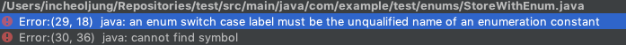

# 아이템34 int 상수 대신 열거 타입을 사용하라

```java
public static final int APPLE_FUJI = 0;
public static final int APPLE_PIPPIN = 1;
public static final int APPLE_GRANNY_SMITH = 2;

public static final int ORANGE_NAVEL = 0;
public static final int ORANGE_TEMPLE = 1;
public static final int ORANGE_BLOOD = 2;
```

#### 정수 열거 패턴 기법에는 단점이 많다.

* `타입 안전`을 보장할 방법이 없으며 `표현력`도 좋지 않다. 오렌지를 건네야 할 메서드에 사과를 보내고 `동등 연산자`로 비교하더라도 컴파일러는 아무런 경고 메시지를 출력하지 않는다.
* 상수의 값이 바뀌면 클라이언트도 반드시 다시 `컴파일`해야 한다. 다시 컴파일하지 않은 클라이언트는 실행이 되더라도 엉뚱하게 동작할 것이다.
* 정수 상수는 `문자열`로 출력하기가 다소 까다롭다. 심지어 그 안에 상수가 몇 개 인지도 알 수 없다.
* 정수 대신 문자열 상수를 사용하는 변형하는 패턴도 있지만, 상수의 의미를 출력할 수 있다는 점은 좋지만 `문자열 상수`의 이름 대신 `문자열` 값을 그대로 사용하면 오타가 있어도 컴파일러는 확인할 길이 없으니 자연스럽게 `런타임 버그`가 생긴다.

#### 열거 타입을 쓰면 어떤 부분이 장점이 있을까

* 열거 타입 자체는 `클래스`이며, 상수 하나당 `자신의 인스턴스`를 하나씩 만들어 `public static final` 필드로 공개한다. 열거 타입은 밖에서 접근할 수 있는 생성자를 제공하지 않으므로 사실상 `final`이다.
* 열거 타입은 `컴파일 타임 타입 안전성`을 제공한다.
* 열거 타입에는 `각자의 이름 공간`이 있어서 이름이 같은 상수도 평화롭게 공존한다.
* 열거 타입에 새로운 상수를 추가하거나 순서를 바꿔도 다시 `컴파일`하지 않아도 된다.
* 열거 타입에는 `임의의 메서드`나 필드를 추가할 수 있고 `임의의 인터페이스`를 구현하게 할 수도 있다.
* 열거 타입은 자신 안에 정의된 상수 들의 값을 배열에 담아 반환하는 정적 메서드인 `values`를 제공한다.

  ```text
  public class WeightTable {
  	public static void main(String[] args) {
  		double eartchWeight = Double.parseDouble(args[0]);
  		double mass = earchWeight / Planet.EARTH.surfaceGravity();
  		for (Planet p : Planet.values())
  			System.out.printf("%s에서의 무게는 %f이다.\\n",p,p.surfaceWeight(mass));
  	}
  }
  ```

* 열거 타입은 `상수별 메서드 구현`도 가능하다.

  ```text
  public enum Operation {
  	PLUS("+") {
  		public double apply(double x, double y) { return x + y; }
  	}
  	MINUS("-") {
  		public double apply(double x, double y) { return x - y; }
  	...
  }
  ```

  ```text
  public static void main(String[] args) {
  	double x = Double.parseDouble(args[0]);
  	double y = Double.parseDouble(args[1]);
  	for (Operation op : Operation.values())
  		System.out.printf("%f %s %f = %f\\n", x, op, y, op.apply(x,y));
  }
  ```

* 하지만 기존 열거 타입에 상수별 동작을 혼합해 넣을 때는 `switch` 문이 좋은 선택이 될 수 있다.

  ```text
  public static Operation inverse(Operation op) {
  	switch(op) {
  		case PLUS: return Operation.MINUS;
  		case MINUS: return Operation.PLUS;
  		case TIMES: return Operation.DIVIDE;
  		case DIVIDE: return Operation.TIMES;

  		default: throw new AssertionError("알 수 없는 연산 : "+ op);
  	}
  }
  ```

#### 열거 타입에서 상수를 하나 제거하면 어떻게 되지?

제거한 상수를 참조하지 않는 `클라이언트`에는 아무 영향이 없다. 클라이언트를 다시 `컴파일`하지 않으면 `런타임`에 역시 같은 줄에서 유용한 예외가 발생할 것이다.



### 정리

`열거 타입`은 확실히 정수 상수보다 뛰어나다. 더 읽기 쉽고 안전하고 강력하다. 대다수 열거 타입이 명시적 `생성자`나 `메서드` 없이 쓰이지만, 각 상수를 특정 데이터와 연결되거나 상수 마다 다르게 동작하게 할 때는 필요하다. 드물게는 하나의 메서드가 상수별로 다르게 동작해야 할 때도 있다. 이런 열거 타입 에서는 switch 문 대신 상수별 메서드 구현을 사용하자.

