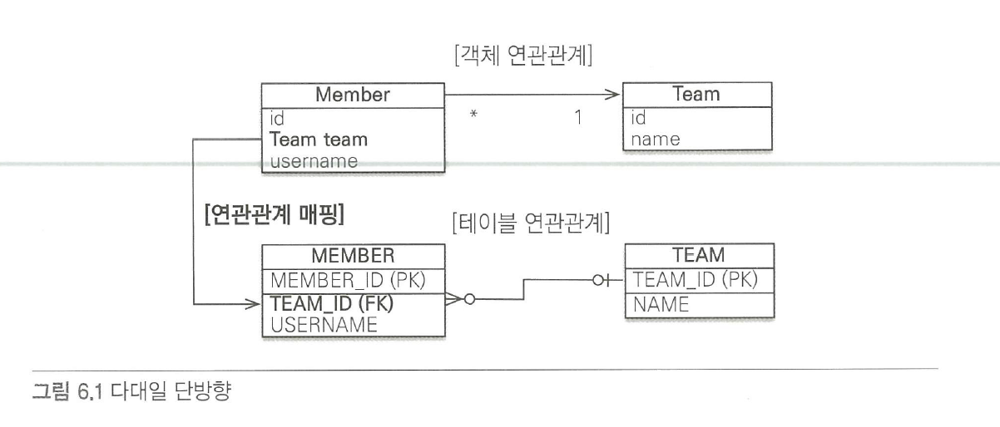
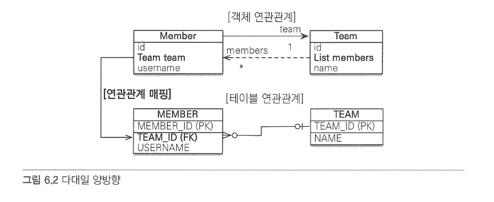
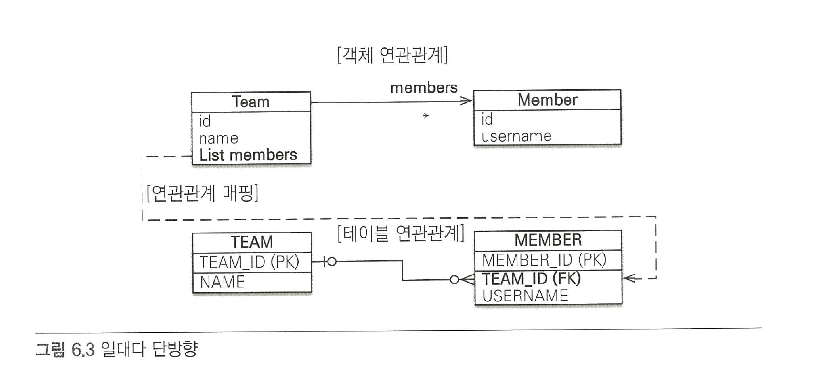
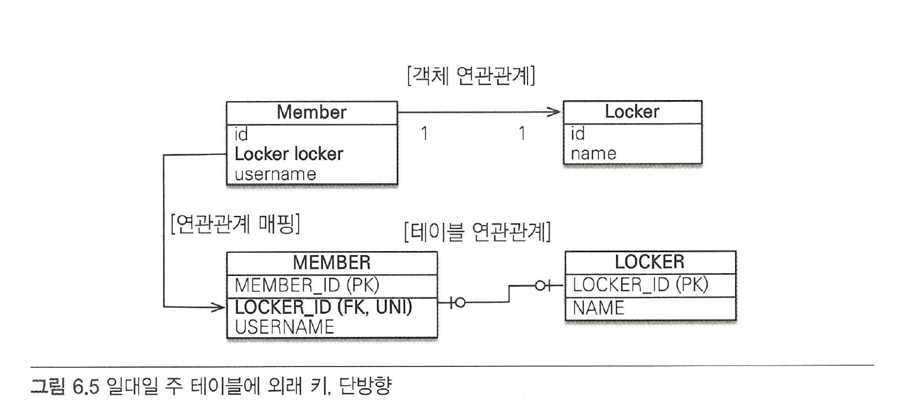
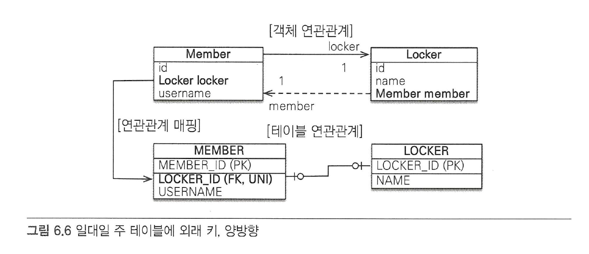
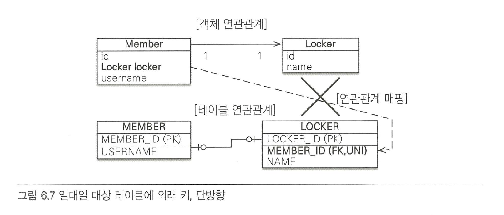
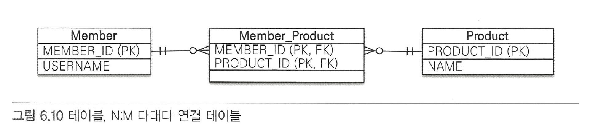
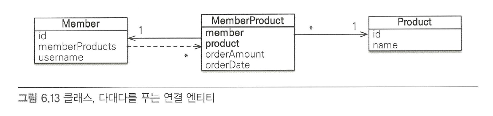

# 6장 다양한 연관관계 매핑

엔티티의 연관관계를 매핑할 때는 다음 `3가지`를 고려해야 한다.

* **다중성**
  * `다대일(@ManyToOne)`
  * `일대다(@OneToMany)`
  * `일대일(@OneToOne)`
  * `다대다(@ManyToMany)`
* **단방향, 양방향**
  * 테이블은 `외래 키` 하나로 조인을 사용해서 `양방향`으로 쿼리가 가능하므로 사실상 방향이라는 개념이 없다.
  * 반연에 `객체`는 `참조용 필드`를 가지고 있는 객체만 연관된 객체를 조회할 수 있다.
* **연관관계의 주인**
  * JPA는 두 객체 연관관계 중 하나를 정해서 데이터 베이스 `외래 키`를 관리하는데 이것을 연간관계의 주인이라 한다. 주인이 아닌 방향은 외래 키를 변경할 수 없고 읽기만 가능하다.
  * 연관관계의 주인이 아니면 `mappedBy` 속성을 사용하고 연관관계의 주인 필드 이름을 값으로 입력해야 한다.

## 다대일

**객체 양방향 관계에서 연관관계의 주인은 항상 다 쪽이다.** 예를 들어 회원(N)과 팀(1)이 있으면 회원 쪽이 연관관계의 주인이다.

### 다대일 단방향 \[N:1]



### 다대일 양방향 \[N:1, 1:N]



*   `양방향`은 외래 키가 있는 쪽이 연관관계의 주인이다.

    `일대다`와 `다대일` 연관 관계는 항상 다(N)에 외래 키가 있다. 여기서는 다 쪽인 `MEMBER` 테이블이 외래 키를 가지고 있으므로 `Member.team`이 연관관계의 주인이다. `JPA`는 외래 키를 관리할 때 연관관계의 주인만 사용한다.
*   **양방향 연관관계는 항상 서로를 참조해야 한다.**

    항상 서로 참조하게 하려면 연관관계 `편의 메소드`를 작성하는 것이 좋은데 회원의 `setTeam()`, 팀의 `addMember()` 메소드가 이런 편의 메소드들이다.

    ```java
    @Entity
    public class Member {
    	@Id @GeneratedValue
    	@Column(name = "MEMBER_ID")
    	private Long id;

    	...

    	public void setTeam(Team team) {
    		this.team = team;
    		
    		//무한루프에 빠지지 않도록 체크
    		if(!team.getMembers().contains(this)) {
    			team.getMembers().add(this);
    		}
    	}
    }
    ```

    ```java
    @Entity
    public class Team {
    	...

    	public void addMember(Member member) {
    		this.members.add(member);
    		
    		//무한루프에 빠지지 않도록 체크
    		if (member.getTeam() != this) {
    			member.setTeam(this);
    		}
    	}
    }
    ```

## 일대다

일대다 관계는 엔티티를 하나 이상 참조할 수 있으므로 자바 컬렉션인 `Collection`, `List`, `Set`, `Map` 중에 하나를 사용해야 한다.


**Q1. 다양한 컬렉션 구현체중에 어느것을 사용하는게 적절한가?**

* List는 순서를 가지고 있으며 중복이 허용된다. 또한 @Orderby 어노테이션을 이용하여 정렬이 가능하다. List에 add할 경우 기존 테이블을 날리고 insert하는 쿼리가 발생한다.
* Set은 순서가 없으며 중복을 허용하지 않는다. @Orderby 어노테이션을 이용하여 정렬을 하여도 해쉬값에 의해 정렬되므로 원하는대로 정렬이 되지 않을 수 있다.
* List를 사용할 경우 순서가 보장되지 않기 때문에 조인 테이블 전략을 사용할 경우 데이터를 삭제하고 다시 삽입하는 쿼리가 발생할 수 있다.&#x20;
  * 전제조건
    * @OneToMany에서 @JoinTable 전략을 설정한다.&#x20;
    * @OneToMany의 컬렉션을 List로 설정한다.&#x20;




보통 자신이 매핑한 테이블의 `외래 키`를 관리하는데, 이 매핑은 `반대쪽 테이블`에 있는 외래 키를 관리한다.

```java
@Entity
public class Team {
	...
	
	@OneToMany
	@JoinColumn(name = "TEAM_ID") // MEMEBER 테이블의 TEAM_ID (FK)
	private List<Member> members = new ArrayList<Member>();
	...
}
```

일대다 단방향 관계를 매핑할 때는 `@JoinColumn`을 명시해야 한다. 그렇지 않으면 JPA는 연결 테이블을 중간에 두고 연관관계를 관리하는 `조인 테이블(JoinTable)` 전략을 기본으로 사용해서 매핑한다.


**Q2. 조인 테이블전략이란?** \
\
@JoinColumn 어노테이션이 없을 경우에 A table 과 B table이 연결된 매핑 테이블이 생성된다. 업데이트 로직 삭제 로직에 매핑 테이블에 갯수 만큼 반영된다. \
@OneToMany 어노테이션에만 적용된다. @ManyToOne에서는 @JoinColumn을 선언하지 않아도 조인 테이블이 생성되지 않는다.&#x20;


*   **일대다 단방향 매핑의 단점**

    일대다 단방향 매핑의 `단점`은 매핑한 객체가 관리하는 `외래 키`가 다른 테이블에 있다는 점이다. 본인 테이블에 외래 키가 있으면 엔티티의 `저장`과 `연관 관계 처리`를 `INSERT SQL` 한 번으로 끝낼 수 있지만, 다른 테이블에 외래 키가 있으면 연관 관계 처리를 위한 `UPDATE SQL`을 추가로 실행해야 한다.

    ```java
    public void testSave() {
    	Member member1 = new Member("member1");
    	Member member2 = new Member("member2");

    	Team teaml = new Team("teaml");
    	teaml.getMembers().add(memberl);
    	teaml.getMembers().add(member2);

    	em.persist(memberl); // INSERT-memberl
    	em.persist(member2); // INSERT-member2
    	em.persist(teaml);   // INSERT-teaml, UPDATE-memberl.fk,
    										   // UPDATE-meinber2. fk
    	transaction.commit();
    }
    ```


**Q3. @JoinColumn 과 mappedBy 속성을 같이 사용하면 에러가 발생한다. 왜 그럴까?**\
\
"Associations marked as mappedBy must not define database mappings like @JoinTable or @JoinColumn" 와 같은 에러가 발생한다. \
그 이유는 mappedBy 옵션과 @JoinTable 이 같은 전략을 사용하기 때문에 충돌이 발생하기 때문이다. mappedBy를 사용해도 @JoinColumn 전략을 사용한다.&#x20;


### 일대다 양방향\[1:N, N:1]

다대일 관계는 항상 다 쪽에 외래 키가 있다. 이런 이유로 `@ManyToOne`에는 `mappedBy` 속성이 없다. **일대다 양방향 매핑이 완전히 불가능한 것은 아니다.** 일대다 단방향 매핑 반대편에 같은 외래 키를 사용하는 다대일 단방향 매핑을 `읽기 전용`으로 하나 추가하면 된다.

```java
@Entity
public class Member {
	@Id @GeneratedValue
	@Column(name = "MEMBER_ID")
	private Long id;

	private String username;

	@ManyToOne
	@JoinColumn(name = "TEAM_ID" , insertable = false, updatable = false)
	private Team team;

	//Getter, Setter ...
}
```

둘 다 같은 키를 관리하므로 문제가 발생할 수 있기 때문에 반대편인 다대일 쪽은 `insetable`,`updatable` 설정으로 읽기만 가능하게 했다. 이 방법은 일대다 양방향 매핑 이라기보다는 일대다 단방향 매핑 반대편을 읽기 전용으로 추가해서 일대다 앙방향처럼 보이도록 하는 방법이다.

## 일대일 \[1:1]

일대일 관계는 주 테이블이나 대상 테이블 중에 누가 외래 키를 가질지 선택해야 한다.

*   **주 테이블에 외래 키**

    주 객체가 대상 객체를 참조하는 것처럼 `주 테이블`에 `외래 키`를 두고 대상 테이블을 참조한다.

    이 방법의 장점은 주 테이블이 외래 키를 가지고 있으므로 주 테이블만 확인해도 대상 테이블과 `연관관계`가 있는지 알 수 있다.
*   **대상 테이블에 외래 키**

    테이블 관계를 `일대일`에서 `일대다`로 변경할 때 테이블 구조를 그대로 유지할 수 있다.

### 주 테이블에 외래 키

#### 단방향



```java
@Entity
public class Member {
  @Id @GeneratedValue
  @Column(name = "MEMBER_ID")
  private Long id;

  private String username;

  @0neTo0ne
  @JoinColunm (name = "LOCKER_ID")
  private Locker locker;

  ...
}
@Entity
public class Locker {
  @Id @GeneratedValue
  @Column(name = "LOCKER_ID")
  private Long id;

  private String name;
  
  ...
}
```

#### 양방향



```java
@Entity
public class Member {
  @Id @GeneratedValue
  @Column(name = "MEMBER_ID")
  private Long id;

  private String username;

  @OneToOne
  @JoinColumn(name = "LOCKER_ID")
  private Locker locker;

}

@Entity
public class Locker {
  @Id @GeneratedValue
  @Column(name = "LOCKER_ID")
  private Long id;

  private String name;

  @OneToOne(mappedBy = "locker")
  private Member member;
  
  ... 
}
```

`MEMBER` 테이블이 `외래 키`를 가지고 있으므로 Member 엔티티에 있는 `Member.locker`가 연관관계의 주인이다. 따라서 반대 매핑인 사물함의 `Locker.member`는 `mappedby`를 선언해서 연관관계의 주인이 아니라고 설정했다.

### 대상 테이블에 외래 키

#### 단방향

`일대일` 관계 중 대상 테이블에 외래 키가 있는 `단방향` 관계는 `JPA`에서 지원하지 않는다. 이때는 단방향 관계를 `Locker`에서 `Member` 방향으로 수정하거나 양방향 관계로 만들고 Locker를 연관관계의 주인으로 설정해야 한다.



#### 양방향

```java
@Entity
public class Member {
  @Id @GeneratedValue
  @Column(name = "MEMBER_ID")
  private Long id;

  private String username;

  @OneToOne(mappedBy = "member")
  private Locker locker;
  ...
}

@Entity
public class Locker {
  @Id @GeneratedValue
  @Column(name = "LOCKER_ID")
  private Long id;

  private String name;

  @OneToOne
  @JoinColumn(name = "MEMBER_ID")
  private Member member;

  ...
}
```

## 다대다 \[N:N]

**관계형 데이터베이스는 정규화된 테이블 2개로 다대다 관계를 표현할 수 없다.** 그래서 보통 다대다 관계를 `일대다`, `다대일` 관계롤 풀어내는 연결 테이블을 사용한다.



### 다대다: 단방향

```java
@Entity
public class Member {
  @Id @Column（name = "MEMBER_ID"）
  private String id;

  private String username;

  @ManyToMany
  @JoinTable（name = "MEMBER_PRODUCT",
    joinColumns = @JoinColumn(name = "MEMBER_ID"),
    inverseJoinColumns = @JoinColumn(name ="PRODUCT_ID"))
  private List<Product> products = new ArrayList<Product>();
  ...

}

@Entity
public class Product {
  @Id @Column(name = "PRODUCT_ID")
  private String id;

  private String name;
  
  ...
}
```

* @JoinTable.name : 연결 테이블을 지정한다.
* @JoinTable.joinColumns : 현재 방향인 회원과 매핑할 조인 컬럼 정보를 지정한다.
* @JoinTable.inverseJoinColums : 반대 방향인 상품과 매핑할 조인 컬럼 정보를 지정한다.

```java
public void save() {
  Product productA = new Product();
  productA.setld("productA");
  productA.setName("상품A");
  em.persist(productA) ;

  Member member1 = new Member();
  member1.setld("member1");
  member1.setUsername("회원1");
  member1.getProducts().add(productA) //연관관계 설정
  em.persist(member1);
}
```

### 다대다: 양방향

`다대다` 매핑이므로 `역방향`도 `@ManyToMany`를 사용한다. 그리고 양쪽 중 원하는 곳에 `mappedBy`로 연관관계 주인을 지정한다.

```java
@Entity
public class Product {
  @Id @Column(name = "PRODUCT_ID")
  private String id;

  private String name;
  
  @ManyToMany(mappedBy = "products") // 역방향 추가
	private List<Member> members;
	...
}
```

```java
public void findinverse () {
  Product product = em.find(Product.class, "productA");
  List<Member> members = product.getMembers();
  for (Member member : members) {
	  System.out.printin("member = " + member.getUsername ());
	}
}
```

### 다대다: 매핑의 한계와 극복, 연결 엔티티 사용

`@ManytoMany`를 사용하면 연결 테이블을 자동으로 처리해 주므로 도메인 모델이 단순 해지고 여러 가지로 편리하다. **하지만 이 매핑을 실무에서 사용하기에는 한계가 있다.**

연결 테이블에 `주문 수량`과 `주문 날짜` 컬럼을 추가했다. 이렇게 컬럼을 추가하면 더는 `@ManyToMany`를 사용할 수 없다. 왜냐하면 주문 엔티티나 상품 엔티티에는 추가한 컬럼 들을 매핑할 수 없기 때문이다.

결국 연결 테이블을 매핑하는 연결 엔티티를 만들고 이곳에 추가한 컬럼들을 매핑해야 한다.



```java
@Entity
public class Member {
  @Id @Column(name = "MEMBER_ID")
  private String id;

  //역방향
  @OneToMany(mappedBy = "member")
  private List<MemberProduct> memberproducts;
}
```

```java
@Entity
@IdClass(MemberProductId.class)
public class MemberProduct {
  @Id
  @ManyToOne
  @JoinColumn(name = "MEMBER_ID")
  private Member member; //MemberProductId.member와 연결

  @Id
  @ManyToOne
  @JoinColumn(name = "PRODUCT_ID")
  private Product product; //MemberProductId.product와 연결

  private int orderAmount;
}

public class MemberProductId implements Serializable {
  private String member; //MemerProduct.member 연결
  private String product; //MemberProduct.product 연결

  //hashCode and equals
  @Override
  public boolean equals(Object o) {...}

  @Override
  public int hashCode() {...}
  
}
```

`회원상품(MemberProduct)` 엔티티를 보면 기본 키를 매핑하는 `@Id`와 외래 키를 매핑하는 `@JoinColumn`을 동시에 사용해서 `기본 키 + 외래 키`를 한번에 매핑했다. 그리고 `@IdClass`를 사용해서 복합 기본 키를 매핑했다.


복합 기본 키란?\
\
JPA에서 복합 키를 사용하려면 별도의 식별자 클래스를 만들어야 한다. 그리고 엔티티에 @IdClass를 사용해서 식별자 클래스를 지정하면 된다.



복합 키를 위한 식별자 클래스 특징

* 복합 키는 별도의 식별자 클래스로 만들어야 한다.
* Serializable을 구현해야 한다.
* equals와 hashCode 메소드를 구현해야 한다.
* 기본 생성자가 있어야 한다.
* 식별자 클래스는 public이어야 한다.
* @IdClass를 사용하는 방법 외에 @EmbeddedId를 사용하는 방법도 있다.


#### 저장 코드

```java
public void save() {
  //회원 저장
  Member member1 = new Member();
  member1.setld("member1");
  member1.setUsername("회원 1");
  em.persist(memberl);

  //상품 저장
  Product productA = new Product();
  productA.setld("productA");
  productA.setName(”상품 1");
  em.persist(productA);

  //회원상품 저장
  MemberProduct memberProduct = new MemberProduct();
  memberProduct.setMember(memberl); //주문 회원 - 연관관계 설정
  memberProduct.setProduct(productA); //주문 상품 - 연관관계 설정
  memberProduct.setOrderAmount(2); //주문 수량
  em.persist(memberProduct);
}
```

#### 조회 코드

```java
public void find () {
  //기본 키 값 생성
  MemberProductld memberProductId = new MemberProductId();
  memberProductld.setMember("member1");
  memberProductld.setProduct("productA");

  MemberProduct memberProduct = em.find(MemberProduct.class,memberProductld);
  Member member = memberProduct.getMember();
  Product product = memberProduct.getProduct();

  System.out.println("member = " + member.getUsername());
  System.out.println("product = " + product.getName());
  System.out.printIn("orderAmount = " + memberProduct.getOrderAmount());
}
```

### 다대다 연관관계 정리

다대다 관계를 `일대다` `다대일` 관계로 풀어내기 위해 연결 테이블을 만들 때 `식별자`를 어떻게 구서할지 선택해야 한다.

* 식별 관계 : 받아온 식별자를 `기본 키 + 외래 키`로 사용한다.
* 비식별 관계 : 받아온 식별자는 `외래 키`로만 사용하고 `새로운 식별자`를 추가한다.

`객체 입장`에서 보면 `비식별 관계`를 사용하는 것이 복합 키를 위한 식별자 클래스를 만들지 않아도 되므로 단순하고 편리하게 ORM 매핑을 할 수 있다.

### 참고

[JPA OneToMany : List vs Set](https://stackoverflow.com/questions/13101882/jpa-onetomany-list-vs-set/29562678)

[JPA list or set 차이](https://m.blog.naver.com/PostView.nhn?blogId=hulint\&logNo=220070697095\&proxyReferer=https:%2F%2Fwww.google.com%2F)

[JPA 컬렉션 - 머루의개발블로그](http://wonwoo.ml/index.php/post/992)

[일대다 단방향 매핑 잘못하면 생기는 ](https://homoefficio.github.io/2019/04/28/JPA-%EC%9D%BC%EB%8C%80%EB%8B%A4-%EB%8B%A8%EB%B0%A9%ED%96%A5-%EB%A7%A4%ED%95%91-%EC%9E%98%EB%AA%BB-%EC%82%AC%EC%9A%A9%ED%95%98%EB%A9%B4-%EB%B2%8C%EC%96%B4%EC%A7%80%EB%8A%94-%EC%9D%BC/)
