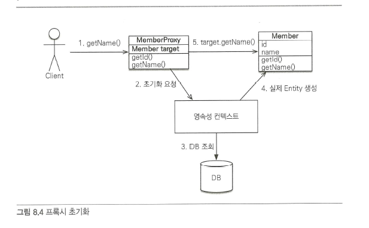

# 8장 프록시와 연관관계 관리

## 프록시

`엔티티`를 조회할 때 연관된 엔티티들이 항상 사용되는 것은 아니다. `연관관계`의 엔티티는 비즈니스 로직에 따라 사용될 때도 있지만 그렇지 않을 때도 있다.

```java
// CASE 1. Member, Team 객체 조회 필요
public void printUserAndTeam(String memberId) {
	Member member = em.find(Member.class, memberId);
	Team team = member.getTeam();
	System.out.println("회원 이름: " + member.getUsername());
	System.out.println("소식팀: " + team.getName()); // team 객체 조회
}

// CASE 2. Member 객체 조회 필요
public void printUser(String memberId) {
	Member member = em.find(Member.class, memberId);
	Team team = member.getTeam();
	System.out.println("회원 이름: " + member.getUsername());
}
```

`JPA`는 이런 문제를 해결하려고 `엔티티`가 실제 사용될 때까지 데이터베이스 조회를 지연하는 방법을 제공하는데 이것을 `지연 로딩`이라 한다. 그런데 지연 로딩 기능을 사용하려면 실제 엔티티 객체 대상에 데이터베이스 조회를 지연할 수 있는 가짜 객체가 필요한데 이것을 `프록시 객체`라 한다.

하이버네이트는 지연 로딩을 지원하기 위해 프록시를 사용하는 방법과 바이트코드를 수정하는 두 가지 방법을 제공하는데 바이트코드를 수정하는 방법은 설정이 복잡하다. 하이버네이트 공식 사이트를 참고하자

### 프록시 기초

`EntityManager.find()`를 사용하면 `영속성 컨텍스트`에 `엔티티`가 없으면 데이터베이스를 조회한다.

```java
Member member = em.find(Member.class, "member1");
```

`엔티티`를 실제 사용하는 시점까지 데이터베이스 조회를 미루고 싶으면 `EntityManager.getReference()` 메소드를 사용하면 된다. 이 메소드를 호출하면 데이터베이스 접근을 위임한 `프록시` 객체를 반환한다.

```java
Member member = em.getReference(Member.class, "member1");
```

프록시 객체는 실제 객체에 대한 `참조(target)`를 보관한다. 그리고 프록시 객체의 메소드를 호출하면 프록시 객체는 실제 객체의 메소드를 호출한다. 이를 프록시 `객체 초기화`라 한다



### 프록시의 특징

* 프록시 객체는 처음 사용할 때 `한 번만` 초기화된다.
* 프록시 객체를 초기화한다고 프록시 객체가 실제 엔티티로 `바뀌는 것은 아니다.` 프록시 객체가 초기화되면 프록시 객체를 통해서 실제 엔티티에 `접근`할 수 있다.
* 프록시 객체는 원본 엔티티를 `상속`받은 객체이므로 타입 체크 시에 주의해서 사용해야 한다.
* `영속성 컨텍스트`에 찾는 `엔티티`가 이미 있으면 데이터베이스를 조회할 필요가 없으므로 `em.getReference()`를 호출해도 프록시가 아닌 실제 엔티티를 반환한다.
* 초기화는 영속성 컨텍스트의 도움을 받아야 가능하다. 따라서 영속성 컨텍스트의 도움을 받을 수 없는 `준영속` 상태의 프록시를 `초기화`하면 문제가 발생한다. 하이버네이트는 `org.hibernate.LazyInitializationException` 예외를 발생시킨다.

### 프록시와 식별자

```java
Team team = em.getReference(Team.class, "team1"); // 식별자 보관
team.getId(); // 초기화되지 않음
```

`프록시` 객체는 `식별자` 값을 가지고 있으므로 식별자 값을 조회하는 team.getId\(\)를 호출 해도 프록시를 초기화하지 않는다. \(단, `@Access(AccessType.PROPERTY)`로 설정한 경우에만 초기화하지 않는다.\) 엔티티 접근 방식을 필드 \(`@Access(AccessType.FIELD)`\)로 설정하면 JPA는 getId\(\) 메소드가 id만 조회하는 메소드인지 다른 필드까지 활용해서 어떤 일을 하는 메소드인지 알지 못하므로 프록시 객체를 초기화한다.

`PersistenceUnitUtil.isLoaded(Object entity)` 메소드를 사용하면 프록시 인스턴스의 초기화 여부를 확인할 수 있다.

```java
boolean isLoad = em.getEntityManagerFactory()
										.getPersistenceUnitUtil().isLoaded(entity);
//또는 boolean isLoad = emf.getPersistenceUnitUtil().isLoaded(entity);

System.out.println("isLoad = " + isLoad); // 초기화 여부 확인
```

하이버네이트의 initialize\(\) 메소드를 사용하면 프록시를 강제로 초기화할 수 있다.

```java
org.hibernate.Hibernate.initialize(order.getMember()); // 프록시 초기화
```

## 즉시 로딩과 지연 로딩

회원 엔티티를 조회할 때 연관된 팀 엔티티도 함께 데이터베이스에서 조회하는 것이 좋을까? 아니면 회원 엔티티만 조회해 두고 팀 엔티티는 실제 사용하는 시점에 데이터베이스에서 조회하는 것이 좋을까? 정답은 없다. 상황에 따라 다를 수 있다.

* 즉시 로딩 : 엔티티를 조회할 때 연관된 엔티티도 함께 조회한다.
  * 설정 방법 : `@ManyToOne(fetch = FetchType.EAGER)`
* 지연 로딩 : 연관된 엔티티를 실제 사용할 때 조회한다.
  * 설정 방법 : `@ManyToOne(getch = FetchType.LAZY)`

### 즉시 로딩

`즉시 로딩`을 최적화하기 위해 가능하면 `조인 쿼리`를 사용한다. 여기서는 회원과 팀을 조인해서 쿼리 한번으로 두 엔티티를 모두 조회한다.

```text
SELECT
    M.MEMBER_ID AS MEMBER_ID,
    M.TEAM_ID AS TEAM_ID,
    M.USERNAME AS USERNAME,
    T.TEAM_ID AS TEAM_ID,
    T.NAME AS NAME
FROM MEMBER M 
LEFT OUTER JOIN TEAM T
	  ON M.TEAM一ID=T.TEAM一ID
WHERE
    M.MEMBER_ID='member1'
```

#### NULL 제약조건과 JPA 조인 전략

현재 회원 테이블에 `TEAM_ID` 외래 키는 `NULL` 값을 허용하고 있다. 따라서 팀에 소속되지 않은 회원이 있을 가능성이 있다. **팀에 소속하지 않은 회원과 팀을 내부 조인 하면 팀은 물론이고 회원 데이터도 조회할 수 없다.**

하지만 `외부 조인`보다 `내부 조인`이 성능과 최적화에서 더 유리하다.

#### 내부 조인을 사용하려면 어떻게 해야 할까?

외래 키에 `NOT NULL` 제약 조건을 설정하면 값이 있는 것을 보장한다. `NOT NULL`을 표현하는 방법은 두 가지가 있다.

* `@JoinColumn(name = "TEAM_ID", nullable = false)`
* `@ManyToOne(fetch = FetchType.EAGER, optional = false)`

정리하자면 `JPA`는 `선택적 관계`면 외부 조인을 사용하고 `필수 관계`면 내부 조인을 사용한다.

### 지연 로딩

**조회 대상이 `영속성 컨텍스트`에 이미 있으면 프록시 객체를 사용할 이유가 없다.** 따라서 `프록시`가 아닌 `실제 객체`를 사용한다. 예를 들어 team1 엔티티가 영속성 컨텍스트에 이미 로딩되어 있으면 프록시가 아닌 실제 team1 엔티티를 사용한다.

`하이버네이트`는 엔티티를 영속 상태로 만들 때 엔티티에 `컬렉션`이 있으면 컬렉션을 추적하고 관리할 목적으로 원본 컬렉션을 하이버네이트가 제공하는 `내장 컬렉션`으로 변경하는데 이것을 `컬렉션 래퍼`라 한다.

```java
@Entity
public class Member {
	@Id
	private String id;

	@OneToMany(mappedBy = "member", fetch = FetchType.LAZY)
	private List<Order> orders;
	
	...
}
```

### JPA 기본 페치 전략

* `@ManyToOne, @OneToOne: 즉시 로딩(FetchType.EAGER)`
* `@OneToMany, @ManyToMany: 지연 로딩(FetchType.LAZY)`

`JPA`의 기본 페치 전략은 연관된 엔티티가 하나면 `즉시 로딩`을, `컬렉션`이면 `지연 로딩`을 사용한다. **하지만 필자가 추천하는 방법은 모든 연관관계에 지연 로딩을 사용하는 것이다.**

### 컬렉션에 FetchType.EAGER 사용 시 주의점

* **컬렉션을 하나 이상 즉시 로딩하는 것은 권장하지 않는다.** 예를 들어 A 테이블을 N, M 두 테이블과 일대다 조인하면 SQL 실행 결과가 N 곱하기 M이 되면서 너무 많은 데이터를 반환할 수 있고 결과적으로 애플리케이션 성능이 저하될 수 있다. 따라서 2개 이상의 컬렉션을 `즉시 로딩`으로 설정하는 것은 권장하지 않는다.
* **컬렉션 `즉시 로딩`은 항상 외부 조인을 사용한다.** 데이터베이스 제약조건으로 내부 조인으로 인해 검색이 되지 않는 상황을 막을 수는 없다. 따라서 `JPA`는 `일대다` 관계를 즉시 로딩할 때 항상 외부 조인을 사용한다.

#### FetchType.EAGER 설정과 조인 전략

* @ManyToOne, @OneToOne
  * \(optional = false\) : 내부 조인
  * \(optional = true\) : 외부 조인
* @OneToMany, @ManyToMany
  * \(optional = false\) : 외부 조인
  * \(optional = true\) : 외부 조인

## 영속성 전이: CASCADE

특정 엔티티를 영속 상태로 만들 때 연관된 엔티티도 함께 영속 상태로 만들고 싶으면 영속성 전이\(`transitive persistence`\) 기능을 사용하면 된다. `JPA`는 `CASCADE` 옵션으로 영속성 전이를 제공한다.

```java
private static void saveNoCascade(EntityManager em) {
    // 부모 저장
    Parent parent = new Parent();
    em.persist(parent) ;

    // 1번 자식 저장
    Child child1 = new Child();
    child1.setParent(parent); //자식 -> 부모 연관관계 설정
    parent.getChildren().add(childl) ; //부모 -> 자식
    em.persist(childl);

    // 2번 자식 저장
    Child child2 = new Child();
    child2.setParent(parent); //자식 -> 부모 연관관계 설정
    parent.getChildren().add(child2); //부모 -> 자식
    em.persist(child2);
}
```

`JPA`에서 엔티티를 저장할 때 연관된 모든 엔티티는 `영속 상태`이여야 한다. 따라서 예제를 보면 부모 엔티티, 자식 엔티티 각각 영속 상태로 만든다.

### 영속성 전이: 저장

```java
@Entity
public class Parent {
	...

	@OneToMany(mappedBy = "parent", cascade = CascadeType.PERSIST)
	private List<Child> children = new ArrayList<Child>();
}
```

```java
private static void saveWithCascade(EntityManager em) {
    Child child1 = new Child();
    Child child2 = new Child();

    Parent parent = new Parent();
    childl.setParent(parent) ; //연관관계 추가
    child2.setParent(parent) ; //연관관계 추가
    parent.getChildren().add(child1);
    parent.getChildren().add(child2);
    
    //부모저장, 연관된자식들저장
    em.persist(parent);
}
```

`영속성 전이`는 `연관관계`를 매핑하는 것과는 아무 관련이 없다. **단지 `엔티티`를 영속화할 때 연관된 엔티티도 같이 영속화하는 편리함을 제공할 뿐이다.**

### CASCADE의 종류

```java
public enum CascadeType {
    ALL, //모두 적용
    PERSIST, //영속
    MERGE, //병합
    REMOVE, //삭제
    REFRESH, //REFRESH
    DETACH //DETACH
}
```

참고로 `CascadeType.PERSIST,` `CascadeType.REMOVE`는 `em.persist()`, `em.remove()`를 실행할 때 바로 전이가 발생하지 않고 `플러시`를 호출할 때 전이가 발생한다.

### 고아 객체

`JPA`는 부모 엔티티와 연관관계가 끊어진 자식 엔티티를 자동으로 삭제하는 기능을 제공하는데 이것을 `고아 객체` 제거라 한다. `부모 엔티티`의 컬렉션에서 `자식 엔티티`의 참조만 제거하면 자식 엔티티가 자동으로 삭제되도록 작성해보자.

```java
@Entity
public class Parent {
    @Id @GeneratedValue
    private Long id;
    
    @OneToMany(mappedBy = "parent", orphanRemoval = true)
    private List<Child> children = new ArrayList<Child>();
    ...
}
```

고아 객체 제거 기능은 영속성 컨텍스트를 플러시할 때 적용되므로 플러시 시점에 `DELETE SQL`이 실행된다.

```java
Parent parent1 = em.find(Parent.class, id);
parent1.getChildren().remove(0); //자식 엔티티를 컬렉션에서 제거
```

참조가 제거된 엔티티는 다른 곳에서 참조하지 않는 고아 객체로 보고 삭제하는 기능이다. 만약 삭제한 엔티티를 다른 곳에서도 참조한다면 문제가 발생할 수 있다. 이런 이유로 `orphanRemovel`은 `@OneToOne`, `@OneToMany`에만 사용할 수 있다.

부모를 제거하면 자식도 같이 제거할 수 있다. `CadecadeType.REMOVE`를 설정하면 가능하다.

### 영속성 전이 + 고아 객체, 생명주기

`CascadeType.ALL` + `orphanRemoval = true`를 동시에 사용하면 어떻게 될까?

일반적으로 엔티티는 `EntityManager.persist()`를 통해 영속화되고 `EntityManager.remove()`를 통해 제거된다. 이것은 엔티티 스스로 생명주기를 관리한다는 뜻이다. 그런데 두 옵션을 모두 활성화하면 부모 엔티티를 통해서 자식의 생명주기를 관리할 수 있다.

영속성 전이는 DDD의 Aggregate Root개념을 구현할 때 사용하면 편리하다

### 정리

* `JPA` 구현체들은 객체 그래프를 마음껏 탐색할 수 있도록 지원하는데 이때 프록시 기술을 사용한다.
* 객체를 조회할 때 연관된 객체를 즉시 로딩하는 방법을 `즉시 로딩`이라 하고, 연관된 객체를 지연해서 로딩하는 방법을 `지연 로딩`이라 한다.
* 객체를 저장하거나 삭제할 때 연관된 객체도 함께 저장하거나 삭제할 수 있는데 이것을 `영속성 전이`라 한다.
* 부모 엔티티와 연관관계가 끊어진 자식 엔티티를 자동으로 삭제하려면 `고아 객체 제거 기능`을 사용하면 된다.

### 참고

[JPA에서 대량의 데이터를 삭제할때 주의해야할 점](https://jojoldu.tistory.com/235)

