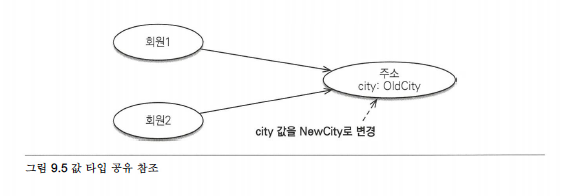
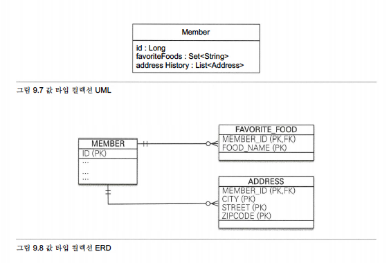

# 9장 값 타입

`JPA`의 데이터 타입을 가장 크게 분류하면 `엔티티` 타입과 `값` 타입으로 나눌 수 있다. 비유하자면 `엔티티` 타입은 살아 있는 `생물`이고 `값` 타입은 단순한 `수치` 정보다.

## 기본값 타입

```java
@Entity
public class Member {
	@Id @GeneratedValue
	private Long id;

	private String name;
	private int age;
	...
}
```

`Member` 엔티티의 값 타입인 `name`, `age` 속성은 식별자 값도 없고 `생명 주기`도 회원 엔티티에 의존한다. 따라서 회원 엔티티 `인스턴스`를 제거하면 `name`, `age` 값도 제거된다. 그리고 `값 타입`은 공유하면 안 된다. 예를 들어 다른 회원 엔티티의 이름을 변경한다고 해서 나의 이름까지 변경되는 것은 상상하기도 싫을 것이다.

> 자바에서 int, double 같은 기본 타입\(primitive type\)은 절대 공유되지 않는다.

## 임베디드 타입\(복합 값 타입\)

새로운 값 타입을 직접 정의해서 사용할 수 있는데, `JPA`에서는 이것을 임베디드 타입이라 한다.

* `@Embeddable` : 값 타입을 정의하는 곳에 표시
* `@Embedded` : 값 타입을 사용하는 곳에 표시

`임베디드 타입`을 포함한 모든 값 타입은 엔티티의 생명주기에 의존하므로 엔티티와 임베디드 타입의 관계를 UML로 표현하면 `컴포지션` 관계가 된다.

#### 임베디드 타입과 테이블 매핑

임베디드 타입 덕분에 `객체`와 `테이블`을 아주 세밀하게 매핑하는 것이 가능하다. **잘 설계한 ORM 애플리케이션은 매핑한 테이블의 수보다 클래스의 수가 더 많다.**

#### @AttributeOverride: 속성 재정의

임베디드 타입에 정의한 매핑 정보를 재정의하려면 엔티티에 `@AttributeOverride`를 사용하면 된다.

```java
@Entity
public class Member {
  @Id @GeneratedValue
  private Long id;
  private String name;

  @Embedded 
  Address homeAddress;
  
  @Embedded
  @AttributeOverrides({
    @AttributeOverride(name="city", column=@Column(name = "COMPANY_CITY")),
    @AttributeOverride(name="street", column=@Column(name = "COMPANY_STREET")),
    @AttributeOverride (name="zipcode", column=@Column (name = "COMPANY_ZIPCODE"))
  })
  Address companyAddress;
}
```

`@AttirbuteOverride`**를 사용하면 어노테이션을 너무 많이 사용해서 엔티티 코드가 지저분해진다.** 다행히도 한 엔티티에 같은 임베디드 타입을 중복해서 사용하는 일은 많지 않다.

## 값 타입과 불변 객체

`값 타입`은 복잡한 객체 세상을 조금이라도 단순화하려고 만든 개념이다.

### 값 타입 공유 참조

임베디드 타입 같은 값 타입을 여러 `엔티티`에서 공유하면 위험하다.



```java
member1.setHomeAddress(new Address("OldCity"));
Address address = member1.getHomeAddress();

address.setCity("NewCity");
member2.setHomeAddress(address);
```

`회원2`의 주소만 "`NewCity`"로 변경 되길 기대했지만 `회원1`의 주소도 "`NewCity`"로 변경되어 버린다. 이런 부작용을 막으려면 값을 복사해서 사용하면 된다.

### 값 타입 복사

`값 타입`의 실제 인스턴스인 값을 공유하는 것은 위험하다. 그러나 `임베디드 타입`처럼 직접 정의한 `값 타입`은 기본 타입이 아니라 `객체 타입`이라는 것이다. **자바는 객체에 값을 대입하면 항상 `참조값`을 전달한다.**

객체의 `공유 참조`는 피할 수 없다. 따라서 근본적인 해결책이 필요한데 가장 단순한 방법은 객체의 값을 수정하지 못하게 막으면 된다.

### 불변 객체

`객체`를 `불변`하게 만들면 값을 수정할 수 없으므로 `부작용`을 원천 차단할 수 있다. 따라서 값 타입은 될 수 있으면 `불변 객체`로 설계해야 한다. **한 번 만들면 절대 변경할 수 없는 객체를 `불변 객체`라 한다.** 불변 객체의 값은 조회할 수 있지만 수정할 수 없다.

불변 객체를 구현하는 다양한 방법이 있지만 가장 간단한 방법은 `생성자`로만 값을 설정하고 `수정자`를 만들지 않으면 된다.

### 값 타입의 비교

자바가 제공하는 객체 비교는 2가지다.

* 동일성\(indentity\) 비교 : 인스턴스의 참조 값을 비교, `==` 사용
* 동등성\(Equivalence\) 비교 : 인스턴스의 값을 비교, `equals()` 사용

값 타입은 `동일성`은 서로 다른 인스턴스이므로 결과는 `거짓`이다. 그러나 `동등성`은 `참`이라는 결과를 반환하기 위해 `equals()` 메소드를 재정의 해야 한다.

> 자바에서 equals\(\)를 재정의하면 hashCode\(\)도 재정의하는 것이 안전하다. 그렇지 않으면 해시를 사용하는 컬렉션\(HashSet, HashMap\)이 정상 동작하지 않는다.

### 값 타입 컬렉션

값 타입을 하나 이상 저장 하려면 컬렉션에 보관하고 `@ElementCollection`, `@CollectionTable` 어노테이션을 사용하면 된다.

```java
@Entity
public class Member {
  @Id @GeneratedValue
  private Long id;
  
  @Embedded
  private Address homeAddress;

  @ElementCollection
  @CollectionTable(
    name = "FAVORITE_FOODS",
    joinColumns = @JoinColumn(name = "MEMBER_ID"))
  @Column(name="FOOD_NAME")
  private Set<String> favor丄teFoods = new HashSet<String>();

  @ElementCollection
  @CollectionTable(
    name = "ADDRESS”, 
    joinColumns = @JoinColumn(name = "MEMBER_ID"))
  private List<Address> addressHistory = new ArrayList<Address>();
  //...
}

@Embeddable
public class Address {
  @Column
  private String city;
  private String street;
  private String zipcode
  //...
}
```

`FavoriteFoods`는 기본값 타입인 `String`을 `컬렉션`으로 가진다. 이것은 데이터베이스 테이블로 매핑해야 하는데 관계형 데이터베이스의 테이블은 컬럼 안에 컬렉션을 포함할 수 없다. 따라서 별도의 `테이블`을 추가하고 `@CollectionTable`를 사용해서 추가한 테이블을 매핑 해야 한다.



### 값 타입 컬렉션 사용

`값 타입 컬렉션`을 어떻게 사용하는지 예제로 알아보자

```java
Member member = new Member();

//임베디드 값 타입
member.setHomeAddress(new Address(”통영”, "몽돌해수욕장”' "660-123"));

//기본값 타입 컬렉션
member.getFavoriteFoods().add(”쌈뽕”);
member.getFavoriteFoods().add("짜장”);
member.getFavoriteFoods().add("탕수육,');

//임베디드 값 타입 컬렉션
member.getAddressHistory().add(new Address("서울”, "강남"，"123-123"));
member.getAddressHistory().add(new Address("서울", "강북", "000-000"》);
em.persist(member);
```

등록하는 코드를 보면 마지막에 `member` 엔티티만 `영속화`했다. 따라서 `em.persist(member)` 한 번 호출로 총 `6번`의 `INSERT SQL`을 실행한다.

> 값 타입 컬렉션은 영속성 전이\(Cascade\) + 고아 객체 제거\(ORPHAN REMOVE\) 기능을 필수로 가진다고 볼 수 있다.

```text
INSERT INTO MEMBER (ID, CITY, STREET, ZIPCODE) VALUES (1, "통영","몽돌해수욕장","660-123")

INSERT INTO FAVORITE_FOODS (MEMBER_ID, FOOD_NAME) VALUES(1,"깜뽕")
INSERT INTO FAVORITE_FOODS (MEMBER_ID, FOOD_NAME) VALUES(1 "짜장")
INSERT INTO FAVORITE_FOODS (MEMBER_ID, FOOD_NAME) VALUES(1, "탕수육")

INSERT INTO ADDRESS (MEMBER_ID, CITY, STREET, ZIPCODE) VALUES(1, "서울", "강남", "123-123")
INSERT INTO ADDRESS (MEMBER_ID, CITY, STREET, ZIPCODE) VALUES(1, "서울", "강북", "000-000")
```

이번에는 값 타입 컬렉션을 수정하면 어떻게 되는지 알아보자

```java
Member member = em.find(Member. class, IL);

// 1. 임베디드값 타입수정
member.setHomeAddress(new Address("새로운도시", "신도시 1", "123456"));

// 2. 기본값 타입컬렉션수정
Set<String> favoriteFoods = member.getFavoriteFoods();
favoriteFoods.remove("탕수육");
favoriteFoods.add("치킨");

// 3. 임베디드값 타입컬렉션수정
List<Address> addressHistory = member.getAddressHistory();
addressHistory.remove(new Address("서울", "기존주소", "123-123"));
addressHistory.add(new Address("새로운도시", "새로운 주소", "123-456"));
```

1. **임베디드 값 타입 수정:** `homeAddress` 임베디드 값 타입은 `MEMBER` 테이블과 매핑 했으므로 `MEMBER` 테이블만 `UPDATE`한다. 사실 `Member` 엔티티를 수정하는 것과 같다.
2. **기본값 타입 컬렉션 수정:** 탕수육을 치킨으로 변경 하려면 탕수육을 제거하고 치킨을 추가해야 한다. 자바의 String 타입은 수정할 수 없다.
3. **임베디드 값 타입 컬렉션 수정:** 값 타입은 `불변`해야 한다. 따라서 컬렉션에서 기존 주소를 삭제하고 새로운 주소를 등록했다. 참고로 값 타입은 `equals`, `hashcode`를 꼭 구현해야 한다.

### 값 타입 컬렉션의 제약사항

값 타입은 `식별자`라는 개념이 없고 단순한 값 들의 모음이므로 값을 변경 해버리면 데이터베이스에 저장된 `원본 데이터`를 찾기는 어렵다.

`JPA` 구현체들은 값 타입 컬렉션에 변경 사항이 발생하면, 값 타입 컬렉션이 매핑된 테이블의 연관된 모든 데이터를 `삭제`하고, 현재 값 타입 컬렉션 객체에 있는 모든 값을 데이터베이스에 다시 `저장`한다.

따라서 실무에서는 값 타입 컬렉션이 매핑된 테이블에 데이터가 많다면 값 타입 컬렉션 대신에 `일대다` 관계를 고려해야 한다. 추가로 값 타입 컬렉션을 매핑하는 테이블은 모든 컬럼을 묶어서 `기본 키`를 구성해야 한다. 따라서 데이터베이스 `기본 키 제약 조건`으로 인해 컬럼에 `null`을 입력할 수 없고, 같은 값을 `중복`해서 저장할 수 없는 제약도 있다.

지금까지 설명한 문제를 해결하려면 값 타입 컬렉션을 사용하는 대신에 새로운 엔티티를 만들어서 `일대다` 관계로 설정하면 된다.

### 정리

#### 엔티티 타입의 특징

* 식별자가 있다.
* 생명 주기가 있다
* 공유할 수 있다.

#### 값 타입의 특징

* 식별자가 없다.
* 생명 주기를 엔티티에 의존한다.
* 공유하지 않는 것이 안전하다.

