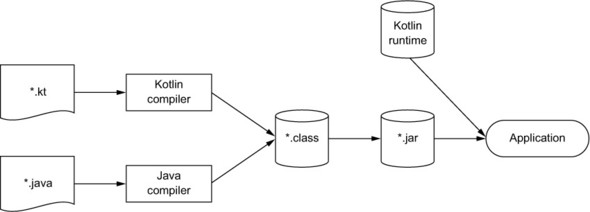

# 1장 코틀린이란 무엇이며, 왜 필요한가?

## 코틀린은 무엇인가?

코틀린은 자바 플랫폼에서 돌아가는 새로운 프로그래밍 언어다. 코틀린은 기존 자바 라이브러리나 프레임워크와 함께 잘 작동하며, 성능도 자바와 같은 수준이다.

## 코틀린 맛보기

코틀린의 특징을 보여줄 수 있는 작은 예제로 시작해보자.

```kotlin
// 데이터 클래스
data class Person(
    val name: String,
    val age: Int? = null // 널이 될 수 있는 타입과 파라미터 디폴트 값
)

// 최상위 함수
fun main(args: Array<String>) {
    val persons = listOf(
        Person("Alice"),
        Person("Bob", age = 29) // 이름 붙은 파라미터
    )

    val oldest = persons.maxBy { it.age ?: 0 } // 람다 식과 엘비스 연산자
    println("The oldest is: $oldest") // 문자열 템플릿
}
```

Alice의 나이를 지정하지는 않았지만 엘비스 연산자가 null을 0으로 변환해주기 때문에 Bob이 가장 나이가 많은 사람으로 선정될 수 있다.

## 코틀린의 주요 특성

코틀린의 핵심 특성을 좀 더 자세히 알아보자. 먼저 코틀린을 통해 어떤 종류의 애플리케이션을 만들 수 있는지 살펴보자

### 대상 플랫폼: 서버, 안드로이드 등 자바가 실행되는 모든 곳

코틀린의 주목적은 현재 자바가 사용되고 있는 모든 용도에 적합하면서도 더 간결하고 생산적이며 안전한 대체 언어를 제공하는 것이다. 코틀린을 활용할 수 있는 가장 일반적인 영역은 다음과 같다.

* 서버상의 코드\(특히 웹 애플리케이션의 백엔드\)
* 안드로이드 디바이스에서 실행되는 모바일 애플리케이션

자바뿐 아니라 자바스크립트로도 코틀린을 컴파일할 수 있다. 따라서 코틀린 코드를 브라우저나 노드에서 실행할 수 있다. \(코틀린 1.1부터는 자바스크립트를 공식적으로 지원한다 밝혔다\)

코틀린이 정한 목표 영역은 상당히 광범위하다. 코틀린은 구체적인 영역의 문제를 해결하거나 특정 프로그래밍 패러다임을 지원하는 여러 라이브러리와 아주 잘 융합된다. 이제 코틀린이 갖는 몇 가지 핵심 특성을 살펴보자

### 정적 타입 지정 언어

자바와 마찬가지로 코틀린도 정적 타입 지정 언어다. 정적 타입 지정이라는 말은 모든 프로그램 구성 요소의 타입을 컴파일 시점에 알 수 있고 프로그램 안에서 객체의 필드나 메소드를 사용할 때마다 컴파일러가 타입을 검증해준다는 뜻이다.

이런 점은 다른 동적 타입 지정 언어와는 다르다. JVM에서는 그루비\(Groovy\)나 JRuby가 대표적인 동적 타입 지정 언어다. 동적 타입 지정 언어세너느 타입과 관계없이 모든 값을 변수에 넣을 수 있고, 메소드나 필드 접근에 대한 검증이 실행 시점에 일어나며, 그에 따라 코드가 더 짧아지고 데이터 구조를 더 유연하게 생성하고 사용할 수 있다. 하지만 이는 실행 시점에 오류가 확인되는 위험이 있다.

한편 자바와 달리 코틀린에서는 컴파일러가 문맥으로부터 변수 타입을 자동으로 유추할 수 있기 때문에 프로그래머는 타입 선언을 생략해도 된다. \(이런 기능을 타입 추론이라고 부른다\)

```kotlin
var x = 1 // x를 정수(Int) 값으로 초기화한다. 
```

#### 정적 타입 지정의 장점은 다음과 같다.

* 성능 : 실행 시점에 어떤 메소드를 호출할지 알아내는 과정이 필요 없으므로 메소드 호출이 더 빠르다.
* 신뢰성 : 컴파일러가 프로그램의 정확성을 검증하기 때문에 실행 시 프로그램이 오류로 중단될 가능성이 더 적어진다.
* 유지 보수성 : 코드에서 다루는 객체가 어떤 타입에 속하는지 알 수 있기 때문에 처음 보는 코드를 다룰 때도 더 쉽다.
* 도구 지원 : 정적 타입 지정을 활용하면 더 안전하게 리팩토링 할 수 있고, 도구는 더 정확한 코드 완성 기ㅣ능을 제공할 수 있으며, IDE의 다른 지원 기능도 더 잘 만들 수 있다.

코틀린은 타입 추론을 지원하므로 정적 타입 지정 언어에서 프로그래머가 직접 타입을 선언해야 함에 따라 생기는 불편함이 대부분 사라진다. 그리고 코틀린의 특성 중 가장 중요한 특성은 널이 될 수 있는 타입을 지원한다는 점이다. \(널 포인터 예외에 대한 설명은 6장에서 더 자세히 살펴볼 예정이다\)

코틀린의 타입 시스템에 있는 다른 새로운 내용으로는 함수 타입\(function type\)에 대한 지원을 들 수 있다. 함수 타입이 무엇인가 알아보기 위해 함수형 프로그래밍이 어떤 개념인지와 코틀린이 함수형 프로그래밍을 어떻게 지원하는지에 대해 먼저 알아보자

### 함수형 프로그래밍과 객체지향 프로그래밍

함수형 프로그래밍의 핵심 개념은 다음과 같다.

#### 일급 시민인 함수

함수\(프로그램의 행동을 나타내는 코드 조각\)를 일반 값처럼 다룰 수 있다. 함수를 변수에 저장할 수 있고, 함수를 인자로 다른 함수에 전달할 수 있으며, 함수에서 새로운 함수를 만들어서 반환할 수 있다.

#### 불변성

함수형 프로그래밍에서는 일단 만들어지고 나면 내부 상태가 절대로 바뀌지 않는 불변 객체를 사용해 프로그램을 작성한다.

#### 부수 효과\(side effect\) 없음

함수형 프로그래밍에서는 입력이 같으면 항상 같은 출력을 내놓고 다른 객체의 상태를 변경하지 않으며, 함수 외부나 다른 바깥 환경과 상호작용하지 않는 순수 함수를 사용한다.

### 함수형 스타일로 작성하면 어떤 유익이 있을까?

#### 첫째로 간결성을 들 수 있다.

함수형 코드는 그에 상응하는 명령형 코드에 비해 더 간결하며 우아하다. \(순수\) 함수를 값처럼 활용할 수 있으면 더 강력한 추상화를 할 수 있고 강력한 추상화를 사용해 코드 중복을 막을 수 있다.

#### 두번째로 다중 스레드를 사용해도 안전하다.

다중 스레드 프로그램에서는 적절한 동기화 없이 같은 데이터를 여러 스레드가 변경하는 경우 가장 많은 문제가 생긴다. 불변 데이터 구조를 사용하고 순수 함수를 그 데이터 구조에 적용한다면 다중 스레드 환경에서 같은 데이터를 여러 스레드가 변경할 수 없다. 따라서 복잡한 동기화를 적용하지 않아도 된다.

#### 마지막으로 함수형 프로그램은 테스트하기 쉽다.

부수 효과가 있는 함수는 그 함수를 실행할 때 필요한 전체 환경을 구성하는 준비 코드가 따로 필요하지만, 순수 함수는 그런 준비 코드 없이 독립적으로 테스트할 수 있다.

#### 코틀린은 처음부터 함수형 프로그래밍을 풍부하게 지원해 왔다.

* 함수 타입을 지원함에 따라 어떤 함수가 다른 함수를 파라미터로 받거나 함수가 새로운 함수를 반환할 수 있다.
* 람다 식을 지원함에 따라 번거로운 준비 코드를 작성하지 않아도 코드 블록을 쉽게 정의하고 여기저기 전달할 수 있다.
* 데이터 클래스는 불변적인 값 객체를 간편하게 만들 수 있는 구문을 제공한다.
* 코틀린 표준 라이브러리는 객체와 컬렉션을 함수형 스타일로 다룰 수 있는 API를 제공한다.

코틀린은 함수형 스타일로 프로그램을 짤 수 있게 지원하지만 함수형 프로그래밍 스타일을 강제하지는 않는다. 명령형 방식이 더 적합한 경우라면 함수형 프로그래밍으로 번거롭게 코드를 작성할 필요 없이 직접 변경 가능한 데이터와 부수 효과를 활용하는 함수를 사용해도 된다.

### 무료 오픈소스

코틀린 언어와 컴파일러, 라이브러리 및 코틀린과 관련된 모든 도구는 모두 오픈소스며, 어떤 목적에든 무료로 사용할 수 있다.

## 코틀린 응용

코틀린은 주로 서버와 안드로이드 개발에서 널리 사용되고 있다. 이 두 분야를 살펴보고 코틀린이 각 분야에 적합한 언어인 이유를 살펴보자

### 코틀린 서버 프로그래밍

다음과 같은 응용 분야를 포함하는 여러 분야가 서버 프로그래밍에 포함된다.

* 브라우저에 HTML 페이지를 돌려주는 웹 애플리케이션
* 모바일 애플리케이션에게 HTTP를 통해 JSON API를 제공하는 백엔드 애플리케이션
* RPC\(원격 프로시저 호출\) 프로토콜을 통해 서로 통신하는 작은 서비스들로 이뤄진 마이크로서비스

개발자들은 이런 애플리케이션을 수년간 자바로 개발해 오면서 이런 종류의 애플리케이션 개발에 도움을 줄 수 있는 기술과 프레임워크를 엄청나게 만들어왔다. 이런 환경에서 자바 코드와 매끄럽게 상호운용할 수 있다는 점이 코틀린의 큰 장점이다. 자바 클래스를 코틀린으로 확장해도 아무 문제가 없으며, 코틀린 클래스 안의 메소드나 필드에 특정 \(자바\) 애노테이션을 붙어야 하는 경우에도 아무 문제가 없다. 그러면서도 시스템 코드는 더 간결해지고 더 신뢰성이 높아지며, 더 유지 보수하기 쉬워질 것이다.

### 코틀린 안드로이드 프로그래밍

모바일 애플리케이션은 엔터프라이즈 애플리케이션보다 더 작고 기존 코드 기반과 새 코드를 통합할 필요도 더 적다. 또 모바일 애플리케이션은 보통 더 다양한 디바이스에 대해 서비스의 신뢰성을 보장하면서 더 빠르게 개발해 배포할 필요가 있다.

코틀린 언어의 특성과 안드로이드 프레임워크의 특별한 컴파일러 플러그인 지원을 조합하면 안드로이드 애플리케이션 개발의 생산성을 더 높이고 개발의 즐거움을 더할 수 있다.

또는 코틀린을 사용하면 애플리케이션의 신뢰성이 더 높아진다. 안드로이드이 앱을 개발해 본 독자라면 '프로세스가 중단됨\(Process Has Stopped\)' 대화상자를 본 일이 많을 것이다. 이 대화상자는 주로 처리되지 않는 예외\(NullPointerException이 주로 발생\)가 발생한 경우에 표시된다. 코틀린 타입 시스템은 null 값을 정확히 추적하며 널 포인터로 생기는 문제를 줄여준다.

한편 코틀린은 자바 6와 완전히 호환된다. 따라서 호환성과 관련한 새로운 문제를 야기하지 않는다. 코틀린을 사용하더라도 성능 측면에서 아무 손해가 없다. 코틀린 컴파일러가 생성한 바이트코드는 일반적인 자바 코드와 똑같이 효율적으로 실행된다.

## 코틀린의 철학

코틀린이 자바와의 상호운용성에 초점을 맞춘 실용적으로 간결하며 안전한 언어라고 설명하는 경우가 자주 있다. 그렇다면 실용성, 간결성, 안전성, 상호운용성은 각각 어떤 뜻일까?

### 실용성

코틀린은 다른 프로그래밍 언어가 채택한 이미 성공적으로 검증된 해법과 기능에 의존한다. 이로 인해 언어의 복잡도가 줄어들고 이미 알고 있는 기존 개념을 통해 코틀린을 더 쉽게 배울 수 있다. 거기에 코틀린은 어느 특정 프로그래밍 스타일이나 패러다임을 사용할 것을 강제로 요구하지 않는다. 코틀린을 처음 배우는 사람은 자바에서 사용해 온 익숙한 프로그래밍 스타일이나 기법을 활용할 수 있다. 나중에 코틀린의 더 강력한 특성을 발견하고 그런 특성을 자신의 코드에 적용하는 방법을 배우고 나면 그 특성을 잘 활용해서 간결하게 코드를 작성할 수 있다.

코틀린의 여러 특성을 배울 때도 IDE의 코틀린 언어 지원이 중요한 역할을 한다. 흔히 쓰이지만 더 간결한 구조로 바꿀 수 있는 대부분의 코드 패턴을 도구가 자동으로 감지해서 수정하라고 제안한다.

### 간결성

개발자가 코드를 새로 작성하는 시간보다 기존 코드를 읽는 시간이 더 길다는 사실이 잘 알려져 있다. 코드가 더 간단하고 간결할수록 내용을 파악하기가 더 쉽다. 물론 설계가 좋고 각 부분의 역할을 잘 표현해주는 적절한 이름이 붙어있다면 내용을 파악할 때 큰 도움이 된다. 그러나 어떤 언어를 사용해 코드를 작성했고 그 언어가 얼마나 간결한 언어인지도 중요하다.

코틀린을 만들면서 프로그래머가 작성하는 코드에서 의미가 없는 부분을 줄이고, 언어가 요구하는 구조를 만족시키기 위해 별 뜻은 없지만 프로그램에 꼭 넣어야 하는 부수적인 요소를 줄이기 위해 많은 노력을 기울였다. getter, setter, 생성자 파라미터를 필드에 대입하기 위한 로직 등 자바에 존재하는 여러 가지 번거로운 준비 코드를 코틀린은 묵시적으로 제공하기 때문에 코틀린 소스코드는 그런 준비 코드로 인해 지저분해지는 일이 없다.

코드가 불필요하게 길어지는 또 다른 이유는 컬렉션에서 원소를 찾는 것과 같은 일반적인 작업을 수행하기 위해 명시적으로 작성해야만 하는 코드의 양이 상당하기 때문이다. 코틀린은 람다를 지원하기 때문에 작은 코드 블록을 라이브러리 함수에 쉽게 전달할 수 있다. 따라서 일반적인 기능을 라이브러리 안에 캡슐화하고 작업에 따라 달라져야 하는 개별적인 내용을 사용자가 작성한 코드 안에 남겨둘 수 있다.

코드가 더 간결하면쓰는 데 시간이 덜 걸린다. 더 중요한 것은 읽는 데도 시간이 덜 걸린다는 점이다. 간결성은 여러분의 생산성을 향상시켜주고 개발을 더 빠르게 진행할 수 있게 해준다.

### 안전성

일반적으로 프로그래밍 언어가 안전하다는 말은 프로그램에서 발생할 수 있는 오류 중에서 일부 유형의 오류를 프로그램 설계가 원칙적으로 방지해준다는 뜻이다. 물론 이는 절대적이지는 않다. 어떤 언어도 발생할 수 있는 모든 오류를 막을 수는 없다.

코틀린을 JVM에서 실행한다는 사실은이미 상당한 안전성을 보장할 수 있다는 뜻이다. 예를 들어 JVM을 사용하면 메모리 안전성을 보장하고, 버퍼 오버플로우를 방지하며, 동적으로 할당한 메모리를 잘못 사용함으로 인해 발생할 수 있는 다양한 문제를 예방할 수 있다. 코틀린은 타입 자동 추론을 사용하여 애플리케이션의 타입 안전성을 보장한다. 또한, 실행 시점에 오류를 발생시키는 대신 컴파일 시점 검사를 통해 오류를 더 많이 방지해준다.

가장 중요한 내용으로 코틀린은 프로그래밍의 NullPointerException을 없애기 위해노력한다. 코틀린의 타입 시스템은 null이 될 수 없는 값을 추적하며, 실행 시점에 NullPointerException이 발생할 수있는 연상을 사용하는 코드를 금지한다.

```kotlin
val s: String? = null // 널이 될 수 있음
var s2: String = "" // 널이 될 수 없음
```

코틀린이 방지해주는 다른 예외로는 ClassCastException이 있다. 자바에서는 타입 검사와 그 직후 이뤄지는 타입 캐스트에서 같은 타입 이름을 반복사용하는 것이 귀찮아서 타입 검사를 생략하는 개발자가 많다. 반면 코틀린에서는 타입 검사와 캐스트가 한 연산자에 의해 이뤄진다.

```kotlin
if (value is String) // 타입을 검사한다. 
		println(value.toUpperCase()) // 해당 타입의 메소드를 사용한다. 
```

### 상호운용성

상호운용성과 관련해 자바 프로그래머들이 던지는 첫 번째 질문은 아마도 "기존 라이브러리를 그대로 사용할 수 있느냐?"일 것이다. 코틀린은 라이브러리가 어떤 API를 제공하던 간에 코틀린에서 그 API를 활용할 수 있다. 자바 메소드를 호출하거나 자바 클래스를 상속\(확장\)하거나 인터페이스를 구현하거나 자바 애노테이션을 코틀린 코드에 적용하는 등의 일이 모두 가능하다.

기존 자바 프로젝트에 코틀린을 도입하는 경우 자바를 코틀린으로 변환하는 도구를 실행해서 그 클래스를 코틀린 클래스로 변환할 수 있다.

상호운용성 측면에서 코틀린이 집중하는 다른 방향으로는 기존 자바 라이브러리를 가능하면 최대한 활용한다는 점을 들 수 있다. 예를 들어 코틀린은 자체 컬렉션 라이브러리를 제공하지 않는다. 코틀린은 자바 표준 라이브러리 클래스에 의존한다.

코틀린이 제공하는 도구도 다중 언어 프로젝트를 완전히 지원한다. 코틀린은 자바와 코틀린 소스 파일이 임의로 섞여 있어도 제대로 컴파일할 수 있다. 따라서 다음과 같은 동작이 가능하다.

* 자바와 코틀린 소스 파일을 자유롭게 내비게이션 할 수 있다.
* 여러 언어로 이뤄진 프로젝트를 디버깅하고 서로 다른 언어로 작성된 코드를 언어와 관계없이 한 단계씩 실행할 수 있다.
* 자바 메소드를 리팩토링해도 그 메소드와 관련 있는 코틀린 코드까지 제대로 변경된다. 역으로 코틀린 메소드를 리팩토링해도 자바 코드까지 모두 자동으로 변경된다.

## 코틀린 도구 사용

자바와 마찬가지로 코틀린도 컴파일 언어다. 따라서 코틀린 코드를 실행하기 전에 먼저 코드를 컴파일해야만 한다.

### 코틀린 코드 컴파일

코틀린 소스코드를 저장할 때는 보통 .kt라는 확장자를 파일에 붙인다. 코틀린 컴파일러는 자바 컴파일러가 자바 소스코드를 컴파일할 때와 마찬가지로 코틀린 소스코드를 분석해서 .class 파일을 만들어낸다. 코틀린 코드를 컴파일한 다음 java 명령으로 그 코드를 실행하는것이다.



### 자바-코틀린 변환기

코틀린을 처음 배웠는데 정확한 코틀린 문법이 기억나지 않는 경우 이 변환기를 유용하게 사용할 수 있다. 작성하고픈 코드를 자바로 작성해 복사한 후 코틀린 파일에 그 코드를 붙여 넣으면 변환기가 자동으로 같은 뜻의 코틀린 코드를 제안한다. 또는 자바 파일 하나를 통째로 코틀린으로 변환하고 싶으면 메뉴에서 코드 → 자바 파일을 코틀린 파일로 변환을 선택하면 된다.

## 요약

* 코틀린은 타입 추론을 지원하는 정적 타입 지정 언어다. 따라서 소스코드의 정확성과 성능을 보장하면서도 소스코드를 간결하게 유지할 수 있다.
* 코틀린은 객체지향과 함수형 프로그래밍 스타일을 모두 지원한다. 코틀린에서는 일급 시민 함수를 사용해 수준 높은 추상화가 가능하고, 불변 값 지원을 통해 다중 스레드 애플리케이션 개발과 테스트를더 쉽게 할 수 있다.
* 코틀린을 서버 애플리케이션 개발에 잘 활용할 수 있다. 코틀린은 기존 자바 프레임워크를 완벽하게 지원하는 한편, HTML 생성기나 영속화등의 일반적인 작업을 위한 새로운 도구를 제공한다.
* 코틀린은 무료며 오픈소스다. 또한 주요 IDE와 빌드 시스템을 완전히 지원한다.
* 코틀린은 실용적이며 안전하고, 간결하며 상호운용성이 좋다. 이는 코틀린을 설계하면서 일반적인 작업에 대해 이미 잘 알려진 해법을 채택하고, NullPointerException과 같이 흔히 발생하는 오류를 방지하며, 읽기 쉽고 간결한 코드를 지원하면서 자바와 아무런 제약 없이 통합될 수 있는 언어를 만드는데 초점을 맞췄다는 뜻이다.

