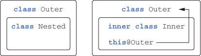
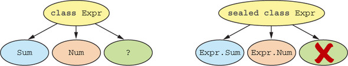

# 4장 클래스, 객체, 인터페이스

코틀린의 클래스와 인터페이스는 자바 클래스, 인터페이스와는 약간 다르다. 예를 들어 인터페이스에 프로퍼티 선언이 들어갈 수 있다. 자바와 달리 코틀린 선언은 기본적으로 final이며 public이다. 게다가 중첩 클래스는 기본적으로는 내부 클래스가 아니다. 즉, 코틀린 중첩 클래스에는 외부 클래스에 대한 참조가 없다.

코틀린 컴파일러는 번잡스러움을 피하기 위해 유용한 메소드를 자동으로 만들어준다. 클래스를 data로 선언하면 컴파일러가 일부 표준 메소드를 생성해준다. 그리고 코틀린 언어가 제공하는 위임\(delegation\)을 사용하면 위임을 처리하기 위한 준비 메소드를 직접 작성할 필요가 없다.

클래스와 인터페이스에 대해 이야기하고 코틀린에서 클래스 계층을 정의할 때 주의해야 할 점에 대해 살펴보자

## 클래스 계층 정의

### 코틀린 인터페이스

코틀린 인터페이스는 자바 8 인터페이스와 비슷하다. 코틀린 인터페이스 안에는 추상 메소드뿐 아니라 구현이 있는 메소드도 정의할 수 있다.

```kotlin
interface Clickable {
		fun click()
}

class Button : Clickable {
		override fun click() = println("I was clicked")
}

// 결과값
// I was clicked
```

코틀린에서는 클래스 이름 뒤에 콜론\(:\)을 붙이고 인터페이스와 클래스 이름을 적는 것으로 클래스 확장과 인터페이스 구현을 모두 처리한다. 자바와 마찬가지로 클래스는 인터페이스를 개수 제한 없이 마음대로구현할 수 있지만, 클래스는 오직 하나만 확장할 수 있다.

인터페이스 메소드도 디폴트 구현을 제공할 수 있다. 그런 경우 메소드 앞에 default를 붙여야 하는 자바 8과 달리 코틀린에서는 메소드를 특별한 키워드로 꾸밀 필요가 없다. 그냥 메소드 본문을 메소드 시그니처 뒤에 추가하면 된다.

```kotlin
interface Clickable {
    fun click() // 일반 메소드 선언
    fun showOff() = println("I'm clickable!") // 디폴트 구현이 있는 메소드
}
```

#### 만약 다중 인터페이스 상속 관계에서 동일한 메소드가 구현되어 있다면?

Focusable 인터페이스를 추가적으로 생성한다.

```kotlin
interface Focusable {
    fun setFocus(b: Boolean) =
        println("I ${if (b) "got" else "lost"} focus.")

    fun showOff() = println("I'm focusable!")
}
```

Button 클래스를 생성하여 Clickable, Focusable 인터페이스를 상속받을 경우에 어떤 메소드를 사용하려고 할까?

```kotlin
class Button : Clickable, Focusable {
    override fun click() = println("I was clicked")
}
```

컴파일 단계에서 아래와 같은 에러 문구를 확인할 수 있을 것이다. 코틀린에서는 중복된 상위 메소드는 하위 클래스에서 반드시 구현되어야 한다는 컴파일 오류가 발생한다.



**자바에서 코틀린의 메소드가 있는 인터페이스 구현하기**  
  
코틀린은 자바 6와 호환되게 설계했다. 따라서 인터페이스의 디폴트 메소드를 지원하지 않는다. 따라서 코틀린은 디폴트 메소드가 있는 인터페이스를 일반 인터페이스와 디폴트 메소드 구현이 정적 메소드로 들어있는 클래스를 조합해 구현한다. 인터페이스에는 메소드 선언만 들어가며, 인터페이스와 함께 생성되는 클래스에는 모든 디폴트 메소드 구현이 정적 메소드로 들어간다. 그러므로 디폴트 인터페이스가 포함된 코틀린 인터페이스를 자바 클래스에서 상속해 구현하고 싶다면 코틀린에서 메소드 본문을 제공하는 메소드를 포함하는 모든 메소드에 대한 본문을 작성해야 한다\(즉 자바에서는 코틀린의 디폴트 메소드 구현에 의존할 수 없다\)


### open, final, abstract 변경자: 기본적으로 final

자바에서는 final로 명시적으로 상속을 금지하지 않는 모든 클래스를 다른 클래스가 상속할 수 있다.

취약한 기반 클래스라는 문제는 하위 클래스가 기반 클래스에 대해 가졌던 가정이 기반 클래스를 변경함으로써 깨져버린 경우에 생긴다. 모든 하위 클래스를 분석하는 것은 불가능하므로 기반 클래스를 변경하는 경우 하위 클래스의 동작이 예기치 않게 바뀔 수도 있다는 면에서 기반 클래스는 '취약'하다.

이 문제를 해결하기 위해 이펙티브 자바에서는 "상속을 위한 설계와 문서를갖추거나, 그럴 수 없다면 상속을 금지하라"라는 조언을 한다. 이는 특별히 하위 클래스에서 오버라이드하게 의도된 클래스와 메소드가 아니라면 모두 final로 만들라는 뜻이다.

코틀린도 마찬가지 철학을 따른다. 코틀린의 클래스와 메소드는 기본적으로 final이다. 어떤 클래스의 상속을 허용하려면 클래스 앞에 open 변경자를 붙여야 한다. 그와 더불어 오버라이드를 허용하고 싶은 메소드나 프러퍼티의 앞에도 open 변경자를 붙여야 한다.

```kotlin
open class RichButton : Clickable { // 이 클래스는 열려있다. 다른 클래스가 이 클래스를 상속할 수 있다. 

    fun disable() {} // 이 함수는 파이널이다. 하위 클래스가 이 메소드를 오버라이드할 수 없다. 

    open fun animate() {} // 이 함수는 열려있다. 하위 클래스에서 이 메소드를 오버라이드해도 된다. 

    override fun click() {} // 이 함수는 (상위 클래스에서 선언된) 열려있는 메소드를 오버라이드 한다. 오버라이드한 메소드는 기본적으로 열려있다. 
}
```

오버라이드하는 메소드의 구현을 하위 클래스에서 오버라이드하지 못하게 금지하려면 오버라이드하는 메소드 앞에 final을 명시해야 한다.

```kotlin
open class RichButton : Clickable {
    // 여기 있는 'final'은 쓸데 없이 붙은 중복이 아니다. 
    // 'final'이 없는 'override' 메소드나 프로퍼티는 기본적으로 열려있다. 
    final override fun click() {}
}
```


**열린 클래스와 스마트 캐스트**  
  
클래스의 기본적인 상속 가능 상태를 final로 함으로써 얻을 수 있는 큰 이익은 다양한 경우에 스마트 캐스트가 가능하다는 점이다. 스마트 캐스트는 타입 검사 뒤에 변경될 수 없는 변수에만 적용 가능하다. 클래스 프로퍼티의 경우 이는 val이면서 커스텀 접근자가 없는 경우에만 스마트 캐스트를 쓸 수 있다는 읨다. 이 요구 사항은 또한 프로퍼티가 final이어야만 한다는 뜻이기도 한다. 프로퍼티가 final이 아니라면 그 프로퍼티를 다른 클래스가 상속하면서 커스텀 접근자를 정의함으로써 스마트 캐스트의 요구 사항을 깰 수 있다. 프로퍼티는 기본적으로 final이기 때문에 따로 고민할 필요 없이 대부분의 프로퍼티를 스마트 캐스트에 활용할 수 있다.


자바처럼 코틀린에서도 클래스를 abstract로 선언할 수 있다. abstract로 선언한 추상 클래스는 인스턴스화할 수 없다. 따라서 추상 멤버 앞에 open 변경자를 명시할 필요가 없다.

```kotlin
abstract class Animated { // 이 클래스는 추상클래스다. 이 클래스의 인스턴스를 만들 수 없다. 
		abstract fun animate() // 이 함수는 추상 함수다. 이 함수에는 구현이 없다. 하위 클래스에서는 이 함수를 반드시 오버라이드해야 한다. 
		open fun stopAnimating() { ... } // 추상 클래스에 속했더라도 비추상 함수는 기본적으로 파이널이지만 원한다면 open으로 오버라이드를 허용할 수 있다. 
		fun animateTwice() { ... } // 추상 클래스에 속했더라도 비추상 함수는 기본적으로 파이널이지만 원한다면 open으로 오버라이드를 허용할 수 있다. 
}
```

인터페이스 멤버의 경우 final, open, abstract를 사용하지 않는다. 인터페이스 멤버는 항상 열려 있으며 final로 변경할 수 없다. 인터페이스 멤버에게 본문이 없으면자동으로 추상 멤버가 되지만, 그렇더라도 따로 멤버 선언 앞에 abstract 키워드를 덧붙일 필요가 없다.

[클래스 내에서상속 제어 변경자의 의미](https://www.notion.so/9ab82905ca7f4a6bb5e5a8c501a64304)

### 가시성 변경자: 기본적으로 공개

자바의 기본 가시성은 패키지 전용은 코틀린에 없다. 코틀린은 패키지를 네임스페이스를 관리하기 위한 용도로만 사용한다. 그래서 패키지를 가시성 제어에 사용하지 않는다.

패키지 전용 가시성에 대한 대안으로 코틀린에는 internal이라는 새로운 가시성 변경자를 도입했다. internal은 "모듈 내부에서만 볼 수 있음"이라는 뜻이다. 모듈은 한 번에 한꺼번에 컴파일되는 코틀린 파일들을 의미한다.

모듈 내부 가시성은 모듈의 구현에 대해 진정한 캡슐화를 제공한다는 장점이 있다. 자바에서는 패키지가 같은 클래스를 선언하기만 하면 어떤 프로젝트의 외부에 있는 코드라도 패키지 내부에 있는 패키지 전용 선언에 쉽게 접근할 수 있다. 그래서 모듈의 캡슐화가 쉽게 깨진다.

코틀린에서는 최상위 선언에 대해 private 가시성을 허용한다. 그런 최상위 선언에는 클래스, 함수, 프로퍼티 등이 포함된다. 비공개 가시성인 최상위 선언은 그 선언이 들어있는 파일 내부에서만 사용할 수 있다. 이 또한 하위 시스템의 자세한 구현 사항을 외부에 감추고 싶을 때 유용한 방법이다.

```kotlin
internal open class TalkativeButton : Focusable {
		private fun yell() = println("Hey!")
		protected fun whisper() = println("Let's talk!")
}

fun TalkativeButton.giveSpeesh() {
		yell()
		whisper() // 오류: "whisper"에 접근할 수 없음: "whisper"는 "TalkativeButton"의 "protected" 멤버임
}
```

코틀린은 public 함수인 giveSpeech 안에서 그보다 가시성이 더 낮은\(이 경우 internal\) 타입인 TalkativeButton을 참조하지 못하게 한다.

자바에서는 같은 패키지 안에서 protected 멤버에 접근할 수 있지만, 코틀린에서는 그렇지 않다는 점에서 자바와 코틀린의 protected가 다르다.


**코틀린의 가시성 변경자와 자바**

코틀린의 변경자는 컴파일된 자바 바이크토드 안에서도 그대로 유지된다. 그렇게 컴파일된 코틀린 선언의 가시성은 자바에서 동일하게 사용할 수 있다. 유일한 예외는 private 클래스다. 자바에서는 클래스를 private으로 만들 수 없으므로 내부적으로 코틀린은 private 클래스를 패키지-전용 클래스로 컴파일한다.

자바에는 internal에 딱 맞는 가시성이 없다. 패키지-전용 가시성은 internal과는 전혀 다르다. 모듈은 보통 여러 패키지로 이뤄지며 서로 다른 모듈에 같은 패키지에 속한 선언이 들어 있을 수도 있다. 따라서 internal 변경자는 바이트코드상에서는 public이 된다.

코틀린 선언과 그에 해당하는 자바 선언에 이런 차이가 있기 때문에 코틀린에서는 접근할 수 없는 대상을 자바에서 접근할 수있는 경우가 생긴다. 예를 들어 다른 모듈에 정의된 internal 클래스나 internal 최상위 선언을 모듈 외부의 자바 코드에서 접근할 수 있다.


### 내부 클래스와 중첩된 클래스: 기본적으로 중첩 클래스

자바처럼 코틀린에서도 클래스 안에 다른 클래스를 선언할 수 있다. 자바와의 차이는 코틀린의 중첩 클래스는 명시적으로 요청하지 않는 한 바깥쪽 클래스 인스턴스에 대한 접근 권한이 없다는 점이다.

View 요소를 하나 만든다고 상상해보자. View 인터페이스 안에는 뷰의 상태를 가져와 저장할 때 getCurrentState와 restoreState 메소드 선언이 있다.

```kotlin
interface State: Serializable

interface View {
		fun getCurrentState(): State
		fun restoreState(state: State) { }
}
```

Button 클래스의 상태를 저장하는 클래스는 Button 클래스 내부에 선언하면 편하다. 자바에서 그런 선언을 어떻게 하는지 살펴보자

```java
// Java 구현
public class Button implements View {
		@Override
		public State getCurrentState() {
				return new ButtonState();
		}
		
		@Override
		public void resoreState(State state) { /*...*/ }
		public class ButtonState implements State { /*...*/ }
}
```

#### 이 코드의 어디가 잘못된 걸까?

왜 선언한 버튼의 상태를 직렬화하면 java.io.NotSerializableException: Button 이라는 오류가 발생할까? 직렬화하려는 변수는 ButtonState 타입의 state 였는데 왜 Button을 직렬화할 수 없다는 예외가 발생할까?

이 예제의 ButtonState 클래스는 바깥쪽 Button 클래스에 대한 참조를 묵시적으로 포함한다. 그 참조로 인해 ButtonState를 직렬화할 수 없다. Button을 직렬화할 수 없으므로 버튼에 대한 참조가 ButtonState의 직렬화를 방해한다.

이 문제를 해결하려면 ButtonState를 static 클래스로 선언해야 한다. 자바에서 중첩 클래스를 static으로 선언하면 그 클래스를 둘러싼 바깥쪽 클래스에 대한 묵시적인 참조가 사라진다. 그렇다면 코틀린은 어떠한지 살펴보자

```kotlin
class Button : View {
		
		override fun getCurrentState(): State = ButtonState();
				
		override fun resoreState(State state) { /*...*/ }

		class ButtonState : State { /*...*/ }
}
```

코틀린 중첩 클래스에 아무런 변경자가 붙지 않으면 자바 static 중첩 클래스와 같다. 이를 내부 클래스로 변경해서 바깥쪽 클래스에 대한 참조를 포함하게 만들고 싶다면 inner 변경자를 붙여야 한다.



[https://livebook.manning.com/book/kotlin-in-action/chapter-4/83](https://livebook.manning.com/book/kotlin-in-action/chapter-4/83)

코틀린에서 바깥쪽 클래스의 인스턴스를 가르키려면 내부 클래스 Inner 안에서 this@Outer라고 써야 한다.

### 봉인된 클래스: 클래스 계층 정의 시 계층 확장 제한

상위 클래스인 Expr에는 숫자를 표현하는 Num과 덧셈 연산을 표현하는 Sum이라는 두 하위 클래스가 있다. when 식에서 이 모든 하위 클래스를 처리하면 편리하다. 하지만 when 식에서 Num과 Sum이 아닌 경우를 처리하는 else 분기를 반드시 넣어줘야만 한다.

```kotlin
interface Expr
class Num(val value: Int) : Expr
class Sum(val left: Expr, val right: Expr) : Expr

fun eval(e: Expr): Int =
    when (e) {
        is Num -> e.value
        is Sum -> eval(e.right) + eval(e.left)
        else -> // "else" 분기가 꼭 있어야 한다. 
            throw IllegalArgumentException("Unknown expression")
    }
```

항상 디폴트 분기를 추가하는 게 편하지는 않다. 그리고 디폴트 분기가 있으면 이런 클래스 계층에 새로운 하위 클래스를 추가하더라도 컴파일러가 when이 모든 경우를 처리하는지 제대로 검사할 수 없다. 혹 실수로 새로운 클래스 처리를 잊어버렸더라도 디폴트 분기가 선택되기 때문에 심각한 버그가 발생할 수 있다.

코틀린은 이런 문제에 대한 해법을 제공한다. sealed 클래스가 그 답이다. 상위 클래스에 sealed 변경자를 붙이면 그 상위 클래스를 상속한 하위 클래스 정의를 제한할 수 있다. sealed 클래스의 하위 클래스를 정의할 때는 반드시 상위 클래스 안에 중첩시켜야 한다.

```kotlin
sealed class Expr {
    class Num(val value: Int) : Expr()
    class Sum(val left: Expr, val right: Expr) : Expr()
}

fun eval(e: Expr): Int =
    when (e) {
        is Expr.Num -> e.value
        is Expr.Sum -> eval(e.right) + eval(e.left)
    }
```




sealed 클래스

sealed는 너무 제약이 심하다. 예를 들어 모든 하위 클래스는 중첩 클래스여야 하고, 데이터 클래스로 sealed 클래스를 상속할 수도 없다. 코틀린 1.1부터는 이 제한이 완화됐다. 봉인된 클래스와 같은 파일의아무데서나 봉인된 클래스를 상속한 하위 클래스를 만들 수 있고, 데이터 클래스로 하위 클래스를 정의할 수도 있다.


## 뻔하지 않은 생성자와 프로퍼티를 갖는 클래스 선언

코틀린은 주\(primary\) 생성자와 부\(secondary\) 생성자를 구분한다. 또한 코틀린에서는 초기화 블록\(initializer block\)을 통해 초기화 로직을 추가할 수있다.

### 클래스 초기화: 주 생성자와 초기화 블록

주 생성자는 생성자 파라미터를 지정하고 그 생성자 파라미터에 의해 초기화되는 프로퍼티를 정의하는 두 가지 목적에 쓰인다.

```kotlin
class User constructor(_nickname: String) { // 파라미터가 하나만 있는 주 생성자
		val nickName: String

		init { // 초기화 블록
				nickName = _nickName
		}
}
```

초기화 블록은 주 생성자와 함께 사용된다. 주 생성자는 제한적이기 때문에 별도의 코드를 포함할 수 없으므로 초기화 블록이 필요하다. 필요하다면 클래스 안에 여러 초기화 블록을 선언할 수 있다.

### 부 생성자: 상위 클래스를 다른 방식으로 초기화

일반적으로 코틀린에서는 생성자가 여럿 있는 경우가 자바보다 훨씬 적다. 그래도 생성자가 여럿 필요한 경우가 가끔 있다. 부 생성자가 필요한 이유는 자바 상호운용성이다.

하지만 부 생성자가 필요한 다른 경우도 있다. 클래스 인스턴스를 생성할 때 파라미터 목록이 다른 생성 방법이 여럿 존재하는 경우에는 부 생성자를 여럿 둘 수밖에 없다.

### 인터페이스에 선언된 프로퍼티 구현

사실 인터페이스는 아무 상태도 포함할 수 없으므로상태를 저장할 필요가 있다면 인터페이스를 구현한 하위 클래스에서 상태 저장을 위한 프로퍼티 등을 만들어야 한다.

이제 이 인터페이스를 구현하는 방법을 몇 가지 살펴보자

```kotlin
interface User {
		val nickName: String
}

class PrivateUser(override val nickname: String) : User // 주 생성자에 있는 프로퍼티

class SubscribingUser(val email: String) : User {
    override val nickname: String // 커스텀 게터
        get() = email.substringBefore('@')
}

class FacebookUser(val accountId: Int) : User {
    override val nickname = getFacebookName(accountId) // 프로퍼티 초기화 식
}
```

SubscribingUser와 FacebookUser의 nickname 구현 차이에 주의하라. 그 둘은 비슷해 보이지만, SubscribingUser의 nickname은 매번 호출될 때마다 substringBefore를 호출해 계산하는 커스텀 게터를 활용하고, FacebookUser의nickname은 객체 초기화 시 계산한 데이터를 뒷받침하는 필드에 저장했다가 불러오는 방식을 활용한다.

인터페이스에는 추상 프로퍼티뿐 아니라 게터와 세터가 있는 프로퍼티를 선언할 수도 있다. 물론 그런 게터와 세터는 뒷받침하는 필드를 참조할 수 없다.\(뒷받침하는 필드가 있다면 인터페이스에 상태를 추가하는 샘인데 인터페이스는 상태를 저장할 수 없다\)

```kotlin
interface User {
		val email: String
		val nickName: String
				get() = email.substringBefore('@') // 프로퍼티에 뒷받침하는 필드가 없다.대신 매번 결과를 계산해 돌려준다. 
}
```

하위 클래스는 추상 프로퍼티인 email을 반드시 오버라이드해야 한다. 반면 nickname은 오버라이드하지 않고 상속할 수 있다.

### 게터와 세터에서 뒷받침하는 필드에 접근

값을 저장하는 동시에 로직을 실행할 수 있게 하기 위해서는 접근자 안에서 프로퍼티를 뒷받침하는 필드에 접근할 수 있어야 한다.

프로퍼티에 저장된 값의 변경 이력을 로그에 남기려는 경우를 생각해보자. 그런 경우 변경 가능한 프로퍼티를 정의하되 세터에서 프로퍼티 값을 바꿀 때마다 약간의 코드를 추가로 실행해야 한다.

```kotlin
class User(val name: String) {
    var address: String = "unspecified"
        set(value: String) {
            println("""
                Address was changed for $name:
                "$field" -> "$value".""".trimIndent())
            field = value
        }
}

>> val user = User("Alice")
>> user.address = "Elsenheimerstrasse 47, 80687 Muenchen"
Address was changed for Alice:
"unspecified" -> "Elsenheimerstrasse 47, 80687 Muenchen".
```

### 접근자의 가시성 변경

접근자의 가시성은 기본적으로 프로퍼티의 가시성과 같다. 하지만 원한다면 get이나 set 앞에 가시성 변경자를 추가해서 접근자의 가시성을 변경할 수 있다.

```kotlin
class LengthCounter {
    var counter: Int = 0
        private set // 이 클래스 밖에서 이 프로퍼티의 값을 바꿀 수 없다. 

    fun addWord(word: String) {
        counter += word.length
    }
}
```

> 프로퍼티에 대해 나중에 다룰 내용

* lateinit 변경자를 널이 될 수 없는 프로퍼티에 지정하면 프로퍼티를 생성자가 호출된 다음에 초기화한다는 뜻이다. 일부 프레임워크에서는 이런 특성이 꼭 필요하다.
* 요청이 들어오면 비로소 초기화되는 지연 초기화\(lazy initialized\) 프로퍼티는 더 일반적인 위임 프로퍼티\(delefated property\)의 일종이다.
* 자바 프레임워크와의 호환성을 위해 자바의 특징을 코틀린에서 애뮬레이션 하는 애노테이션을 활용할 수 있다.

## 컴파일러가 생성한 메소드: 데이터 클래스와 클래스 위임

자바 플랫폼에서는 클래스가 equals, hashCode, toString 등의 메소드를 구현해야 한다. 하지만 코틀린 컴파일러는 이런 메소드를 기계적으로 생성하는 작업을 보이지 않는 곳에서 해준다. 따라서 필수 메소드로 인한 잡음 없이 소스코드를 깔끕하게 유지할 수 있다.

### 데이터 클래스: 모든 클래스가 정의해야 하는 메소드 자동 생성

어떤 클래스가 데이터를 저장하는 역할만을 수행한다면 toString, equals, hashCode를 반드시 오버라이드해야 한다. 다행히 IDE는 자동으로 그런 메소드를 정의해주고, 작성된 메소드의 정확성을 일관성을 검사해준다.

코틀린은 더 편리하다. data라는 변경자를 클래스 앞에 붙이면 필요한 메소드를 컴파일러가 자동으로 만들어준다.

```kotlin
data class Client(val name: String, val postalCode: Int)
```

이제 Client 클래스는 자바에서 요구하는 모든 메소드를 포함한다.

* 인스턴스 간 비교를 위한 euqals
* HashMap과 같은 해시 기반 컨테이너에서 키로 사용할 수 있는 hashCode
* 클래스의 각 필드를 각 순서대로 표시하는 문자열 표현을 만들어주는 toString

#### 데이터 클래스와 불변성: copy\(\) 메소드

데이터 클래스의모든 프러피를 읽기 전용으로 만들어서 데이터 클래스를 불변 클래스로 만들라고 권장한다. HashMap 등의 컨테이너에 데이터 클래스 객체를 담는 경우엔 불변성은 필수적이다.

데이터 클래스 인스턴스를 불변 객체로 더 쉽게 활용할 수 있게 코틀린 컴파일러는 한 가지 편의 메소드를 제공한다. 그 메소드는 객체를 복사하면서 일부 프로퍼티를 바꿀 수 있게 해주는 copy 메소드다. 복사본은 원본과 다른 생명주기를 가지며, 복사를하면서 일부 프로퍼티 값을 바꾸거나 복사본을 제거해도 프로그램에서 원본을 참조하는 다른 부분에 전혀 영향을 끼치지 않는다.

### 클래스 위임: by 키워드 사용

종종 상속을 허용하지 않는 클래스에 새로운 동작을 추가해야 할 때가 있다. 이럴 때 사용하는 일반적인 방법이 데코레이터 패턴이다. 이 패턴의 핵심은 상속을 허용하지 않는 클래스 대신 사용할 수 있는 새로운 클래스를 만들되 기존 클래스와 같은 인터페이스를 데코레이터가 제공하게 만들고, 기존 클래스를 데코레이터 내부에 필드로 유지하는 것이다. 이런 접근 방법의 단점은 준비 코드가 상당히 많이 필요하다는 점이다.

```kotlin
class DelegatingCollection<T> : Collection<T> {
		private val innerList = arrayListOf<T>()

		override val size: Int get() = innerList.size
		override val isEmpty() : Boolean = innerList.isEmpty()
		override val contains(element: T): Boolean = innerList.contains(element)
		override val iterator(): Iterator<T> = innerList.iterator()
		override val containsAll(elements): Boolean = innerList.containsAll(elements)
}
```

코틀린에서는 인터페이스를 구현할 때 by 키워드를 통해 그 인터페이스에 대한 구현을 다른 객체에 위임 중이라는 사실을 명시할 수있다.

```kotlin
class CountingSet<T>(
        val innerSet: MutableCollection<T> = HashSet<T>()
) : MutableCollection<T> by innerSet {

    var objectsAdded = 0

    override fun add(element: T): Boolean {
        objectsAdded++
        return innerSet.add(element)
    }

    override fun addAll(c: Collection<T>): Boolean {
        objectsAdded += c.size
        return innerSet.addAll(c)
    }
}
```

add와 addAll을 오버라이드해서 카운터를 증가시키고, MutableCollection 인터페이스의 나머지 메소드는 내부 컨테이너\(innerSet\)에게 위임한다.

## object 키워드: 클래스 선언과 인스턴스 생성

object 키워드를 사용하는 여러 상황을 살펴보자

* 객체 선언은 싱글턴을 정의하는 방법 중 하나다.
* 동반 객체는 인스턴스 메소드는 아니지만 어떤 클래스와 관련 있는 메소드와 팩토리 메소드를 담을 때 쓰인다. 동반 객체 메소드는 접근할 때는 동반 객체가 포함된 클래스의 이름을 사용할 수 있다.
* 객체 식은 자바의 무명 내부 클래스 대신 쓰인다.

### 객체 선언: 싱글턴을 쉽게 만들기

자바에서는 보통 클래스의 생성자를 private으로 제한하고 정적인 필드에 그 클래스의 유일한 객체를 저장하는 싱글턴 패턴을 통해 이를 구현한다. 반면에 코틀린은 객체 선언 기능을 통해 싱글턴을 언어에서 기본 지원한다. 객체 선언은 클래스 선언과 그 클래스에 속한 단일 인스턴스의 선언을 합친 선언이다.

```kotlin
object CaseInsensitiveFileComparator : Comparator<File> {
    override fun compare(file1: File, file2: File): Int {
        return file1.path.compareTo(file2.path,
                ignoreCase = true)
    }
}

fun main(args: Array<String>) {
    println(CaseInsensitiveFileComparator.compare(
        File("/User"), File("/user")))
    val files = listOf(File("/Z"), File("/a"))
    println(files.sortedWith(CaseInsensitiveFileComparator))
}
```

객체 선언도 클래스나 인터페이스를 상속할 수 있다. 프레임워크를 사용하기 위해 특정 인터페이스를 구현해야 하는데, 그 구현 내부에 다른 상태가 필요하지 않은 경우에 이런 기능이 유용하다.


_싱글턴과 의존관계 주입_

싱글턴 패턴과 마찬가지 이유로 대규모 소프트웨어 시스템에서는 객체 선언이 항상 적합하지는 않다. 이유는 객체 생성을 제어할 방법이 없고 생성자 파라미터를 지정할 수 없어서다. 이는 단위 테스트를 하거나 소프트웨어 시스템의 설정이 달라질 때 객체를 대체하거나 객체의 의존관계를 바꿀 수 없다. 따라서 그런 기능이 필요하다면 자바와 마찬가지로 의존관계 주입 프레임워크와 코틀린 클래스를 함께 사용해야 한다.


클래스 안에서 객체를 선언할 수도 있다. 그런 객체도 인스턴스는 단 하나뿐이다.

```kotlin
data class Person(val name: String) {
    object NameComparator : Comparator<Person> {
        override fun compare(p1: Person, p2: Person): Int =
            p1.name.compareTo(p2.name)
    }
}

fun main(args: Array<String>) {
    val persons = listOf(Person("Bob"), Person("Alice"))
    println(persons.sortedWith(Person.NameComparator))
}
```

### 동반 객체: 팩토리 메소드와 정적 멤버가 들어갈 장소

코틀린 클래스 안에는 정적인 멤버가 없다. 코틀린 언어는 자바 static 키워드를 지원하지 않는다. 그 대신 코틀린에서는 패키지 수준의 최상위 함수와 객체 선언을 활용할 수 있다.

클래스 안에 정의된 객체 중 하나에 companion이라는 특별한 표시를 붙이면 그 클래스의 동반 객체로 만들 수 있다. 동반 객체의 프로퍼티나 메소드에 접근하려면 그 동반 객체가 정의된 클래스 이름을 사용한다.

```kotlin
class A {
		companion object {
				fun bar() {
						println("Companion object called")
				}
		}
}

>>> A.bar()
Companion object called
```

private 생성자를 호출하기 좋은 위치를 알려준다는 했던 사실을 기억하는가? 바로 동반 객체가 private 생성자를 호출하기 좋은 위치다. 동반 객체는 자신을 둘러싼 클래스의 모든 private 멤버에 접근할 수 있다.

```kotlin
class User private constructor(val nickname: String) {
    companion object {
        fun newSubscribingUser(email: String) =
            User(email.substringBefore('@'))

        fun newFacebookUser(accountId: Int) =
            User(getFacebookName(accountId))
    }
}

fun main(args: Array<String>) {
    val subscribingUser = User.newSubscribingUser("bob@gmail.com")
    val facebookUser = User.newFacebookUser(4)
    println(subscribingUser.nickname)
}
```

### 동반 객체를 일반 객체처럼 사용

동반 객체는 클래스 안에 정의된 일반 객체다. 따라서 동반 객체에 이름을 붙이거나, 동반 객체가 인터페이스를 상속하거나, 동반 객체 안에 확장 함수와 프로퍼티를 정의할 수 있다.

```kotlin
class Person(val name: String) {
		companion object Loader {
				fun fromJSON(jsonText: String) : Person = ... // 동반 객체에 이름을 붙인다
		}
}

>>> person = Person.Loader.fromJSON("{name: 'Dmitry'}")
>>> person.name
Dmitry
>>> person2 = Person.fromJSON("{name: 'Brent'}")
>>> person2.name
Brent
```

특별히 이름을 지정하지 않으면 동반 객체 이름은 자동으로 Companion이 된다.

#### 동반 객체에서 인터페이스 구현

다른 객체 선언과 마찬가지로 동반 객체도 인터페이스를 구현할 수 있다.

```kotlin
interface JSONFactory<T> {
		fun fromJSON(jsonText: String): T
}
class Person(val name: String) {
		companion object : JSONFactory<Person> {
				override fun fromJSON(jsonText: String): Person = ... // 동반 객체가 인터페이스를 구현한다. 
		}
}
```

이제 JSON으로부터 각 원소를 다시 만들어내는 추상 팩토리가 있다면 Person 객체를 그 팩토리에게 넘길 수 있다.

> 코틀린 동반 객체와 정적 멤버

클래스와 동반 객체는 일반 객체와 비슷한 방식으로, 클래스에 정의된 인스턴스를 가리키는 정적 필드로 컴파일된다. 동반 객체에 이름을 붙이지 않았다면자바 쪽에서 Companion이라는 이름으로 그 참조에 접근할 수 있다.

### 객체 식: 무명 내부 클래스를 다른 방식으로 작성

무명 객체\(anonymous object\)를 정의할 때도 object 키워드를 쓴다. 무명 객체는 자바의무명 내부 클래스를 대신한다.

```kotlin
window.addMouseListener(
		object : MouseAdapter() {
				override fun mouseClicked(e: MouseEvent) { ... }
				override fun mouseEntered(e: MouseEvent) { ... }
		}
)

val listener = object : MouseAdapter() {
		override fun mouseClicked(e: MouseEvent) { ... }
		override fun mouseEntered(e: MouseEvent) { ... }
}
```

한 인터페이스만 구현하거나 한 클래스만 확장할 수 있는 자바의 무명 내부 클래스와 달리 코틀린 무명 클래스는 여러 인터페이스를 구현하거나 클래스를 확장하면서 인터페이스를 구현할 수 있다.

자바의 무명 클래스와 같이 객체 식 안의 코드는 그 식이 포함된 함수의 변수에 접근할 수 있다. 하지만 자바와 달리 final이 아닌 변수도 객체 식 안에서 사용할 수 있다.

## 요약

* 코틀린의 인터페이스는 자바 인터페이스와 비슷하지만 디폴트 구현을 포함할 수 있고, 프로퍼티도 포함할 수 있다.
* 모든 코틀린 선언은 기본적으로 final이며 public이다.
* 선언이 final이 되지 않게 만들려면\(상속과 오버라이딩이 가능하게 하려면\) 앞에 open을 붙여야 한다.
* internal 선언은 같은 모듈 안에서만 볼 수 있다.
* 중첩 클래스는 기본적으로 내부 클래스가 아니다. 바깥쪽 클래스에 대한 참조를 중첩 클래스안에 포함시키려면 inner 키워드를 중첩 클래스 선언 앞에 붙여서 내부 클래스로 만들어야 한다.
* sealed 클래스를 상속하는 클래스를 정의하려면 반드시 부모 클래스 정의 안에 중첩\(또는 내부\) 클래스로 정의해야 한다.\(코틀린 1.1부터는 같은 파일 안에만 있으면 된다\)
* 초기화 블록과 부 생성자를 활용해 클래스 인스턴스를 더 유연하게 초기화할 수 있다.
* field 식별자를 통해 프로퍼티 접근자\(게터와 세터\) 안에서 프로퍼티의 데이터를 저장하는 데 쓰이는 뒷받침하는 필드를 참조할 수 있다.
* 데이터 클래스를 사용하면 컴파일러가 equals, hashCode, toString, copy 등의 메소드를 자동으로 생성해준다.
* 클래스 위임을 사용하면 위임 패턴을 구현할 때 필요한 수많은 성가신 준비 코드를 줄일 수 있다.
* 객체 선언을 사용하면 코틀린답게 싱글턴 클래스를 정의할 수 있다.
* 동반 객체는 자바의 정적 메소드와 필드 정의를 대신한다.
* 동반 객체도 다른 \(싱글턴\) 객체와 마찬가지로 인터페이스를 구현할 수 있다. 외부에서 동반 객체에 대한 확장 함수와 프로퍼티를 정의할 수 있다.
* 코틀린의 객체 식은 자바의 무명 내부 클래스를 대신한다. 하지만 코틀린 객체식은 여러 인스턴스를 구현하거나 객체가 포함된 영역\(scope\)에 있는 변수의 값을 변경할 수 있는 등 자바 무명 내부 클래스보다 더 많은 기능을 제공한다.

