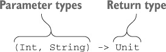

# 8장 고차 함수: 파라미터와 반환 값으로 람다 사용

## 고차 함수 정의

고차 함수는 다른 함수를 인자로 받거나 함수를 반환하는 함수다. 코틀린에서는 람다나 함수 참조를 사용해 함수를 값으로 표현할 수 있다. 따라서 고차 함수는 람다나 함수 참조를 인자로 넘길 수 있거나 람다나 함수 참조를 반환하는 함수다.

### 함수 타입

함수 타입을 정의하려면 함수 파라미터의 타입을 괄호 안에 넣고, 그 뒤에 화살표\(→\)를 추가한 다음, 함수의 반환 타입을 지정하면 된다.



Unit 타입은 의미 있는 값을 반환하지 않는 함수 반환 타입에 쓰는 특별한 타입이다. 그냥 함수를 정의한다면 함수의 파라미터 목록 뒤에 오는 Unit 반환 타입 지정을 생략해도 되지만, 함수 타입을 선언할 때는 반환 타입을 반드시 명시해야 하므로 Unit을 빼먹어서는 안 된다.

### 인자로 받은 함수 호출

인자로 받은 함수를 호출하는 구문은 일반 함수를 호출하는 구문과 같다.

```kotlin
fun twoAndThree(operation: (Int, Int) -> Int) {
    val result = operation(2, 3)
    println("The result is $result")
}

fun main(args: Array<String>) {
    twoAndThree { a, b -> a + b }
    twoAndThree { a, b -> a * b }
}
```

### 디폴트 값을 지정한 함수 타입 파라미터나 널이 될 수 있는 함수 타입 파라미터

파라미터를 함수 타입으로 선언할 때도 디폴트 값을 정할 수 있다.

```kotlin
fun <T> Collection<T>.joinToString(
        separator: String = ", ",
        prefix: String = "",
        postfix: String = "",
        transform: (T) -> String = { it.toString() } // 함수 타입 파라미터를 선언하면서 람다를 디폴트 값으로 지정한다. 
): String {
    val result = StringBuilder(prefix)

    for ((index, element) in this.withIndex()) {
        if (index > 0) result.append(separator)
        result.append(transform(element)) // "transform" 파라미터로 받은 함수를 호출한다. 
    }

    result.append(postfix)
    return result.toString()
}

fun main(args: Array<String>) {
    val letters = listOf("Alpha", "Beta")
    println(letters.joinToString()) // 디폴트 변환 함수를 사용한다. -> Alpha, Beta
    println(letters.joinToString { it.toLowerCase() }) // 람다를 인자로 전달한다. -> alpha, beta
    println(letters.joinToString(separator = "! ", postfix = "! ",
           transform = { it.toUpperCase() })) // 이름 붙은 인자 구문을 사용해 람다를 포함하는 여러 인자를 전달한다. -> ALPHA! BETA!
}
```

### 함수를 함수에서 반환

다른 함수를 반환하는 함수를 정의하려면 함수의 반환 타입으로 함수 타입을 지정해야 한다. 함수를 반환하려면 return 식에 람다나 멤버 참조나 함수 타입의 값을 계산하는 식 등을 넣으면 된다.

```kotlin
data class Person(
        val firstName: String,
        val lastName: String,
        val phoneNumber: String?
)

class ContactListFilters {
    var prefix: String = ""
    var onlyWithPhoneNumber: Boolean = false

    fun getPredicate(): (Person) -> Boolean { // 함수를 반환하는 함수를 정의한다. 
        val startsWithPrefix = { p: Person ->
            p.firstName.startsWith(prefix) || p.lastName.startsWith(prefix)
        }
        if (!onlyWithPhoneNumber) {
            return startsWithPrefix // 함수 타입의 변수를 반환한다. 
        }
        return { startsWithPrefix(it)
                    && it.phoneNumber != null } // 람다를 반환한다. 
    }
}

fun main(args: Array<String>) {
    val contacts = listOf(Person("Dmitry", "Jemerov", "123-4567"),
                          Person("Svetlana", "Isakova", null))
    val contactListFilters = ContactListFilters()
    with (contactListFilters) {
        prefix = "Dm"
        onlyWithPhoneNumber = true
    }
    println(contacts.filter(
        contactListFilters.getPredicate()))
}
```

### 람다를 활용한 중복 제거

함수 타입과 람다 식은 재활용하기 좋은 코드를 만들 때 쓸 수 있는 훌륭한 도구다. 웹 사이트 방문 기록을 분석하는 예를 살펴보자.

```kotlin
data class SiteVisit(
    val path: String,
    val duration: Double,
    val os: OS
)

enum class OS { WINDOWS, LINUX, MAC, IOS, ANDROID }

val log = listOf(
    SiteVisit("/", 34.0, OS.WINDOWS),
    SiteVisit("/", 22.0, OS.MAC),
    SiteVisit("/login", 12.0, OS.WINDOWS),
    SiteVisit("/signup", 8.0, OS.IOS),
    SiteVisit("/", 16.3, OS.ANDROID)
)

val averageWindowsDuration = log
    .filter { it.os == OS.WINDOWS }
    .map(SiteVisit::duration)
    .average()
```

이는 함수를 사용하여 일반 함수를 통해 중복을 줄일 수 있다.

```kotlin
fun List<SiteVisit>.averageDurationFor(os: OS) =
        filter { it.os == os }.map(SiteVisit::duration).average()

fun main(args: Array<String>) {
    println(log.averageDurationFor(OS.WINDOWS))
    println(log.averageDurationFor(OS.MAC))
}
```

하지만 이 함수는 충분히 강력하지 않다. 만약 모바일 디바이스\(IOS, 안드로이드\)의 평균 방문 시간을 구하고 싶다거나 IOS 사용자의 /signup 페이지 평균 방문 시간을 구하고 싶을 경우는 어떻게 해야 할까?

이는 고차 함수를 이용하여 함수를 확장할 수 있다.

```kotlin
fun List<SiteVisit>.averageDurationFor(predicate: (SiteVisit) -> Boolean) =
        filter(predicate).map(SiteVisit::duration).average()

fun main(args: Array<String>) {
    println(log.averageDurationFor {
        it.os in setOf(OS.ANDROID, OS.IOS) })
    println(log.averageDurationFor {
        it.os == OS.IOS && it.path == "/signup" })
}
```

## 인라인 함수: 람다의 부가 비용 없애기

반복되는 코드를 별도의 라이브러리 함수로 빼내되 컴파일러가 자바의 일반 명령문만큼 효율적인 코드를 생성하게 만들 수는 없을까? 코틀린 컴파일러에서는 그런 일이 가능하다. inline 변경자를 어떤 함수에 붙이면 컴파일러는 그 함수를 호출하는 모든 문장을 함수 본문에 해당하는 바이트코드로 바꿔치기 해준다.

### 인라이닝이 작동하는 방식

어떤 함수를 inline으로 선언하면 그 함수의 본문이 인라인된다. 다른 말로 하면 함수를 호출하는 코드를 함수를 호출하는 바이트코드 대신에 함수 본문을 번역한 바이트 코드로 컴파일한다는 뜻이다.

### 컬렉션 연산 인라이닝

코틀린 표준 라이브러리의 컬렉션 함수는 대부분 람다를 인자로 받는다. filter와 map은 인라인 함수다. 따라서 그 두 함수의 본문은 인라이닝되며, 추가 객체나 클래스 생성은 없다. 하지만 이 코드는 리스트를 걸러낸 결과를 저장하는 중간 리스트를 만든다. 처리할 원소가 많아지면 중간 리스트를 사용하는 부가 비용도 걱정할 만큼 커진다. asSequence를 통해 리스트 대신 시퀀스를 사용하면 중간 리스트로 인한 부가 비용은 줄어든다. 이때 각 중간 시퀀스는 람다를 필드에 저장하는 객체로 표현되며, 최종 연산은 중간 시퀀스에 있는 여러 람다를 연쇄 호출한다.

### 함수를 인라인으로 선언해야 하는 경우

inline 키워드의 이점을 배우고 나면 코드를 더 빠르게 만들기 위해 코드 여기저기에서 inline을 사용하고 싶어질 것이다. 하지만 사실 이는 좋은 생각이 아니다. inline 키워드를 사용해도 람다를 인자로 받는 함수만 성능이 좋아질 가능성이 높다.

일반 함수 호출의 경우 JVM은 이미 강력하게 인라이닝을 지원한다. JVM은 코드 실행을 분석해서 가장 이익이 되는 방향으로 호출을 인라이닝한다. 이런 과정은 바이트코드를 실제 기계어 코드로 번역하는 과정\(JIT\)에서 일어난다. 이런 JVM의 최적화를 활용한다면 바이트코드에서는 각 함수 구현이 정확히 한 번만 있으면 되고, 그 함수를 호출하는 부분에서 따로 함수 코드를 중복할 필요가 없다. 반면 코틀린 인라인 함수는 바이트 코드에서 각 함수 호출 지점을 함수 본문으로 대치하기 때문에 코드 중복이 생긴다. 게다가 함수를 직접 호출하면 스택 트레이스가 더 깔끔해진다.

inline 변경자를 함수에 붙일 때는 코드 크기에 주의를 기울여야 한다. 인라이닝하는 함수가 큰 경우 함수의 본문에 해당하는 바이트코드를 모든 호출 지점에 복사해 넣고 나면 바이트코드가 전체적으로 아주 커질 수 있다.

### 자원 관리를 위해 인라인된 람다 사용

자바 7부터는 자원을 관리하기 위한 특별한 구문인 try-with-resource문이 생겼다.

```kotlin
static String readFirstLineFromFile(String path) throws IOException {
		try (BufferedReader br = 
						new BufferedReader(new FileReader(path))) {
				return br.readLine();
		}
}
```

코틀린 언어는 이와 같은 기능을 언어 구성 요소로 제공하지는 않는다. 대신 자바 try-with-resource와 같은 기능을 제공하는 use라는 함수가 코틀린 표준 라이브러리 안에 들어있다.

```kotlin
fun readFirstLineFromFile(path: String): String {
    BufferedReader(FileReader(path)).use { br ->
        return br.readLine()
    }
}
```

use 함수는 닫을 수 있는\(closeable\) 자원에 대한 확장 함수며, 람다를 인자로 받는다. use는 람다를 호출한 다음에 자원을 닫아준다.

## 고차 함수 안에서 흐름 제어

### 람다 안의 return문: 람다를 둘러싼 함수로부터 반환

다음 코드의 실행 결과를 보면 이름이 Alice인 경우에 lookForAlice 함수로부터 반환된다는 사실을 분명히 알 수 있다.

```kotlin
data class Person(val name: String, val age: Int)

val people = listOf(Person("Alice", 29), Person("Bob", 31))

fun lookForAlice(people: List<Person>) {
    for (person in people) {
        if (person.name == "Alice") {
            println("Found!")
            return
        }
    }
    println("Alice is not found")
}
```

이 코드를 forEach로 바꿔 써도 괜찮을까?

```kotlin
fun lookForAlice(people: List<Person>) {
    people.forEach {
        if (it.name == "Alice") {
            println("Found!")
            return
        }
    }
    println("Alice is not found")
}
```

람다 안에서 return을 사용하면 람다로부터만 반환되는 게 아니라 그 람다를 호출하는 함수가 실행을 끝내고 반환된다. 그렇게 자신을 둘러싸고 있는 블록보다 더 바깥에 있는 다른 블록을 반환하게 만드는 return 문을 넌로컬\(non-local\) return이라 부른다.

이렇게 return이 바깥쪽 함수를 반환시킬 수 있는 때는 람다를 인자로 받는 함수가 인라인 함수인 경우뿐이다. 예제에서 forEach는 인라인 함수이므로 람다 본문과 함께 인라이닝된다. 따라서 return 식이 바깥쪽 함수\(여기서는 lookForAlice\)를 반환시키도록 쉽게 컴파일할 수 있다.

### 람다로부터 반환: 레이블을 사용한 return

람다 식에서도 로컬 return을 사용할 수 있다. 람다 안에서 로컬 return은 for루프의 break와 비슷한 역할을 한다. 로컬 return과 넌로컬 return을 구분하기 위해 레이블\(label\)을 사용해야 한다.

```kotlin
fun lookForAlice(people: List<Person>) {
    people.forEach label@{
        if (it.name == "Alice") return@label
    }
    println("Alice might be somewhere")
}
```

람다에 레이블을 붙여서 사용하는 대신 람다를 인자로 받는 인라인 함수의 이름을 return 뒤에 레이블로 사용해도 된다.

```kotlin
fun lookForAlice(people: List<Person>) {
    people.forEach {
        if (it.name == "Alice") return@forEach
    }
    println("Alice might be somewhere")
}
```

### 무명 함수: 기본적으로 로컬 return

무명 함수는 코드 블록을 함수에 넘길 때 사용할 수 있는 다른 방법이다.

```kotlin
fun lookForAlice(people: List<Person>) {
    people.forEach(fun (person) {
        if (person.name == "Alice") return
        println("${person.name} is not Alice")
    })
}
```

무명 함수는 일반 함수와 비슷해 보인다. 차이는 함수 이름이나 파라미터 타입을 생략할 수 있다는 점뿐이다. 무명 함수 안에서 레이블이 붙지 않은 return 식은 무명 함수 자체를 반환시킬 뿐 무명 함수를 둘러싼 다른 함수를 반환시키지 않는다. 사실 return에 적용되는 규칙은 단순히 return은 fun 키워드를 사용해 정의된 가장 안쪽 함수를 반환시킨다는 점이다. 람다 식의 구현 방법이나 람다 식을 인라인 함수에 넘길 때 어떻게 본문이 인라이닝 되는지 등의 규칙을 무명 함수에도 모두 적용할 수 있다.

## 요약

* 함수 타입을 사용해 함수에 대한 참조를 담는 변수나 파라미터나 반환 값을 만들 수 있다.
* 고차 함수는 다른 함수를 인자로 받거나 함수를 반환한다. 함수의 파라미터 타입이나 반환 타입으로 함수 타입을 사용하면 고차 함수를 선언할 수 있다.
* 인라인 함수를 컴파일할 때 컴파일러는 그 함수의 본문과 그 함수에게 전달된 람다의 본문을 컴파일한 바이트코드를 모든 함수 호출 지점에 삽입해준다. 이렇게 만들어지는 바이트코드는 람다를 활용한 인라인 함수 코드를 풀어서 집적 쓴 경우와 비교할 때 아무 부가 비용이 들지 않는다.
* 고차 함수를 사용하면 컴포넌트를 이루는 각 부분의 코드를 더 잘 재사용할 수 있다. 또 고차 함수를 활용해 강력한 제네릭 라이브러리를 만들 수 있다.
* 인라인 함수에서는 람다 안에 있는 return 문이 바깥쪽 함수를 반환시키는 넌로컬 return을 사용할 수 있다.
* 무명 함수는 람다 식을 대신할 수 있으며 return 식을 처리하는 규칙이 일반 람다 식과는 다르다. 본문 여러 곳에서 return 해야 하는 코드 블록을 만들어야 한다면 람다 대신 무명 함수를 쓸 수 있다.

