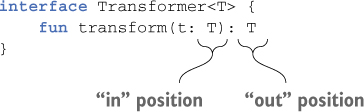
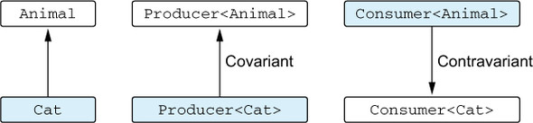

# 9장 제네릭스

## 제네릭 타입 파라미터

### 제네릭 함수와 프로퍼티

리스트를 다루는 함수를 작성한다면 어떤 특정 타입을 저장하는 리스트뿐 아니라 모든 리스트를 다룰 수 있는 함수를 원할 것이다. 이럴때 제네릭 함수를 작성해야 한다.


이런 함수를 구체적인 리스트에 대해 호출할 때 타입 인자를 명시적으로 지정할 수 있다. 하지만 실제로는 대부분 컴파일러가 타입 인자를 추론할 수 있으므로 그럴 필요가 없다.

```kotlin
>>> val letters = ('a'..'z').toList()
>>> println(letters.slice<Char>(0..2)) // 타입 인자를 명시적으로 지정한다. 
[a, b, c]
>>> println(letters.slice(10..13)) // 컴파일러는 여기서 T가 Char라는 사실을 추론한다. 
[k, l, m, n]
```

### 타입 파라미터 제약

어떤 타입을 제네릭 타입의 타입 파라미터에 대한 상한\(upper bound\)으로 지정하면 그 제네릭 타입을 인스턴스화할 때 사용하는 타입 인자는 반드시 그 상한 타입이거나 그 상한 타입의 하위 타입이어야 한다.


타입 파라미터 T에 대한 상한을 정하고 나면 T 타입의 값을 그 상한 타입의 값으로 취급할 수 있다.

```kotlin
fun <T : Number> oneHalf(value: T): Double { // Number를 타입 파라미터 상한으로 정한다. 
    return value.toDouble() / 2.0 // Number 클래스에 정의된 메소드를 호출한다. 
}

>>> println(oneHalf(3))
1.5
```

### 타입 파라미터를 널이 될 수 없는 타입으로 한정

아무런 상한을 정하지 않은 타입 파라미터는 결과적으로 Any?를 상한으로 정한 파라미터와 같다.

```kotlin
class Processor<T> {
		fun process(value: T) {
				value?.hashCode() // "value"는 널이 될 수 있다. 따라서 안전한 호출을 사용해야 한다. 
		}
}
```

&lt;T : Any&gt;라는 제약은 T 타입이 항상 널이 될 수 없는 타입이 되도록 보장한다.

```kotlin
class Processor<T : Any> {
		fun process(value: T) {
				value.hashCode()
		}
}
```

또는 타입 파라미터를 널이 될 수 없는 타입으로 제약하기만 하면 타입 인자로 널이 될 수 있는 타입이 들어오는 일을 막을 수 있다.

## 실행 시 제네릭스의 동작: 소거된 타입 파라미터와 실체화된 타입 파라미터

### 실행 시점의 제네릭: 타입 검사와 캐스트

자바와 마찬가지로 코틀린 제네릭 타입 인자 정보는 런타임에 지워진다. 이는 제네릭 클래스 인스턴스가 그 인스턴스를 생성할 때 쓰인 타입 인자에 대한 정보를 유지하지 않는다는 뜻이다.

```kotlin
val list1: List<String> = listOf("a", "b")
val list2: List<Int> = listOf(1, 2, 3)
```


컴파일러는 두 리스트르를 서로 다른 타입으로 인식하지만 실행 시점에 그 둘은 완전히 같은 타입의 객체다. 타입 파라미터가 2개 이상이라면 모든 타입 파라미터에 \*를 포함시켜야 한다.

```kotlin
fun printSum(c: Collection<*>) {
    val intList = c as? List<Int>                 
            ?: throw IllegalArgumentException("List is expected")
    println(intList.sum())
}
>>> printSum(listOf(1, 2, 3))               
6
```

실행 시점에는 제네릭 타입의 타입 인자를 알 수 없으므로 캐스팅은 항상 성공한다. 그런 타입 캐스팅을 사용하면 컴파일러가 "unchecked case\(검사할 수 없는 캐스팅\)"이라는 경고를 해준다. 컴파일러가 캐스팅 관련 경고를 한다는 점을 제외하면 모든 코드가 문제없이 컴파일 된다. 하지만 잘못된 타입의 원소가 들어있는 리스트를 전달하면 실행 시점에 ClassCaseException이 발생한다.

```kotlin
>>> printSum(setOf(1, 2, 3))                  
IllegalArgumentException: List is expected
>>> printSum(listOf("a", "b", "c"))          
ClassCastException: String cannot be cast to Number
```

코틀린 컴파일러는 컴파일 시점에 타입 정보가 주어진 경우에는 is 검사를 수행하게 허용할 수 있을 정도로 똑똑하다.

```kotlin
fun printSum(c: Collection<Int>) {
    if (c is List<Int>) {           
        println(c.sum())
    }
}
>>> printSum(listOf(1, 2, 3))
6
```

일반적으로 코틀린 컴파일러는 우리에게 안전하지 못한 검사와 수행할 수 있는 검사를 알려주기 위해 최대한 노력한다. 따라서 컴파일러 경고의 의미와 어떤 연산이 안전한지에 대해 알아야 한다.

### 실체화한 타입 파라미터의 제약

다음과 같은 경우에 실페화한 타입 파라미터를 사용할 수 있다.

* 타입 검사와 캐스팅\(is, !is, as, as?\)
* 10장에서 설명할 코틀린 리플렉션 API\(::class\)
* 코틀린 타입에 대응하는 java.lang.Class를 얻기\(::class.java\)
* 다른 함수를 호출할 때 타입 인자로 사용

하지만 다음과 같은 일은 할 수 없다.

* 타입 파라미터 클래스의 인스턴스 생성하기
* 타입 파라미터 클래스의 동반 객체 메소드 호출하기
* 실체화한 타입 파라미터를 요구하는 함수를 호출하면서 실체화하지 않은 타입 파라미터로 받은 타입을 타입 인자로 넘기기
* 클래스, 프로퍼티, 인라인 함수가 아닌 함수의 타입 파라미터를 refied로 지정하기

## 변성: 제네릭과 하위 타입

변성 개념은 List&lt;String&gt;와 List&lt;Any&gt;와 같이 기저 타입이 같고 타입 인자가 다른 여러 타입이 서로 어떤 관계가 있는지 설명하는 개념이다. 변성을 잘 활용하면 사용에 불편하지 않으면서 타입 안전성을 보장하는 API를 만들 수 있다.

### 변성이 있는 이유: 인자를 함수에 넘기기

List&lt;Any&gt; 타입의 파라미터를 받는 함수에 List&lt;String&gt;을 넘기면 안전할까? String 클래스는 Any를 확장하므로 Any 타입 값을 파라미터로 받는 함수에 String 값을 넘겨도 절대로 안전하다. 하지만 Any와 String이 List 인터페이스의 타입 인자로 들어가는 경우 그렇게 자신 있게 안전성을 말할 수 없다.

```kotlin
>>> val strings = mutableListOf("abc", "bac")
>>> addAnswer(strings) // 이 줄이 컴파일된다면.                 
>>> println(strings.maxBy { it.length })  
ClassCastException: Integer cannot be cast to String // 실행 시점에 예외가 발생할 것이다. 
```

이 예제는 MutableList&lt;Any&gt;가 필요한 곳에 MutableList&lt;String&gt;을 넘기면 안 된다는 사실을 보여준다. 코틀린 컴파일러는 실제 이런 함수 호출을 금지한다.

### 공변성: 하위 타입 관계를 유지

Producer&lt;T&gt;를 예로 공변성 클래스를 설명하자. A가 B의 하위 타입일 때 Producer&lt;A&gt;가 Producer&lt;B&gt;의 하위 타입이면 Peoducer는 공변적이다. 이를 하위 타입 관계가 유지된다고 말한다. 예를 들어 Cat가 Animal의 하위 타입이기 때문에 Producer&lt;Cat&gt;은 Producer&lt;Animal&gt;의 하위 타입이다.

코틀린에서 제네릭 클래스가 타입 파라미터에 대해 공변적임을 표시하려면 타입 파라미터 이름 앞에 out을 넣어야 한다.

```kotlin
interface Producer<out T> {  // 클래스가 T에 대해 공변적이라고 선언한다. 
    fun produce(): T
}
```

클래스의 타입 파라미터를 공변적으로 만들면 함수 정의에 사용한 파라미터 타입과 타입 인자의 타입이 정확히 일치하지 않더라도 그 클래스의 인스턴스를 함수 인자나 반환값으로 사용할 수 있다.

```kotlin
open class Animal {
    fun feed() { ... }
}
class Herd<T : Animal> {  // 이 타입 파라미터를 무공변성으로 지정한다. 
    val size: Int get() = ...
    operator fun get(i: Int): T { ... }
}
fun feedAll(animals: Herd<Animal>) {
    for (i in 0 until animals.size) {
        animals[i].feed()
    }
}

// 사용자 코드가 고양이 무리를 만들어서 관리한다. 
class Cat : Animal() {   
    fun cleanLitter() { ... }
}
fun takeCareOfCats(cats: Herd<Cat>) {
    for (i in 0 until cats.size) {
        cats[i].cleanLitter()
        // feedAll(cats)           
    }
}
```

feedAll 함수에게 고양이 무리를 넘기면 타입 불일치\(type mismatch\) 오류를 볼 수 있다. Herd 클래스의 T 타입 파라미터에 대해 아무 변성도 지정하지 않았기 때문에 고양이 무리는 동물 무리의 하위 클래스가 아니다.

Herd 클래스는 List와 비슷한 API를 제공하며 동물을 그 클래스에 추가하거나 무리안의 동물을 다른 동물로 바꿀 수는 없다. 따라서 Herd를 공변적인 클래스로 만들고 호출 코드를 적절히 바꿀 수 있다.

```kotlin
class Herd<out T : Animal> {  
   ...
}
fun takeCareOfCats(cats: Herd<Cat>) {
    for (i in 0 until cats.size) {
        cats[i].cleanLitter()
    }
    feedAll(cats)  
}
```

클래스 멤버를 선언할 때 타입 파라미터를 사용할 수 있는 지점은 모두 인\(in\)과 아웃\(out\)위치로 나뉜다. T라는 타입 파라미터를 선언하고 T를 사용하는 함수가 멤버로 있는 클래스를 생각해보자. T가 함수의 반환 타입에 쓰인다면 T는 아웃 위치에 있다. 그 함수는 T 타입의 값을 생산한다. T가 함수의 파라미터 타입에 쓰인다면 T는 인 위치에 있다. 그런 함수는 T 타입의 값을 소비한다.



### 반공변성: 뒤집힌 하위 타입 관계

반공변 클래스의 하위 타입 관계는 공변 클래스의 경우와 반대다. Consumer&lt;T&gt;를 예로 들어 설명하자. 타입 B가 타입 A의 하위 타입인 경우 Consumer&lt;A&gt;가 Consumer&lt;B&gt;의 하위 타입인 관계가 성립하면 제네릭 클래스 Consumer&lt;T&gt;는 타입 인자 T에 대해 반공변이다.



| 공변성 | 반공변성 | 무공변 |
| :--- | :--- | :--- |
| Producer&lt;T&gt; | Consumer&lt;T&gt; | MutableList&lt;T&gt; |
| 타입 인자의 하위 타입 관계가 제네릭 타입에서도 유지된다. | 타입 인자의 하위 타입 관계가 제네릭 타입에서 뒤집힌다. | 하위 타입 관계가 성립하지 않는다. |
| Producer은 Producer의 하위 타입이다. | Producer은 Producer의 하위 타입이다. |  |
| T를 아웃 위치에서만 사용할 수 있다. | T를 인 위치에서만 사용할 수 있다. | T를 아무 위치에서나 사용할 수 있다. |

### 스타 프로젝션: 타입 인자 대신 \* 사용

앞부분에서 타입 검사와 캐스트에 대해 설명할 때 제네릭 타입 인자 정보가 없음을 표현하기 위해 스타 프로젝션을 사용한다고 말했다. 이제 스타 프로젝션의 의미를 자세히 살펴보자

첫째, MutableList&lt;_&gt;는 MutableList&lt;Any?&gt;와 같지 않다.MutableList&lt;Any?&gt;는 모든 타입의 원소를 담을 수 있다는 사실을 알 수 있는 리스트다. 반면 MutableList&lt;_&gt;는 어떤 정해진 구체적인 타입의 원소만을 담는 리스트지만 그 원소의 타입을 정확히 모른다는 사실을 표현한다.

```kotlin
>>> val list: MutableList<Any?> = mutableListOf('a', 1, "qwe")
>>> val chars = mutableListOf('a', 'b', 'c')
>>> val unknownElements: MutableList<*> =                
...         if (Random().nextBoolean()) list else chars
>>> unknownElements.add(42) // 컴파일러는 이 메소드 호출을 금지한다.                              
Error: Out-projected type 'MutableList<*>' prohibits
the use of 'fun add(element: E): Boolean'
>>> println(unknownElements.first()) // 원소를 가져와도 안전하다. first()는 Any? 타입의 원소를 반환한다. 
a
```

타입 파라미터를 시그니처에서 전혀 언급하지 않거나 데이터를 읽기는 하지만 그 타입에는 관심이 없는 경우와 같이 타입 인자 정보가 중요하지 않을 때도 스타 프로젝션 구문을 사용할 수 있다.

```kotlin
fun printFirst(list: List<*>) {  // 모든 리스트를 인자로 받을 수 있다. 
    if (list.isNotEmpty()) { // isNotEmpty()에서는 제네릭 타입 파라미터를 사용하지 않는다. 
        println(list.first()) // first()는 이제 Any?를 반환하지만 여기서는 그 타입만으로 충분하다. 
    }
}
>>> printFirst(listOf("Svetlana", "Dmitry"))
Svetlana
```

## 요약

* 코틀린 제네릭스는 자바와 아주 비슷하다. 제네릭 함수와 클래스를 자바와 비슷하게 선언할 수 있다.
* 자바와 마찬가지로 제네릭 타입의 타입 인자는 컴파일 시점에만 존재한다.
* 타입 인자가 실행 시점에 지워지므로 타입 인자가 있는 타입\(제네릭 타입\)을 is 연산자를 사용해 검사할 수 없다.
* 인라인 함수의 타입 매개변수를 refied로 표시해서 실체화하면 실행 시점에 그 타입을 is로 검사하거나 java.lang.Class 인스턴스를 얻을 수 있다.
* 변성은 기저 클래스가 같고 타입 파라미터가 다른 두 제네릭 타입 사이의 상위/하위 타입 관계가 타입 인자 사이의 상위/하위 타입 관계에 의해 어떤 영향을 받는지를 명시하는 방법이다.
* 제네릭 클래스의 타입 파라미터가 아웃 위치에서만 사용되는 경우\(생산자\) 그 타입 파라미터를 out으로 표시해서 공변적으로 만들 수 있다.
* 공변적인 경우와 반대로 제네릭 클래스의 타입 파라미터가 인 위치에서만 사용되는 경우\(소비자\) 그 타입 파라미터를 in으로 표시해서 반공변적으로 만들 수 있다.
* 코틀린의 읽기 전용 List 인터페이스는 공변적이다. 따라서 List&lt;String&gt;은 List&lt;Any\)의 하위 타입이다..
* 함수 인터페이스는 첫 번째 타입 파라미터에 대해서는 반공변적이고, 두 번째 타입 파라미터에 대해서는 공변적이다. 그래서 \(Animal\) → Int는 \(Cat\) → Number의 하위 타입이다.
* 코틀린에서는 제네릭 클래스의 공변성을 전체적으로 지정하거나\(선언 지점 변성\) 구체적인 사용 위치에서 지정할 수 있다. \(사용 지점 변성\)
* 제네릭 클래스의 타입 인자가 어떤 타입인지 정보가 없거나 타입 인자가 어떤 타입인지가 중요하지 않을 때 스타 프로젝션 구문을 사용할 수 있다.

