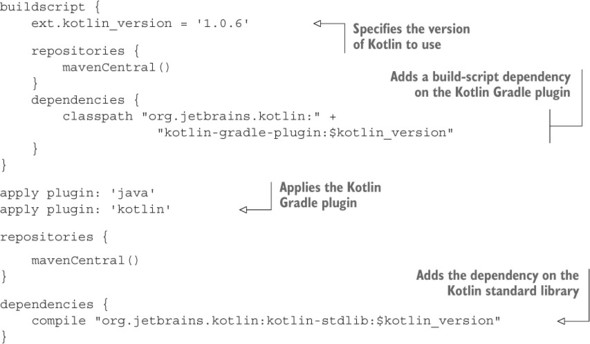

# 부록 A. 코틀린 프로젝트 빌드

코틀린 프로젝트를 빌드할 때 그레이들 사용을 권장한다. 그레이들은 안드로이드 프로젝트의 표준 빌드 시스템이며, 코틀린을 사용할 수 있는 모든 유형의 프로젝트를 지원한다. 그레이들은 유연한 프로젝트 모델을 제공하며, 점진적 빌드, 장시간 실행되는 빌드 프로세스 등의 고급 기법을 통해 더 나은 빌드 성능을 제공한다.

