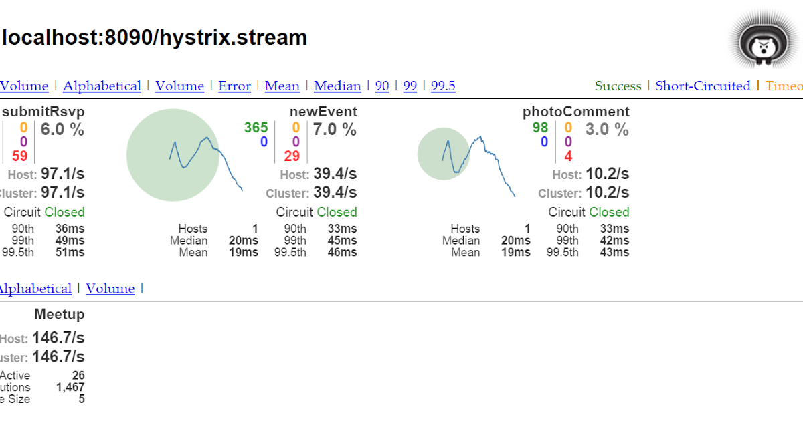
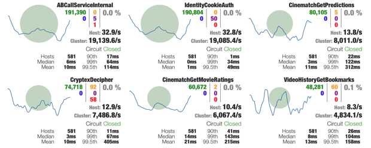

# CHAP 15. 실패와 지연 처리하기

## 서킷 브레이커 이해하기

서킷 브레이커 패턴의 발상은 비교적 간단하며, 이름을 가져온 실세계의 전기 회로 차단기와 꽤 유사하다. 소프트웨어 서킷 브레이커는 메서드의 호출을 허용하며, 서킷은 닫힘 상태에서 시작된다. 그리고 어떤 이유로든 메서드의 실행이 실패하면\(메서드 실행 횟수나 시간 등의 정의된 한곗값을 초과하면\), 서킷 브레이커가 개발되고 실패한 메서드에 대해 더 이상 호출이 수행되지 않는다.


그림에서 보면 알 수 있듯이, 서킷 브레이커로 보호되는 메서드가 실행에 성공하면 서킷은 닫힘 상태가 유지되고 이후에도 해당 메서드가 실행된다. 그러나 서킷 브레이커로 보호되는 메서드가 실행에 실패하면, 서킷은 열림 상태가 되고 이후에는 실패한 메서드 대신 폴백 메서드가 호출된다. 그러다가 때때로\(예를 들어, 지정된 시간 간격에 맞춰\) 서킷이 절반-열림 상태로 바뀌면서 실패했던 메서드의 호출을 서킷 브레이커가 다시 시도한다. 그러나 여전히 실패하면 서킷은 다시 열림 상태가 되고, 이후에는 다시 폴백 메서드가 호출된다. 하지만 성공하면 문제가 해결된 것으로 간주하여 서킷은 닫힘 상태가 된다.

서킷 브레이커를 더 강력한 형태의 try/catch라고 생각하면 이해하는 데 도움이 될 수 있다. 즉, 닫힘 상태는 try 블록과 유사한 반면, 폴백 메서드는 catch 블록과 유사하다. 그러나 try/catch와 다르게, 서킷 브레이커는 원래 호출하려던 메서드\(서킷 브레이커로 보호되는 메서드\)가 너무 자주 실패하면\(정의된 한계값을 초과하면\) 폴백 메서드를 호출한다.

서킷 브레이커를 선언할지 경정할 때는 실패의 대상이 되는 메서드를 식별하는 것이 중요하다.

* REST를 호출하는 메서드 : 사용할 수 없거나 HTTP 500 응답을 반환하는 원격 서비스로 인해 실패할 수 있는 메서드다.
* 데이터베이스 쿼리를 수행하는 메서드 : 어떤 이유로든 데이터베이스가 무반응 상태가 되거나, 애플리케이션을 중단시킬 수 있는 스키마의 변경이 생기면 실패할 수 있는 메서드다.
* 느리게 실행될 가능성이 있는 메서드 : 이것은 반드시 실패하는 메서드가 아니다. 그러나 너무 오랫동안 실행된다면 비정상적인 상태를 고려할 수 있다.

### 우리는 어떻게 서킷 브레이커를 적용할 수 있을까?

우리는 Netflix 오픈 소스 프로젝트의 Hystrix 라이브러리를 사용할 수 있다. Hystrix 서킷 브레이커는 대상 메서드가 실패할 때 폴백 메서드를 호출하는 애스펙트\(aspect\)로 구현된다. 그리고 서킷 브레이커 패턴을 제대로 구현하기 위해 애스펙트는 대상 메서드가 얼마나 자주 실패하는지도 추적한다. 그 다음에 실패율이 한계값을 초과하면 모든 대상 메서드 호출을 폭백 메서드 호출로 전달한다.

## 서킷 브레이커 선언하기

우선 플러그인을 추가해야 한다. 또한 스프링 클라우드 버전도 설정 해주어야 한다.

```text
<dependency>
	<groupId>org.springframework.cloud</groupId>
	<artifactId>spring-cloud-starter-netflix-hystrix</artifactId>
</dependency>
```

Hystrix 스타터 의존성이 추가되었으므로 다음은 Hystrix를 활성화해야 한다.

```java
@SpringBootApplication
@EnableHystrix
public class IngredientClientApplication {

	public static void main(String[] args) {
		SpringApplication.run(IngredientClientApplication.class, args);
	}
}
```

그러나 아직 어떤 메서드에도 서킷 브레이커가 선언되지 않았기 때문에 @HystrixCommand 애노테이션이 필요하다.

```java
@HystrixCommand(fallbackMethod="getDefaultIngredients")
public Iterable<Ingredient> getAllIngredients() {
  ParameterizedTypeReference<List<Ingredient>> stringList =
      new ParameterizedTypeReference<List<Ingredient>>() {};
  return rest.exchange(
      "<http://ingredient-service/ingredients>", HttpMethod.GET,
      HttpEntity.EMPTY, stringList).getBody();
}
```

해당 메서드는 exchange\(\)의 호출이 문제를 유발할 수있는 잠제적 원인을 가진다. ingredient-service로 등록된 서비스가 없거나 해당 요청이 어떤 이유로든 실패한다면 RestClientException이 발생한다.

그러나 마이크로서비스에서 생긴 에러는 다른 곳에 전파하지 않고 남기고 기록해야 한다. 이제는 getAllIngredients\(\)내에서 예외가 발생하면 폴백 메서드인 getDefaultIngredients를 호출해 준다.

폴백 메서드는 우리가 원하는 어떤 것도 할 수 있지만, 원래 의도했던 메서드가 실행이 불가능할 때에 대비하는 의도로 사용한다. getDefaultIngredients는 mock 데이터를 내려주도록 구현하였다.

```java
private Iterable<Ingredient> getDefaultIngredients() {
    List<Ingredient> ingredients = new ArrayList<>();
    ingredients.add(new Ingredient(
            "FLTO", "Flour Tortilla", Ingredient.Type.WRAP));
    ingredients.add(new Ingredient(
            "GRBF", "Ground Beef", Ingredient.Type.PROTEIN));
    ingredients.add(new Ingredient(
            "CHED", "Shredded Cheddar", Ingredient.Type.CHEESE));
    return ingredients;
  }
```

### 지연 시간 줄이기

서킷 브레이커는 메서드의 실행이 끝나고 복귀하는 시간이 너무 오래 걸릴 경우 타임 아웃을 사용하여 지연 시간을 줄일 수도 있다. 기본적으로 @HystrixCommand가 지정된 모든 메서드는 1초 후에 타임아웃되고 이 메서드의 폴백 메서드가 호출된다. 서킷 브레이커의 타임아웃을 변경하려면 Hystrix 명령 속성인 execution.isolation.thread.timeoutInMillisesonds를 설정해야 한다.

```java
@HystrixCommand(fallbackMethod="getDefaultIngredients",
      commandProperties={
          @HystrixProperty(
              name="execution.isolation.thread.timeoutInMilliseconds",
              value="500")
})
public Iterable<Ingredient> getAllIngredients() {
	...
}
```

### 서킷 브레이커 한계값 관리하기

Hystrix 명령 속성을 설정하면 실패와 재시도 한계값을 변경할 수 있다. 서킷 브레이커의 상태 변화를 초래하는 조건에 영향을 주는 명령 속성들은 다음과 같다.

* circuitBreaker.requestVolumeThreshold : 지정된 시간 내에 메서드가 호출되어야 하는 횟수
* circuitBreaker.errorThresholdPercentage : 지정된 시간 내에 실패한 메서드 호출의 비율
* metrics.rollingStats.timeInMilliseconds : 요청 횟수와 에러 비율이 고령되는 시간
* circuitBreaker.sleepWindowInMilliseconds : 절반 열림 상태로 진입하여 실패한 메서드가 다시 시도되기 전에 열림 상태의 서킷이 유지되는 시간

```java
@HystrixCommand(fallbackMethod="getDefaultIngredients",
      commandProperties={
          @HystrixProperty(
              name="execution.isolation.thread.timeoutInMilliseconds",
              value="500"),
              @HystrixProperty(
                  name="circuitBreaker.requestVolumeThreshold",
                  value="30"),
              @HystrixProperty(
                  name="circuitBreaker.errorThresholdPercentage",
                  value="25"),
              @HystrixProperty(
                  name="metrics.rollingStats.timeInMilliseconds",
                  value="20000"),
              @HystrixProperty(
                  name="circuitBreaker.sleepWindowInMilliseconds",
                  value="60000")
      })
public Iterable<Ingredient> getAllIngredients() {
	...
}
```

## 실패 모니터링하기

서킷 브레이커로 보호되는 메서드가 매번 호출될 때마다 해당 호출에 관한 여러 데이터가 수집되어 Hystrix 스트림으로 발행된다. 그리고 이 Hystrix 스트림은 실행 중인 애플리케이션의 건강 상태를 실시간으로 모니터링하는 데 사용할 수 있다. 각 서킷 브레이커로부터 수집한 데이터 중에서 Hystrix 스트림은 다음을 포함한다.

* 메서드가 몇 번 호출되는지
* 성공적으로 몇 번 호출되는지
* 폴백 메서드가 몇 번 호출되는지
* 메서드가 몇 번 타임아웃되는지

이 Hystrix 스트림은 액추에이터 엔드포인트로 제공된다.

```text
management:
  endpoints:
    web:
      exposure:
        include: hystrix.stream
```

Hystrix 스트림의 각 항목은 온갖 JSON 데이터로 가득 차 있으므로 이 데이터를 해석하기 위해 클라이언트 측의 작업이 많이 필요하다. 물론 이런 코드를 작성하는 것이 불가능한 것은 아니지만, 이때는 Hystrix 대시보드의 사용을 고려할 수 있다.

### Hystrix 대시보드 개요

Hystrix 대시보드를 사용하려면 우선 Hystrix 대시보드 스타터 의존성을 갖는 새로운 스프링 부트 애플리케이션 프로젝트를 생성해야 한다.

```text
<dependency>
	<groupId>org.springframework.cloud</groupId>
	<artifactId>spring-cloud-starter-netflix-hystrix-dashboard</artifactId>
</dependency>
```

그 다음에 메인 구성 클래스에 @EnablehystrixDashboard 애노테이션을 지정해야 한다.

```java
@SpringBootApplication
@EnableHystrixDashboard
public class HystrixDashboardApplication {
	public static void main(String[] args) {
		SpringApplication.run(HystrixDashboardApplication.class, args);
	}
}
```

애플리케이션을 실행하면 대시보드를 확인할 수 있다.


### Hystrix 스레드 풀 이해하기

어떤 메서드가 자신의 일을 수행하는 데 너무 오랜 시간이 걸리는 경우를 생각해 보자. 만일 그런 메서드가 호출자와 같은 스레드의 컨텍스트에서 실행 중이라면 호출자는 오래 실행되는 메서드로부터 벗어날 기회가 없다. 게다가 블로킹된 스레드가 제한된 수의 스레드 중 하나인데 문제가 계속 생긴다면, 사용 가능한 모든 스레드가 포화 상태가 되어 응답을 기다리게 된다.

이런 상황을 방지하기 위해 Hystrix는 각 의존성 모듈의 스레드 풀을 할당한다. 그리고 Hystrix 명령 메서드 중 하나가 호출될 때 이 메서드는 Hystrix가 관리하는 스레드 풀의 스레드에서 실행된다. 따라서 이 메서드가 너무 오래 걸린다면 호출 스레드는 해당 호출을 포기하고 벗어날 수 있으므로 잠재적인 스레드 포화를 Hystrix가 관리하는 스레드 풀에 고립시킬 수 있다.



서킷 브레이커 모니터와 흡사하게, 각스레드 풀 모니터에는 왼쪽 위 모서리에 원이 있다. 이 원의 크기와 색상은 해당 스레드 풀이 현재 얼마나 활성적인지와 건강 상태를 나타낸다. 스레드 풀 모니터의 왼쪽 아래 모서리는 다음 정보들을 보여준다.

* 활성 스레드 카운트 : 활성 스레드의 현재 개수
* 큐 스레드 카운트 : 현재 큐에 있는 스레드 개수, 기본적으로 큐가 비활성화되어 있으므로 이 값은 항상 0이다.
* 풀 크기 : 스레드 풀에 있는 스레드 개수

그리고 오른쪽 아래 모서리에는 스레드 풀에 관한 다음 정보들을 보여준다.

* 최대 활성 스레드 카운트 : 생플린 시간 동안의 최대 활성 스레드 개수
* 실행 횟수 : Hystrix 명령의 실행을 처리하기 위해 스레드 풀의 스레드가 호출된 횟수
* 큐 크기 : 스레드 풀 큐의 크기, 스레드 큐는 기본적으로 비활성화되어 있으므로 이 값은 의미가 없다.

## 다수의 Hystrix 스트림 종합하기

Hystrix 대시보드는 한 번에 하나의 Hystrix 스트림만 모니터링할 수 있다. 그러나 다행히도 또다른 Netflix 프로젝트인 Turbine이 모든 마이크로서비스로부터 모든 Hystrix 스트림을 Hystrix 대시보드가 모니터링할 수 있는 하나의 스트림으로 종합하는 방법을 제공한다. Turbine 서비스를 생성하려면, 새로운 스프링 부트 프로젝트를 생성하고 Turbine 스타터 의존성을 빌드에 포함시켜야 한다.

```text
<dependency>
	<groupId>org.springframework.cloud</groupId>
	<artifactId>spring-cloud-starter-netflix-turbine</artifactId>
</dependency>
```

프로젝트가 생성되었으면 Turbine을 활성화해야 한다. 메인 구성 클래스에 @EnableTurbine 애노테이션을 지정한다.

```java
@SpringBootApplication
@EnableTurbine
public class TurbineServerApplication {
	public static void main(String[] args) {
		SpringApplication.run(TurbineServerApplication.class, args);
	}
}
```

대시보드를 확인해보자



## 요약

* 서킷 브레이커 패턴은 유연한 실패 처리를 할 수 있다.
* Hystrix는 메서드가 실행에 실패하거나 너무 느릴 때 폴백 처리를 활성화하는 서킷 브레이커 패턴을 구현한다.
* Hystrix가 제공하는 각 서킷 브레이커는 애플리케이션의 건강 상태를 모니터링할 목적으로 Hystrix 스트림의 메트릭을 발행한다.
* Hystrix 스트림은 Hystrix 대시보드가 소비할 수 있다. Hystrix 대시보드는 서킷 브레이커 메트릭을 보여주는 웹 애플리케이션이다.
* Turbine은 여러 애플리케이션의 Hystrix 스트림들을 하나의 Hystrix 스트림으로 종합하여, 종합된 Hystrix 스트림은 Hystrix 대시보드에서 볼 수 있다.

