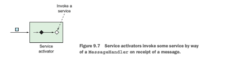
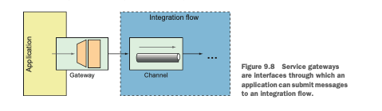
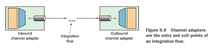
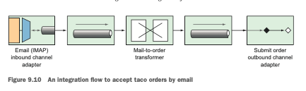

# Chap 9. 스프링 통합하기

스프링 통합은 &lt;Enterprise Integration Patterns 2003&gt;에서 보여준 대부분의 통합 패턴을 사용할 수 있게 구현한 것이다. 각 통합 패턴은 하나의 컴포넌트로 구현되며, 이것을 통해서 파이프라인으로 메시지가 데이터를 운반한다. 스프링 구성을 사용하면 데이터가 이동하는 파이프라인으로 이런 컴포넌트들을 조립할 수 있다.

## 간단한 통합 플로우 선언하기

### 메시지 게이트웨이 생성

애플리케이션이 통합할 수 있는 그런 리소스 중 하나가 파일 시스템이다. 이에 따라 스프링 통합의 많은 컴포넌트 중에 파일을 읽거나 쓰는 채널 어댑터가 있다.

```markup
<dependency>
		<groupId>org.springframework.boot</groupId> 
		<artifactId>spring-boot-starter-integration</artifactId>
</dependency>

<dependency> 
		<groupId>org.springframework.integration</groupId> 
		<artifactId>spring-integration-file</artifactId>
</dependency>
```

첫 번째 의존성은 스프링 통합의 스프링 부트 스타터이다. 통합하려는 플로우와 무관하게 이 의존성은 스프링 통합 플로우의 개발 시에 반드시 추가해야 한다.

두 번째 의존성은 스프링 통합의 파일 엔드포인트\(endpoint\) 모듈이다. 이 모듈은 외부 시스템 통합에 사용되는 24개 이상의 엔드포인트 모듈 중 하나다.

```java
import org.springframework.integration.file.FileHeaders;
import org.springframework.messaging.handler.annotation.Header;

@MessagingGateway(defaultRequestChannel="textInChannel")
public interface FileWriterGateway {
	void writeToFile(
		@Header(FileHeaders.FILENAME) String filename, 
		String data
	);
}
```

* @MessagingGateway : FileWriterGateway 인터페이스의 구현체\(클래스\)를 런타임 시에 생성하라고 스프링 통합에 알려준다.
* defaultRequestChannel : 해당 인터페이스의 메서드 호출로 생성된 메시지가 이 속성에 지정된 메시지 채널로 전송된다는 것을 나타낸다.
* writeToFile\(\)의 호출로 생긴 메시지가 textInChannel이라는 이름의 채널로 전송된다.
* @Header : filename에 전달되는 값이 메시지 페이로드가 아닌 메시지 헤더에 있다는 것을 나타낸다.

### 통합 플로우 구성

#### Java로 통합 플로우 구성하기

```java
@Configuration
public class FileWriterIntegrationConfig {

  @Bean
  @Transformer(inputChannel="textInChannel", // Declares a transformer
      outputChannel="fileWriterChannel")
  public GenericTransformer<String, String> upperCaseTransformer() {
    return text -> text.toUpperCase(); }

  @Bean
  @ServiceActivator(inputChannel="fileWriterChannel")
  public FileWritingMessageHandler fileWriter() { // Declares a file writer
    FileWritingMessageHandler handler =
        new FileWritingMessageHandler(new File("/tmp/sia5/files"));
    
		handler.setExpectReply(false); 
		handler.setFileExistsMode(FileExistsMode.APPEND); 
		handler.setAppendNewLine(true);
    
		return handler;
  }
}
```

* 자바 구성에서는 두 개의 빈을 정의한다.
  * 변환기\(GenericTransformer\) :
  * 파일-쓰기 메시지 핸들러\(FileWritingMessageHandler\)
    * fileWriterChannel로부터 메시지를 받아서 FileWritingMessageHandler의 인스턴스로 정의된 서비스에 넘겨준다.
    * handler.setExpectReply\(false\)는 서비스에서 응답 채널\(플로우의 업스트림 컴포넌트로 값이 반환될 수 있는 채널\)을 사용하지 않음을 나타낸다. 해당 메서드를 호출하지 않았다면 통합 플로우가 정상적으로 작동하더라도 응답 채널이 구성되지 않았다는 로그 메시지들이 나타난다.

#### 스프링 통합의 DSL 구성 사용하기

통합 플로우의 각 컴포넌트를 별도의 빈으로 선언하지 않고 전체 플로우를 하나의 빈으로 선언한다.

```java
@Configuration
public class FileWriterIntegrationConfig {

    @Bean
    public IntegrationFlow fileWriterFlow() {
        return IntegrationFlows.from(MessageChannels.direct("textInChannel"))
            .<String, String>transform(t -> t.toUpperCase())
            .handle(Files
                .outboundAdapter(new File("/tmp/sia5/files"))
                .fileExistsMode(FileExistsMode.APPEND)
                .appendNewLine(true))
            .get();
    }
}
```

* IntegrationFlows 클래스는 플로우를 선언할 수 있는 빌더 API를 시작시킨다.
* channel\(\) 메서드를 호출하여 해당 채널을 이름으로 참조할 수 있다.
* 코드는 많이 줄었지만 코드의 가독성을 높이기 위해 들여쓰기를 잘 해야 한다.

## 스프링 통합의 컴포넌트 살펴보기

스프링 통합은 다수의 통합 시나리오를 갖는 많은 영역을 포함한다. 따라서 그 모든 것을 하나의 챕터에 포함시키려고 하는 것은 마치 코끼리를 봉투에 맞춰 넣으려고 하는 것과 같다. 통합 플로우는 하나 이상의 컴포넌트로 구성되며 다음과 같다.

* 채널\(Channel\) : 한 요소로부터 다른 요소로 메시지를 전달한다.
* 필터\(Filter\) : 조건에 맞는 메시지가 플로우를 통과하게 해준다.
* 변환기\(Transaformer\) : 메시지 값을 변경하거나 메시지 페이로드의 타입을 다른 타입으로 변환한다.
* 라우터\(Router\) : 여러 채널 중 하나로 메시지를 전달하며, 대개 메시지 헤더를 기반으로 한다.
* 분배기\(Splitter\) : 들어오는 메시지를 두 개 이상의 메시지로 분할하며, 분할된 각 메시지는 다른 채널로 전송된다.
* 집적기\(Aggregator\) : 분배기와 상반된 것으로 별개의 채널로부터 전달되는 다수의 메시지를 하나의 메시지로 결합한다.
* 서비스 액티베이터\(Service activator\) : 메시지를 처리하도록 자바 메서드에 메시지를 넘겨준 후 메서드의 반환값을 출력 채널로 전송한다.
* 채널 어댑터\(Channel adapter\) : 외부 시스템에 채널을 연결한다. 외부 시스템으로부터 입력을 받거나 쓸 수 있다.
* 게이트웨이\(Gateway\) : 인터페이스를 통해 통합 플로우로 데이터를 전달한다.

### 메시지 채널

메시지 채널은 통합 파리프라인을 통해서 메시지가 이동하는 수단이다. 즉, 채널은 스프링 통합의 다른 부분을 연결하는 통로다. 스프링 통합은 다음을 포함해서 여러 채널 구현체\(클래스\)를 제공한다.

* PublishSubscribeChannel : 전송되는 메시지는 하나 이상의 컨슈머로 전달된다. 컨슈머가 여럿일 때는 모든 컨슈머가 해당 메시지를 수신한다.
* QueueChannel : 전송되는 메시지는 FIFO 방식으로 컨슈머가 가져갈 때까지 큐에 저장된다. 컨슈머가 여럿일 때는 그중 하나의 컨슈머만 해당 메시지를 수신한다.
* PriorityChannel : QueueChannel과 유사하지만, FIFO 방식 대신 메시지의 priority 헤더를 기반으로 컨슈머가 메시지를 가져간다.
* RendezvousChannel : QueueChannel과 유사하지만, 전송자와 동일한 스레드로 실행되는 컨슈머를 호출하여 단일 컨슈머에게 메시지를 전송한다. 이 채널은 트랜잭션을 지원한다.
* ExecutorChannel : DirectChannel과 유사하지만, TaskExecutor를 통해서 메시지가 전송된다. \(전송자와 다른 스레드에서 처리된다\) 이 채널 타입은 트랜잭션을 지원하지 않는다.
* FluxMessageChannel : 프로젝트 리액터\(Product Reactor\)의 플럭스\(Flux\)를 기반으로 하는 리액티브 스트림즈 퍼블리셔\(Reactive Streams Publisher\) 채널이다.

```java
// option1. PublishSubscribeChannel
@Bean
public MessageChannel orderChannel() {
  return new PublishSubscribeChannel();
}

// option2. QueueChannel
@Bean
public MessageChannel orderChannel() {
  return new QueueChannel();
}

@Bean
public IntegrationFlow orderFlow() {
	return IntegrationFlows 
		...
		.channel("orderChannel")
		...
		.get();
}
```

### 필터

필터는 통합 파이프라인의 중간에 위치할 수 있으며, 플로우의 전 단계로부터 다음 단계로의 메시지 전달을 허용 또는 불허한다.


```java
// option1. 어노테이션 기반 필터 설정
@Filter(inputChannel="numberChannel",
        outputChannel="evenNumberChannel")
public boolean evenNumberFilter(Integer number) {
  return number % 2 == 0;
}

// option2. 자바 DSL 구성 필터 설정
@Bean
public IntegrationFlow evenNumberFlow(AtomicInteger integerSource) {
    return IntegrationFlows 
        ...
        .<Integer>filter((p) -> p % 2 == 0) 
        ...
        .get();
}
```

### 변환기

변환기는 메시지 값의 변경이나 타입을 변환하는 일을 수행한다.


```java
// option1. 어노테이션 기반 변환기 설정
@Bean
@Transformer(inputChannel="numberChannel",
             outputChannel="romanNumberChannel")
public GenericTransformer<Integer, String> romanNumTransformer() {
  return RomanNumbers::toRoman;
}

// option2. 자바 DSL 구성 변환기 설정
@Bean
public IntegrationFlow transformerFlow() {
	return IntegrationFlows ...
				.transform(RomanNumbers::toRoman)
		    ...
				.get();
}

// option3. 어노테이션 + 자바 DSL 구성 조합
@Bean
public RomanNumberTransformer romanNumberTransformer() {
  return new RomanNumberTransformer();
}

@Bean
public IntegrationFlow transformerFlow(
                    RomanNumberTransformer romanNumberTransformer) {
  return IntegrationFlows
				...
				.transform(romanNumberTransformer) 
				...
				.get();
}

```

### 라우터

라우터는 전달 조건을 기반으로 통합 플로우 내부를 분기\(서로 다른 채널로 메시지를 전달\)한다.


예를 들어, 정수값을 전달하는 numberChannel이라는 이름의 채널이 있다고 하자. 그리고 모든 짝수 메시지를 evenChannel이라는 이름의 채널로 전달하고, 홀수 메시지는 oddChannel이라는 이름의 채널로 전달한다고 가정해보자.

```java
// option1. 어노테이션 기반 라우터 설정
@Bean
@Router(inputChannel="numberChannel")
public AbstractMessageRouter evenOddRouter() {
    return new AbstractMessageRouter() {
        @Override
        protected Collection<MessageChannel>
        determineTargetChannels(Message<?> message) { Integer number = (Integer) message.getPayload();
            if (number % 2 == 0) {
                return Collections.singleton(evenChannel()); }
            return Collections.singleton(oddChannel()); }
    }; 
}

@Bean
public MessageChannel evenChannel() {
    return new DirectChannel();
}
@Bean
public MessageChannel oddChannel() {
    return new DirectChannel();
}
```

여기서 선언한 AbstractMessageRouter 빈은 numberChannel이라는 이름의 입력 채널로부터 메시지를 받는다. 그리고 이 빈을 구현한 익명의 내부 클래스에서는 메시지 페이로드를 검사하여 짝수일 때는 evenChannel이라는 이름의 채널을 반환한다.

```java
// option2. 자바 DSL 구성 라우터 설정
@Bean
public IntegrationFlow numberRoutingFlow(AtomicInteger source) {
    return IntegrationFlows
        ...
        .<Integer, String>route(n -> n%2==0 ? "EVEN":"ODD", mapping -> mapping 
            .subFlowMapping("EVEN", 
                sf -> sf.<Integer, Integer>transform(n -> n * 10) 
                    .handle((i,h) -> { ... })
                )
            .subFlowMapping("ODD", sf -> sf 
                .transform(RomanNumbers::toRoman) 
                .handle((i,h) -> { ... })
             ) 
            .get();
}
```

### 분배기

때로는 통합 플로우에서 하나의 메시지를 여러 개로 분할하여 독립적으로 처리하는 것이 유용할 수 있다.


#### 분배기를 사용할 수 있는 중요한 두 가지 경우가 있다.

* 메시지 페이로드가 같은 타입의 컬렉션 항목들을 포함하며, 각 메시지 페이로드 별로 처리하고자 할 때다
* 연관된 정보를 함께 전달하는 하나의 메시지 페이로드는 두 개 이상의 서로 다른 타입 메시지로 분할될 수 있다.

예를 들어, 주문 데이터를 전달하는 메시지는 대금 청구 정보와 주문 항목 리스트의 두 가지 메시지로 분할할 수 있다.

```java
public class OrderSplitter {
    public Collection<Object> splitOrderIntoParts(PurchaseOrder po) {
				ArrayList<Object> parts = new ArrayList<>(); 
				parts.add(po.getBillingInfo()); 
				parts.add(po.getLineItems());
				
				return parts;
		}
}
```

그 다음에 @Splitter 애노테이션을 지정하여 통합 플로우의 일부로 OrderSplitter 빈을 선언할 수 있다.

```java
@Bean
@Splitter(inputChannel="poChannel",
					outputChannel="splitOrderChannel")
public OrderSplitter orderSplitter() {
		return new OrderSplitter();
}
```

플로우의 이 지점에서 PayloadTypeRouter를 선언하여 대금 청구 정보와 주문 항목 정보를 각 정보에 적합한 하위 플로우로 전달할 수 있다.

```java
@Bean
@Router(inputChannel = "splitOrderChannel")
public MessageRouter splitOrderRouter() {
    PayloadTypeRouter router = new PayloadTypeRouter();
    router.setChannelMapping(BillingInfo.class.getName(), "billingInfoChannel");
    router.setChannelMapping(List.class.getName(), "lineItemsChannel");
    return router;
}
```

BillingInfo 타입의 페이로드는 billingInfoChannel로 전달되어 처리되며, java.util.List 컬렉션에 저장된 주문 항목들은 List 타입으로 lineItemsChannel에 전달된다.

#### List&lt;LineItem&gt;을 처리하는 대신 각 LineItem을 별도로 처리하고 싶다면?

이때는 List&lt;LineItem&gt;을 다수의 메시지로 분할하기 위해 @Splitter 애노테이션을 지정한 메서드\(빈이 아님\)를 작성하고 이 메서드에서는 처리된 LineItem이 저장된 컬렉션을 반환하면 된다.

```java
@Splitter(inputChannel="lineItemsChannel", outputChannel="lineItemChannel")
public List<LineItem> lineItemSplitter(List<LineItem> lineItems) {
    return lineItems;
}
```

이 경우 List&lt;LineItem&gt; 페이로드를 갖는 메시지가 limeItemsChannel에 도착하면 이 메시지는 lineItemSplitter\(\) 메서드 인자로 전달된다. 그리고 이 메서드는 분할된 LineItem들이 저장된 컬렉션을 반환하는데, 여기서는 이미 LineItem들이 저장된 컬렉션을 갖고 있으므로 이것을 바로 반환한다. 이에 따라 컬렉션에 저장된 각 LineItem은 lineItemChannel로 전달된다.

```java
return IntegrationFlows...
    .split(orderSplitter()).<Object, String> route(
        p->{
            if(p.getClass().isAssignableFrom(BillingInfo.class)){
                return"BILLING_INFO";
            }else{
                return"LINE_ITEMS";
            }
        }, mapping->mapping
            .subFlowMapping("BILLING_INFO",
                sf->sf.<BillingInfo> handle((billingInfo,h)->{
                    ...
                }))
            .subFlowMapping("LINE_ITEMS",
                sf->sf.split()
                        .<LineItem> handle((lineItem,h)->{
                    ...
                }))
            )
    .get();
```

### 서비스 액티베이터

서비스 액티베이터는 입력 채널로부터 메시지를 수신하고 이 메시지를 MessageHandler 인터페이스를 구현한 클래스\(빈\)에 전달한다.



```java
@Bean
@ServiceActivator(inputChannel="someChannel")
public MessageHandler sysoutHandler() {
    return message -> {
        System.out.println("Message payload: " + message.getPayload());
    };
}
```

또는 받은 메시지의 데이터를 처리한 후 새로운 페이로드를 반환하는 서비스 앧티베이터를 선언할 수도 있다. 이 경우 이 빈은 MessageHandler가 아닌 GenericHandler를 구현한 것이어야 한다.

```java
@Bean
@ServiceActivator(inputChannel="orderChannel",
    outputChannel="completeOrder")
public GenericHandler<Order> orderHandler(OrderRepository orderRepo) { 
		return (payload, headers) -> {
		    return orderRepo.save(payload); 
		};
}
```

이번에는 자바 DSL 구성으로 변경해보자.

```java
public IntegrationFlow someFlow() {
    return IntegrationFlows
            ...
            .handle(msg -> {
                System.out.println("Message payload: " + msg.getPayload());
            }) 
        .get();
}
```

여기서는 handle\(\) 메서드의 인자로 전달되는 MessageHandler로 람다를 사용하였다. 그러나 메서드 참조 또는 MessageHandler 인터페이스를 구현하는 클래스 인스턴스까지도 handler\(\) 메서드의 인자로 제공할 수 있다.

만일 서비스 액티베이터를 플로우의 제일 끝에 두지 않는다면 MessageHandler의 경우와 유사하게 handle\(\) 메서드에서 GenericHandler를 인자로 받을 수도 있다.

```java
public IntegrationFlow orderFlow(OrderRepository orderRepo) {
    return IntegrationFlows
        ...
        .<Order>handle((payload, headers) -> { 
            return orderRepo.save(payload);
        }) 
        ...
        .get();
}
```

### 게이트웨이

게이트웨이는 애플리케이션이 통합 플로우로 데이터를 제출\(submit\)하고 선택적으로 플로우의 처리 결과인 응답을 받을 수 있는 수단이다.



이전의 본 FileWriterGateway는 단방향 게이트웨이며, 파일에 쓰기 위해 문자열을 인자로 받고 void를 반환하는 메서드를 갖고 있다. 양방향 게이트웨이의 작성도 어렵지 않으며, 이때는 게이트웨이 인터페이스를 작성할 때 통합 플로우로 전송할 값을 메서드에서 반환해야 한다.

예를 들어, 문자열을 받아서 모두 대문자로 변환하는 통합 플로우의 게이트웨이를 생각해 보자.

```java
// option1. 어노테이션 기반 게이트웨이 설정
@Component
@MessagingGateway(defaultRequestChannel="inChannel",
    defaultReplyChannel="outChannel")
public interface UpperCaseGateway {
    String uppercase(String in);
}

// option2. 자바 DSL 구성 게이트웨이 설정
@Bean
public IntegrationFlow uppercaseFlow() {
    return IntegrationFlows
        .from("inChannel")
        .<String, String> transform(s -> s.toUpperCase()) 
				.channel("outChannel")
        .get();
}
```

### 채널 어댑터

채널 어댑터는 통합 플로우의 입구와 출구를 나타낸다. 데이터는 인바운드\(inbound\) 채널 어댑터를 통해 통합 플로우로 들어오고, 아웃바운드\(outbound\) 채널 어댑터를 통해 통합 플로우에서 나간다.



인바운드 채널 어댑터는 플로우에 지정된 데이터 소스에 따라 여러 가지 형태를 갖는다. 예를 들어, 증가되는 숫자를 AtomicInteger로부터 플로우로 넣는 인바운드 채널 어댑터를 선언할 수 있다.

```java
// option1. 자바 어노테이션 기반 어댑터 구성
@Bean
@InboundChannelAdapter(
    poller=@Poller(fixedRate="1000"), channel="numberChannel")
public MessageSource<Integer> numberSource(AtomicInteger source) {
	return () -> {
		return new GenericMessage<>(source.getAndIncrement());
	};
}

// option2. 자바 DSL 기반 어댑터 구성
@Bean
public IntegrationFlow someFlow(AtomicInteger integerSource) {
    return IntegrationFlows 
        .from(integerSource, "getAndIncrement",
          c -> c.poller(Pollers.fixedRate(1000))) 
        ...
        .get();
}
```

### 엔드포인트 모듈

스프링 통합은 우리 나름의 채널 어댑터를 생성할 수 있게 해준다. 아래 표에 있는 것을 포함해서 다양한 외부 시스템과의 통합을 위해 채널 어댑터가 포함된 24개 이상의 엔드포인트 모듈을 스프링 통합이 제공한다.

#### 외부 시스템과의 통합을 위한 24개 이상의 엔드포인트 모듈 

| Module | Dependency artifact ID \(Group ID: org.springframework.integration\) |
| :--- | :--- |
| AMQP | spring-integration-amqp |
| Spring application events | spring-integration-event |
| RSS and Atom | spring-integration-feed |
| Filesystem | spring-integration-file |
| FTP/FTPS | spring-integration-ftp |
| GemFire | spring-integration-gemfire |
| HTTP | spring-integration-http |
| JDBC | spring-integration-jdbc |
| JPA | spring-integration-jpa |
| JMS | spring-integration-jms |
| Email | spring-integration-mail |
| MongoDB | spring-integration-mongodb |
| MQTT | spring-integration-mqtt |
| Redis | spring-integration-redis |
| RMI | spring-integration-rmi |
| SFTP | spring-integration-sftp |
| STOMP | spring-integration-stomp |
| Stream | spring-integration-stream |
| Syslog | spring-integration-syslog |
| TCP/UDP | spring-integration-ip |
| Twitter | spring-integration-twitter |
| Web Services | spring-integration-ws |
| WebFlux | spring-integration-webflux |
| WebSocket | spring-integration-websocket |
| XMPP | spring-integration-xmpp |
| ZooKeeper | spring-integration-zookeeper |

## 이메일 통합 플로우 생성하기

타코 클라우드 받은 편지함의 타코 주문 이메일을 지속적으로 확인하여 이메일의 주문 명세를 파싱한 후 해당 주문 데이터의 처리를 위해 타코 클라우드에 제출하는 통합 플로우를 구현해보자.

#### 이메일 설정 정보를 정의하자

```java
@Data
@ConfigurationProperties(prefix="tacocloud.email")
@Component
public class EmailProperties {
    private String username;
    private String password;
    private String host;
    private String mailbox;
    private long pollRate = 30000;
    public String getImapUrl() {
        return String.format("imaps://%s:%s@%s/%s",
            this.username, this.password, this.host, this.mailbox);
    }
}
```

EmailProperties 클래스에 필요한 데이터는 application.yml 파일에 구성할 수 있다.

```java
tacocloud:
  email:
		host: imap.tacocloud.com 
		mailbox: INBOX
		username: taco-in-flow 
		password: 1L0v3T4c0s 
		poll-rate: 10000
```

#### 이메일로 타코 주문을 받기 위한 통합 플로우



지금부터는 타코 주문 이메일 플로우의 자바 DSL 구성 해보자

```java
@Configuration
public class TacoOrderEmailIntegrationConfig {

    @Bean
    public IntegrationFlow tacoOrderEmailFlow(EmailProperties emailProps,
                                              EmailToOrderTransformer emailToOrderTransformer,
                                              OrderSubmitMessageHandler orderSubmitHandler) {
        return IntegrationFlows.from(Mail.imapInboundAdapter(emailProps.getImapUrl()),
                                     e -> e.poller(Pollers.fixedDelay(emailProps.getPollRate())))
                               .transform(emailToOrderTransformer)
                               .handle(orderSubmitHandler)
                               .get();
    }
}
```

tacoOrderEmailFlow\(\) 메서드에 정의된 타코 주문 이메일 플로우는 3개의 서로 다른 컴포넌트로 구성된다.

* IMAP 이메일 인바운드 채널 어댑터 : 이 채널 어댑터는 EmailProperties의 getImapUrl\(\) 메서드로부터 생성된 IMP URL로 생성되며, EmailProperties의 poolRate 속성에 설정된 지연 시간이 될 때마다 이메일을 확인한다. 받은 이메일은 변환기에 연결하는 채널로 전달된다.
* 이메일을 Order 객체로 변환하는 변환기 : 이 변환기는 tacoOrderEmailFlow\(\) 메서드로 주입되는 EmailToOrderTransformer에 구현된다. 변환된 주문 데이터\(Order 객체\)는 다른 채널을 통해 최종 컴포넌트로 전달된다.
* 핸들러\(아웃바운드 채널 어댑터로 작동\) : 핸들러는 Order 객체를 받아서 타코 클라우드의 REST API로 제출한다.

#### 통합 변환기를 사용해서 입력 이메일을 타코 주문\(Order 객체\)으로 변환하기

```java
@Component
public class EmailToOrderTransformer
    extends AbstractMailMessageTransformer<Order> {
    @Override
    protected AbstractIntegrationMessageBuilder<Order>
    doTransform(Message mailMessage) throws Exception {
        Order tacoOrder = processPayload(mailMessage); // 이메일을 Order 객체로 파싱
        return MessageBuilder.withPayload(tacoOrder); 
    }
...
}
```

AbstractMailMessageTransformer는 페이로드가 이메일인 메시지를 처리하는 데 편리한 베이스 클래스다. 입력 메시지로부터 이메일 정보를 Message 객체\(doTransform\(\) 메서드의 인자로 전달\)로 추출하는 일을 지원한다.

EmailToOrderTransformer가 마지막으로 하는 일은 Order 객체를 포함하는 페이로드를 갖는 MessageBuilder를 반환하는 것이다.

#### 메시지 핸들러를 통해서 타코 클라우드 API에 주문을 POST하기

```java
@Component
public class OrderSubmitMessageHandler implements GenericHandler<Order> {
    private RestTemplate rest;
    private ApiProperties apiProps;

    public OrderSubmitMessageHandler(ApiProperties apiProps, RestTemplate rest) {
        this.apiProps = apiProps;
        this.rest = rest;
    }

    @Override
    public Object handle(Order order, Map<String, Object> headers) {
        rest.postForObject(apiProps.getUrl(), order, String.class);
        return null;
    }
}
```

GenericHandler 인터페이스의 handle 메서드를 오버라이드 하였다. 이 메서드는 입력된 Order 객체를 받으며, 주입된 RestTemplate을 사용해서 주문\(Order 객체\)을 제출한다.

#### ApiProperties 구성

```java
@Data 
@ConfigurationProperties(prefix="tacocloud.api") 
@Component
public class ApiProperties {
  private String url;
}
```

application.yml에는 다음과 같은 구성한다.

```yaml
tacocloud:
  api:
		url: <http://api.tacocloud.com>
```

## 타코 클라우드 애플리케이션 빌드 및 실행하기

* simple-flow 프로젝트를 빌드한다.
* ./mvnw clean package
* simple-flow 프로젝트가 빌드되어 simple-flow\target 아래에 simple-flow-0.0.9-SNAPSHOT.jar 파일로 생성된다.
* java -Dspring.profiles.active=javaconfig -jar target/simple-flow-0.0.9-SNAPSHOP.jar
* /tmp/sia5/files/simple.txt 파일 확인

## 요약

* 스프링 통합은 플로우를 정의할 수 있게 해준다. 데이터는 애플리케이션으로 들어오거나 나갈 때 플로우를 통해 처리할 수 있다.
* 통합 플로우는 XML, Java, Java DSL을 사용해서 정의할 수 있다.
* 메시지 게이트웨이와 채널 어댑처는 통합 플로우의 입구나 출구의 역할을 한다.
* 메시지는 플로우 내부에서 변환, 분할, 집적, 전달될 수 있으며, 서비스 액티베이터에의해 처리될 수 있다.
* 메시지 채널은 통합 플로우의 컴포넌트들을 연결한다.

