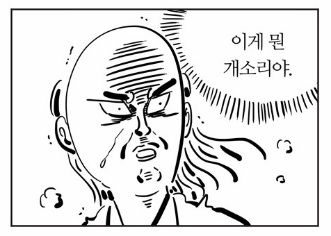
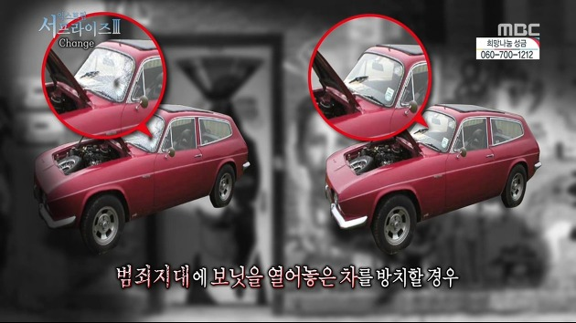

# 1장 깨끗한 코드

## 코드가 존재하리라

`코드`는 더 이상 문제가 아니라고, `모델`이나 `요구사항`에 집중해야 한다고 생각하는 사람도 있고, 실제로도 코드의 종말이 코앞에 닥쳤다고 주장하는 사람이 없지 않다. \(그때가 되면 영업 직원이 명세에서 프로그램을 자동으로 생성하면 되니까\)

하지만 지은이는 그럴수 없다고 주장한다. 왜냐하면 코드는 요구사항을 상세히 표현하는 수단이니까 어느 수준에 이르면 `코드`의 도움 없이 요구사항을 상세하게 표현하기란 `불가능`하다. `추상화`도 불가능하다. 기계가 실행할 정도로 상세하게 요구사항을 명시하는 작업이 바로 `프로그래밍`이다.

앞으로 프로그래밍 언어의 `추상화` 수준은 높아지고 특정 응용 분야에 적합한 `프로그래밍 언어` 수도 점차 많아지리라 예상한다. 하지만 그렇다고 코드가 사라지진 않는다. 고도로 추상화된 언어나 특정 응용 분야 언어로 기술하는 명세 역시 `코드`이기 때문이다.

#### 궁극적으로 코드는 요구사항을 표현하는 `언어`라는 사실을 명심하라.

요구사항에 더욱 가까운 언어를 만들 수도 있고, 요구사항에서 정형 구조를 뽑아내는 도구를 만들 수도 있다. 하지만 어느 순간에는 정밀한 표현이 필요하다. 그 필요성을 없앨 방법은 없다. 그러므로 코드도 항상 존재할것이다.

## 나쁜 코드

**우리 모두는 좋은 코드가 중요하다는 사실을 안다.** 왜? 오랫동안 나쁜 코드에 시달려왔으니까.

> 80년대 후반 킬러 앱 하나를 구현한 회사가 있었다. 제춤은 커다란 인기를 끌었으며 수많은 전문가가 구매해 사용했다. 그런데 `제품 출시 주기`가 점차 늘어지기 시작했다. 이전 버전에 있었던 `버그`가 다음 버전에도 그래도 남아 있었다. `프로그램 시동 시간`이 길어지고 프로그램이 `다운`되는 횟수도 늘어났다. **그 후 얼마 못가 회사는 망했다.**

20여년이 지난 후 그 회사 초창기 직원을 만나 자초지종을 들을 수 있었다. 회사가 망한 원인은 바로 `나쁜 코드` 탓이었다. 그들은 출시에 바빠 코드를 마구 짰다. 기능을 추가할수록 코드는 엉망이 되어갔고, 결국은 감당이 불가능한 수준에 이르렀다.

프로그래머라면 누구나 당연히 나쁜 코드로 고생한 경험이 있다. 그렇다면 묻겠다.

### 어째서 나쁜 코드를 짰는가?

* 급해서?
* 서두르느라?
* 코드를 다듬느라 시간을 보냈다가 상사한테 욕 먹을까봐
* 지겨워서 빨리 끝내려고
* 다른 업무가 너무 밀려 후딱 해치우고 밀린 업무로 넘어가려고...

모두가 겪어본 상황이다. 우리 모두는 대충 짠 프로그램이 돌아간다는 사실에 `안도감`을 느끼며 그래도 안 돌아가는 프로그램보다 돌아가는 쓰레기가 좋다고 스스로를 `위로`한 경험이 있다.

그리고 다시 돌아와 나중에 정리하겠다고 다짐했었다. 하지만 그 코드는 여전히 남아있다...

\***르블랑의 법칙 : 나중은 결코 오지 않는다.**

## 나쁜 코드로 치르는 대가

`**나쁜 코드`는 개발 속도를 크게 떨어뜨린다\*\*. `프로젝트 초반`에는 번개처럼 나가다가 `1-2년만에` 굼뱅이처럼 기어가는 팀도 많다. 코드를 고칠 때마다 `엉뚱한 곳`에서 문제가 생긴다. `간단한 변경`은 없다. 매번 얽히고 설킨 코드를 `'해독'`해서 얽히고 설킨 코드를 더한다. 시간이 지나면서 쓰레기 더미는 점점 높아지고 깊어지고 커진다.

### 나쁜 코드를 개선하는 과정...

* `생산성`이 떨어지면 관리층은 나름대로 복구를 시도한다.
* 생산성을 증가시키려는 희망을 품고 프로젝트에 `인력`을 추가로 투입한다.
* 하지만 새 인력은 `시스템 설계`에 대한 조예가 깊지 않다.
* `설계 의도`에 맞는 `변경`과 설계 의도에 반하는 변경을 구분하지 못한다.
* 게다가 새 인력과 팀은 `생산성`을 높여야 한다는 `극심한 압력`에 시달린다.
* 그래서 결국은 `나쁜 코드`를 더 많이 양산한다.
* **덕택에 생산성은 더더욱 떨어져 거의 0이 된다.**

## 원대한 재설계의 꿈

**마침내 팀이 반기를 든다.** 그들은 이처럼 혐오스러운 코드로는 더 이상 일하지 못하겠다며 관리층에게 재설계를 요구한다. 결국은 팀이 요구하는 대로 원대한 재설계를 허락한다.

### 레거시 시스템을 재설계하는 과정...

* 새로운 타이거 팀이 구성된다.
* 모두가 타이거 팀에 합류하고 싶어한다. \(처음부터 시작해 진정으로 아름다운 작품을 창조할 기회니까\)
* 하지만 가장 유능하고 똑똑한 사람들만 타이거 팀으로 차출된다.
* 나머지는 계속해서 현재 시스템을 유지보수한다.
* 이제 두 팀이 경주를 시작한다.
* 타이거 팀은 기존 시스템 기능을 모두 제공하는 새 시스템을 내놓아야 한다. 그뿐만이 아니다. 그동안 기존 시스템에 가해지는 변경도 모두 따라잡아야 한다.
* 때때로 경주는 아주 오랫동안 이어진다. 10년이 넘게 걸리는 경우도 보았다고 한다....

## 태도

* **코드가 너무도 엉망이라 몇 시간으로 예상한 업무가 몇 주로 늘어진 경험이 있는가?**
* **한 줄만 고치면 되리라 예상했다가 모듈을 수백 개 건드린 경험이 있는가?**

코드가 왜 그렇게 되었을까? 좋은 코드가 어째서 순식간에 나쁜 코드로 전략할까?

### 우리는 온갖 이유를 들이댄다.

* 어째서 우리 잘못입니까?
* 요구사항은 어쩌구여?
* 일정은요?
* 멍청한 관리자와 쓸모없는 마케팅 인간들은요?
* 그들에게는 잘못이 없다는 말입니까?

#### 이말도 틀린말은 아니다. 하지만 정작 중요한 책임은 우리에게 있다...

* 관리자와 마케팅은 약속과 공약을 내걸며 **우리에게** 정보를 구한다.
* 사용자는 요구사항을 내놓으며 **우리에게** 현실성을 자문한다.
* 프로젝트 관리자는 일정을 잡으며 **우리에게** 도움을 청한다.
* 그러므로 프로젝트 실패는 **우리에게도** 커다란 책임이 있다.

**아니, 잠깐만요! 상사가 시키는 대로 하지 않으면 딸린다구요!**

> 하지만 겉으로 아닌 듯 행동해도 대다수 관리자는 `진실`을 원한다.

일정에 쫒기더라도 대다수 `관리자`는 좋은 코드를 원한다. 그들이 `일정`과 `요구사항`을 강력하게 밀어붙이는 이유는 그것이 그들의 `책임`이기 때문이다. `**좋은 코드`를 사수하는 일은 바로 우리 `프로그래머`들의 책임이다.\*\*

### 원초적 난제

모든 `프로그래머`가 기한을 맞추려고 `나쁜 코드`를 양산할 수밖에 없다고 느낀다. 진짜 전문가는 이 부분이 틀렸다는 사실을 잘 안다. `나쁜 코드`를 양산하면 `기한`을 맞추지 못한다. **기한을 맞추는 유일한 방법은, 언제나 코드를 최대한 깨끗하게 유지하는 `습관`이다.**

### 깨끗한 코드라는 예술?

그렇다면 `깨끗한 코드`는 무엇일까?

지은이는 우리 분야에서 아주 유명하고 노련한 `프로그래머`들에게 의견을 물었다.

> 비야네 스트롭스트룹\(C++ 창시자\)

나는 우아하고 `효율적인` 코드를 좋아한다. `논리`가 `간단`해야 `버그`가 숨어들지 못한다. `의존성`을 최대한 줄여야 `유지보수`가 쉬워진다. `성능`을 최적으로 유지해야 사람들이 `원칙` 없는 `최적화`로 코드를 망치려는 `유혹`에 빠지지 않는다.

실용주의 프로그래머 데이브 토마스와 앤디 헌트는 같은 이야기를 다르게 표현했는데, 그들은 `깨진 창문`이라는 비유를 사용했다. 창문이 깨진 건물은 누구도 상관하지 않는다. 그래서 창문이 더 깨져도 상관하지 않는다. 마침내는 자발적으로 창문을 깬다. 외벽에 그려진 `낙서`를 방치하고 차고에 쓰레기가 쌓여도 치우지 않는다. 일단 창문이 깨지고 나면 쇠퇴하는 과정이 시작된다. 마지막으로 비야네는 깨끗한 코드란 한 가지를 잘 한다고 단언한다. 나쁜 코드는 너무 많은 일을 하려 애쓰다가 의도가 뒤섞이고 목적이 흐려진다. 깨끗한 코드는 한가지에 '집중'한다. 각 함수와 클래스와 모듈은 주변 상황에 현혹되거나 오염되지 않은 채 한길만 걷는다.

> 그래디 부치\(객체지향 원리와 디자인 저자\)  
>   
> `깨끗한 코드`는 `단순`하고 `직접적`이다. 깨끗한 코드는 `잘 쓴 문장`처럼 읽힌다. 깨끗한 코드는 결코 설계자의 `의도`를 숨기지 않는다. 오히려 `명쾌한 추상화`와 `단순한 제어문`으로 가득하다.

**코드는 추측이 아니라 사실에 기반해야 한다.** 반드시 필요한 내용만 담아야 한다. 코드를 읽는 사람에게 프로그래머가 단호하다는 인상을 줘야 한다.

> big Dave Thomas\(OTI 창립자이자 이클립스 전략의 대부\)  
>   
> 깨끗한 코드는 작성자가 아닌 사람도 `읽기 쉽고 고치기 쉽다.` `단위 테스트 케이스`와 `인수 테스트 케이스`가 존재한다. 특정 목적을 달성하는 방법은 \(여러 가지가 아니라\) 하나만 제공한다. `의존성`은 최소이며 각 의존성을 명확히 정의한다. API는 명확하며 `최소`로 줄였다.

테스트 케이스가 없는 코드는 깨끗한 코드가 아니다. 아무리 코드가 우아해도, 아무리 가독성이 높아도, **테스트 케이스가 없으면 깨끗하지 않다.**

> 마이클 패더스 \( 레거시 코드를 이용한 효율적인 업무 저자\)  
>   
> 깨끗한 코드는 언제나 누군가 `주의 깊게` 짰다는 느낌을 준다. 고치려고 살펴봐도 딱히 손 댈 곳이 없다. 작성자가 이미 `모든 상항`을 고려했으므로, 고칠 궁리를 하다보면 언제나 제지로 돌아온다.

마이클은 정곡을 찌른다. 깨끗한 코드는 `주의 깊게 작성한 코드`다. 누군가 시간을 들여 깔끔하고 단정하게 정리한 코드다.

> 론 제프리스\(C\#의 효율적인 언어 저자\)  
>   
> 최근 들어 나는 켄트 벡이 제안한 단순한 코드 규칙으로 규현을 시작한다.   
> 중요한 순으로 나열하자면 간단한 코드는  
>   
> - 모든 테스트를 통과한다.  
> - 중복이 없다.  
> - 시스템 내 모든 설계 아이디어를 표현한다.  
> - 클래스, 메서드, 함수 등을 최개한 줄인다.

내게 있어 표현력은 의미 있는 이름을 포함한다. 하지만 표현력은 이름에만 국한되지 않는다. 여러 기능을 수행하는 `객체`나 `메서드`도 찾는다. `중복`과 `표현력`만 신경 써도 깨끗한 코드라는 목표에 성큼 다가선다. `중복 줄이기`, `표현력 높이기`, 초반부터 간단한 `추상화` 고려하기. 내게는 이 세가지가 깨끗한 코드를 만드는 비결이다.

## 우리는 저자다

javadoc에서 `@author` 필드는 저자를 소개한다. 우리는 저자다. `저자`에게는 `독자`가 있다. 그리고 저자에게는 독자와 잘 `소통`할 책임도 있다. 다음에 코드를 짤때는 자신이 저자라는 사실을, 여러분의 노력을 보고 판단을 내릴 독자가 있다는 사실을 기억하기 바란다.

## 보이스카우트 규칙

**잘 짠 코드가 전부는 아니다**. 시간이 지나도 언제나 깨끗하게 유지해야 한다. 시간이 지나면서 엉망으로 코드가 한둘이 아니다. 그러므로 우리는 적극적으로 코드의 `퇴보`를 막아야 한다. `체크아웃`할 때보다 좀 더 깨끗한 코드를 `체크인`한다면 코드는 절대 나빠지지 않는다.

#### 한꺼번에 많은 시간과 노력을 투자해 코드를 정리할 필요가 없다.

변수 이름 하나를 개선하고, 조금 긴 함수 하나를 분할하고, 약간의 중복을 제거하고, 복잡한 if문 하나를 정리하면 충분하다.

## 결론

**예술에 대한 책을 읽는다고 예술가가 된다는 보장은 없다.** 책은 단지 다른 예술가가 사용하는 `도구`와 `기법`, 그리고 생각하는 `방식`을 소개할 뿐이다. 이 책을 읽는다고 뛰어난 프로그래머가 된다는 보장은 없다. '`코드 감각`'을 확실히 얻는다는 보장도 없다. 단지 뛰어난 프로그래머가 생각하는 방식과 그들이 사용하는 `기술`과 `기교`와 `도구`를 소개할 뿐이다.

