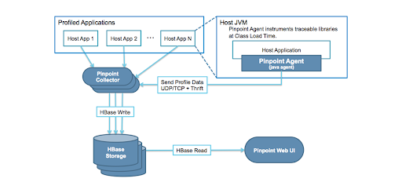
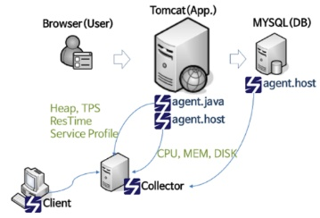

# CHAP 02. scouter 살펴보기

## APM

APM은 Application Performance Monitoring 혹은 Application Performance Management의 약자로, 애플리케이션의 성능을 모니터링하고 관리하는 도구를 의미한다. APM을 사용하면 운영 중인 시스템을 모니터링하거나 성능 측정 시 병목지점을 매우 빠르게 찾을 수 있다.

### 핀포인트\(pinpoint\)

가장 유명한 오픈소스 기반의 APM에는 scouter와 pinpoint가 있다. pinpoint는 자바 에이전트에서 데이터를 수집하여 중간에 Collector로 보낸다. Collector에서는 HBase에 그 정보를 저장하며, 화면에서는 분산되어 있는 HBase에 저장된 데이터를 읽어 사용자에게 제공한다.

#### 장점

* 전반적인 시스템의 연계 현황을 한눈에 확인할 수 있다.
* 하나의 요청을 여러 서버에 걸쳐 처리할 경우, 마치 하나의 서버에서 처리한것처럼 프로파일링된 결과를 확인할 수 있다.
* 웹 기반의 UI로 어디서나 쉽게 상황을 모니터링할 수 있다.

#### 단점

* 실시간 모니터링 기능이 매우 약하다
* 화면을 사용자의 입맛대로 수정할 수 있는 기능이 존재하지 않는다.
* 초당 처리량이 매우 많을 경우 성능 저하 및 문제가 발생할 수 있다.

### scouter

에이전트는 데이터를 수집하여 scouter 서버로 데이터를 전송하는 역할을 한다. 수집 서버에서는 별도의 파일 기반의 저장소에 데이터를 저장한다. scouter의 저장소는 파일 기반의 저장소이기 때문에 공용 디스크를 연결하지 않는 이상 한 대의 서버에만 데이터를 저장할 수 있는 구조가 기본이다. 이러한 단점을 보완하기 위해 scouter 2.5 버전 이후부터는 집킨\(zipkin\)이라는 아파치 분산 저장소를 활용하여 데이터를 저장할 수도 있다.

집킨 서버는 Spring Boot 기반의 성능 모니터링을 위한 분산 저장 애플리케이션이다. 사용 가능한 주요 저장소로는 Cassandra, Eleasticsearch 등이 있으며, 데이터를 수집할 때에는 HTTP를 사용할 수도 있고, Kafka, RabbitMQ와 같은 큐를 사용할 수도 있다.

#### 방화벽 설정

에이전트에서 서버 방향으로 TCP와 UDP 포트를 개방해주어야 하고, 기본 포트 번호는 6100이다. \(서버 → 클라이언트도 동일하다\)

* 에이전트 → 서버
* 서버 → 클라이언트

#### scouter 데모 프로그램 설치하기

* [https://github.com/scouter-project/scouter-demo/releases/download/v0.4.21/demo-env1.tar.gz](https://github.com/scouter-project/scouter-demo/releases/download/v0.4.21/demo-env1.tar.gz) 다운로드
* scouter 서버 시작
* scouter 클라이언트 시작
* 호스트 에이전트 시작
* 모니터링 대상 애플리케이션 시작
* 브라우저 확인
* 가상 부하 생성
* 모니터링

## 참고

* [http://developer.gaeasoft.co.kr/development-guide/knowledge/apm/pinpoint/pinpoint-practice/](http://developer.gaeasoft.co.kr/development-guide/knowledge/apm/pinpoint/pinpoint-practice/)
* [https://12bme.tistory.com/396](https://12bme.tistory.com/396)

