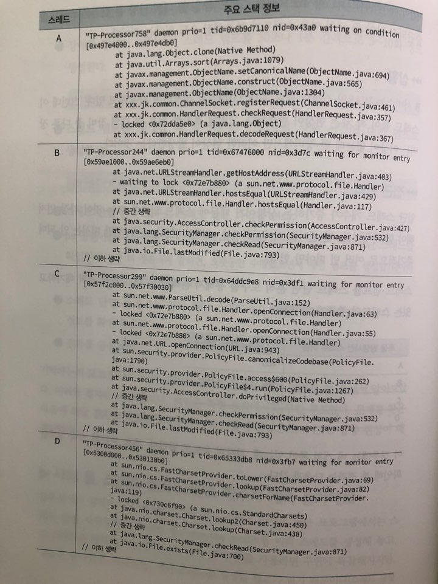

# CHAP 11. 스레드 문제

## 스레드 단면으로 어떤 문제를 확인할 수 있을까?

1장에서 알아본 문제 중 스레드 단면으로 확인할 수 있는 문제는 무엇일까?

| 구분 | 장애 | 확인 가능 여부 |
| :--- | :--- | :--- |
| 시스템이 느려요 | 전체적인 시스템이 항상 느린 경우 | O |
|  | 특정 기능\(화면\)이 느린 경우 | O |
|  | 특정 시간대\(기간\)에 전체 애플리케이션이 느린 경우 | O |
|  | 특정 시간대\(기간\)에 특정 애플리케이션이 느린 경우 | O |
|  | 특정 기능\(화면\)이 점점 느려질 경우 | O |
|  | 특정 사용자만 애플리케이션이 느린 경우 | O |
| 시스템이 응답이 없어요 | 모든 애플리케이션이 응답하지 않는 경우 | O |
|  | 특정 기능이 응답하지 않는 경우 | O |
| 예외가 계속 발생해요 | 모든 사용자가 특정 기능을 수행하면 예외가 발생하는 경우 | △ |
|  | 특정 사용자의 특정 기능에서만 예외가 발생하는 경우 | △ |
|  | 특정 시간대에만 전체 애플리케이션에 예외가 발생하는 경우 | △ |
|  | 특정 시간대에 특정 애플리케이션에 예외가 발생하는 경우 | △ |
| 시스템이 죽어요 | 시스템의 프로세스가 죽는 경우 | X |

### 스레드 단면으로 문제를 확인하기 불가능한 케이스

시스템이 죽는 경우에는 스레드 단면이 기본적으로 생성되지 않기 때문에 좋은 단서가 될 수 없다. 하지만 문제가 발생했을 때마다 명령어를 수행하도록 하는 OnError 옵션을 추가하면 실마리가 남을 수도 있다.

```text
// 에러가 발생했을 때 수행되는 명령어
-XX:OnError="명령어"
// 에러가 발생했을 때 에러 로그 파일 지정
-XX:OnErrorFile=파일 경로
// 에러 발생 시 자동으로 스레드 단면 생성(%p는 프로세스의 아이디를 의미)
-XX:OnError="Kill -3 %p"
```

## 시스템이 느릴 때도 스레드와 관련이 있을까?

시스템이 느리다고 무작정 스레드 단면을 뜨는 것은 좋은 해결 방법은 아니지만 근거를 찾을 수도 있으니 남겨놓는 것이 좋다. 시스템이 느릴 때에는 다음과 같은 순서로 점검하는 것이 좋다.

1. CPU, 메모리와 같은 리소스 사용량 점검
2. 외부와 연동하는 리소스 사용량 점검
3. WAS 메모리 및 스레드 설정 및 사용량 점검
4. Web 서버 설정 점검
5. OS 설정 점검
6. 스레드 상태 점검
7. 메모리 상태 점검

대부분의 웹 기반의 애플리케이션의 응답 시간이 느려지는 원인 중 대부분\(약 80% 정도\)은 DB와 같은 WAS와 연동되는 외부 서버들 때문이다. 따라서, 관련된 DB쿼리가 느린지, DB 서버의 CPU 사용량은 어떤지, DB에 록\(lock\)이 발생하지는 않았는지, 다른 외부 연동 서버들의 상태는 괜찮은지를 먼저 확인해 보는 것이 우선이다.

## 시스템 응답이 없을 때에는 스레드 단면이 가장 효과적이다

시스템이 응답하지 않을 때에는 보통 WAS가 정해 놓은 스레드 풀이나 DB 커넥션 풀이 꽉 찼을 확률이 높다. 이러한 경우에는 스레드 단면을 30초에서 1분 단위로 발생시킨 후 스레드 단면 분석 도구로 열어서 스레드 단면을 확인해 보면 된다. 응답이 없을 때 분석 도구를 활용하여 어떤 순서로 봐야하는지 정리해 보면 다음과 같다.

1. 전체 스레드의 개수가 몇 개인지 확인한다.
2. Java 6 이상일 경우 스레드 단면의 루트 노드를 클릭하여 메모리 사용량을 확인해 보고, 여러 개의 단면 파일을 비교해 가면서 그 값이 어떻게 변하는지 확인해 본다.
3. Monitor 목록에서 빨간색으로 표시되어 여러 스레드를 잡는 녀석이 없는지 찾아본다.
4. 1번에 해당하는 스레드가 보이지 않을 때에는 Runnable인 스레드들을 살펴보자
5. 지속해서 수행 중인 스레드가 존재하지 않는지 "Long running threads detect" 기능을 사용하여 확인한다.
6. 그래도 원인이 없어 보인다면 다른 원인을 찾아보자

#### 다른 원인도 있을 수 있다.

* 웹 서버의 설정이 잘못되었거나 웹 서버에 문제가 있어도 응답이 없을 수 있다.
* JVM의 힙 메모리가 부족하여 시스템이 응답하지 않을 수도 있다.

### 메모리 관련 문제가 발생하였을 경우 확인 방법

1. 스레드 단면을 주기적으로 떠놓는다.
2. 스레드 단면을 뜰 때 ps -Lf -p pid 명령어도 같이 수행하여 주기적으로 떠놓는다.
3. 2번에서 점검한 스레드 중 CPU 사용 시간이 지속해서 증가하는 스레드가 있다면, 그 스레드의 아이디를 확인한 후 스레드 단면 분석 도구를 열어 방금 만든 스레드 단면에서 해당 스레드가 어떤 스레드인지 확인해 본다.
4. 만약 3번의 스레드가 GC 관련 스레드라면, 메모리가 부족하거나 DC 알고리즘에 문제가 발생했을 확률이 높다. 따라서 jstat 명령어로 메모리 사용량을 확인한후 메모리가 부족하면 메모리 단면을 떠서 어떤 객체가 메모리를 가장 많이 잡고 있는지를 확인해 본다.

   ```text
   > jstat -gcutil 5s
   ```

5. 3번에서 GC 관련 스레드가 아닌 다른 스레드라면 해당 스레드가 지속해서 수행되고 있는지 확인해 본다.

## 예외가 지속해서 발생할 때도 스레드 단면이 도움이 될까?

일반적으로 예외가 발생하는 원인은 애플리케이션 코딩상의 실수나 예상치 못한 입력값을 등록하는 것이 대부분이다. 예외가 발생하는 시점은 스레드 단면으로 확인하기는 쉽지 않다. \(운이 좋으면 예외가 발생하는 시점에 스레드 단면을 생성할수도 있다.\) 이 경우에는 자바의 로그가 찍히는 시스템 로그를 확인하는 것이다.

코딩 문제로 지속해서 예외가 발생할 수 있지만, 그밖의 이유로 예외 상황이 이어질수도 있다. 그중 하나가 TimeoutException이다. TimeoutException은 애플리케이션의 설정에 지정해 놓은 Timeout 시간 동안 응답이 없을 때 발생한다. WAS 설정에도 있을 수 있고, DB, 각종 외부 연동 시스템에서 응답이 없을 경우에도 이러한 예외가 발생할 수 있다.

만약 GC 때문이라면, jstat 명령어나 verbosegc 옵션을 사용하여 확인해 보기 바란다. 만약 연동 시스템에서 응답을 주지 않는 것이 원인이라면, 연동 시스템에 응답 시간 로그를 찍도록 하여 응답이 느린 원인을 찾아본다.

예외가 지속해서 발생할 때, 원인을 찾는 또 한 가지 방법은 scouter의 XLog에서 빨간 점들을 확인하는 것이다. 이 점들을 드래그하여 문제가 발생한 요청의 어느 부분에서 예외가 발생하는지 확인하면 보다 빠르게 문제의 원인을 찾을 수 있을 것이다. scouter의 메서드 프로파일링 옵션이 제대로 설정되지 않은 경우에는 정확한 위치를 찾기 어려우므로 예외 로그의 스택 트레이스 로그를 확인하는 것이 좋다.

## 사례 하나. CPU 사용량이 갑자기 올라가서 안 내려와요

### &gt; 상황

A 시스템에 서버들의 CPU 사용량이 불규칙적으로 증가한 후 떨어지지 않는 현상이 발생하고 있다.


### &gt; 접근 방법

CPU 사용량을 봐야 하는데 그냥 보는게 아니라, 각 CPU가 어떻게 점유하는지를 확인해야 한다. 예를 들어, 네 개의 CPU 코어가 있는 장비가 25%를 점유하고 있는 상황을 생각해 보자. 이때 일반적인\(정상적인\) 경우라면 네개의 CPU 코어가 고르게 25% 내외로 사용하고 있을 것이다. 하지만 비정상적인 경우라면 네 개의 CPU 코어 중에서 세 개는 놀고 있고\(약 0~3% 정도 사용\), 나머지 코어가 100%를 사용하고 있을 수도 있다.

#### 이렇게 하나의 CPU 코어 사용량이 급증하는 원인은 여러 가지다.

* 애플리케이션 로직상의 잘못으로 무한 루프에 빠졌을 떄
* XML 라이브러리의 문제로 특수문자가 들어왔을 때 parsing을 제대로 못 하고 무한 루프에 빠졌을 때
* 정규 표현식을 잘못 사용하여 무한 루프에 빠졌을 때
* 메모리가 부족하여 GC 관련 스레드만 반복적으로 수행하고 있을 때

#### 문제 해결 방법

1. 장애가 발생한 장비에서 스레드 덤프를 30초나 1분 간격으로 5~10회 정도 생성한다.

   ```text
   kill -3 pid
   ```

2. 스레드 덤프를 생성할 때 동시에 각 스레드별 사용 시간에 대한 덤프도 생성한다.

   ```text
   ps -Lf -p pid
   ```

3. 스레드 단면 분석 도구로 스레드 덤프 파일을 연다
4. ps 명령어를 사용하여 수집한 덤프에서 수행 시간이 가장 오래 걸린 스레드를 확인한다.
5. 스레드 단면 분석 도구에서 해당 스레드에서 어떤 작업을 하고 있는지 스택 정보를 확인해 본다.
6. 결과를 공유한다.

## 사례 둘. 스레드 풀의 스레드 개수가 계속 증가해요

WAS와 같은 멀티 스레드 작업을 하는 프로그램에서는 스레드 풀을 사용한다. DB Connection pool 처럼 미리 스레드를 생성해 놓고, 그 스레드를 재사용하는 방식이다. 매번 스레드를 생성할 필요가 없기 때문에 성능은 좋아지겠지만 스레드가 중단되지 않아 풀 내의 여유 스레드가 부족해질 수도 있다는 것이다.

### &gt; 상황

B 서비스는 WAS의 스레드 풀을 최대 1,024개로 설정하여 사용하고 있다. 그런데 이 스레드 풀이 꽉 차는 현상이 발생했다. 그런데 특이한 것은 여 대의 장비 중 다른 장비는 이상이 없는데 한 장비에서만 이러한 현상이 발생한다는 것이다.

### &gt; 접근 방법

일단 스레드 개수가 증가하는 상황이기 떄문에 스레드 덤프를 뜬다. 스레드 덤프는 한두 번만 떠서는 안 되며 주기적으로 여러 번 떠야만 한다.

스레드 덤프를 스레드 단면 분석 도구를 통해서 분석해 본 결과 록에 잠겨 대기하고 있는 스레드의 종류가 다양했다.

| 록을 발생시킨 스레드 이름 | 대기 스레드 개수 |
| :--- | :--- |
| A | 405 |
| B | 212 |
| C | 15 |
| D | 10 |



### 원인 분석

스레드들을 살펴보면 대부분 I/O와 관련되어 있는 부분이다. java.io.File.lastModified\(\) 메서드와 java.io.File.exists\(\) 메서드에서 호출된 부분에서 록이 걸려 있는 것을 발션할 수 있다. 그리고 록이 가장 많이 걸려 있는 부분은 JMX의 데이터를 처리하기 위해서 객체를 복사하는 작업\(Object.clone\(\)\)을 수행 중이다.

첫 번째 록이 발생한 원인은 이 스레드 단면만 갖고는 분석하기가 어렵다. 객체 복사 부분에서 계속 록을 잡고 있는지, 몇 초 뒤에는 록이 모두 해제되었는지를 알 수가 없기 때문이다.

두 번째에서 세 번째, 네 번째 록이 발생한 원인은 해당 I/O 관련 장비 때문이었다. 장비가 노후되어 다른 장비로 교체한 것이었는데, 만약 해당 장애 상황에서 스레드 정보 외에 시스템의 리소스 정보를 수집해 놓았다면 조금 더 빨리 원인을 찾았을 것이다. 다시 말해서, 장애가 발생했을때 애플리케이션상의 문제가 아닌 다른 원인 때문에도 장애가 발생할 수 있다는 것을 반드시 명심하자

## 사례 셋. 시스템 응답이 없어요

### &gt; 상황

C 시스템의 WAS가 응답을 하지 않는다. 각 서버의 CPU는 하나만 줄기차게 사용하고 있으며, 스레드 덤프와 ps -LF 명령어를 사용하여 어떤 스레드가 CPU를 계속 사용하고 있는지에 대한 자료는 모아 두었다.

### &gt; 접근 방법

ps -Lf 명령어로 수집한 데이터를 토대로 확인해 보자

```text
user 2250 1 2250 0 608 sep15 ? 00:00:00 java ...
user 2250 1 2252 0 608 sep15 ? 00:00:06 java ...
user 2250 1 2253 1 608 sep15 ? 06:12:06 java ...
user 2250 1 2254 1 608 sep15 ? 06:12:00 java ...
user 2250 1 2255 6 608 sep15 ? 1-07:48:00 java ...
user 2250 1 2256 0 608 sep15 ? 03:24:22 java ...
user 2250 1 2257 0 608 sep15 ? 00:00:00 java ...
```

이 결과를 보면 다섯 번째 열의 값이 2255라는 숫자를 가진 스레드가 지금도 사용중이고 매우 오랜 시간 동안 수행되어 온 것을 확인할 수 있다. 2254도 비슷한 상황이다. 이 세 개의 스레드의 아이디를 확인하려면 스레드 단면 분석 도구를 열어 Native ID를 확인해 보면 된다.

즉, CPU를 혼자 점유하고 있는 것은 바로 GC 관련 스레드였다. 이러한 상황에서 장애를 발생시킨 가장 유력한 용의자는 바로 메모리 릭\(leak\)이다. 메모리 릭이라는 것은 말 그대로 메모리가 부족해지는 것을 말하는데, JVM을 지속해서 사용하면서 어떤 애플리케이션에서 메모리를 풀어주지 않고 야금야금 먹는다면, 이 애플리케이션은 언젠가 할당해 놓은 메모리가 부족해질 것이다.

