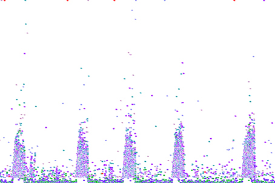
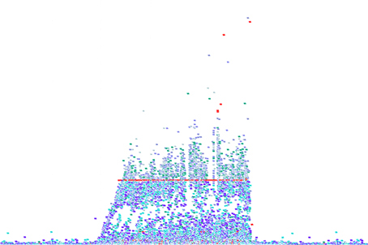
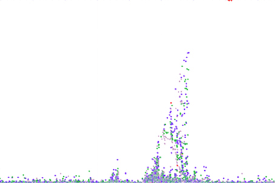

# CHAP 25. 장애 진단은 이렇게 한다

## 진단 요청을 받았을 때(장애가 났을 때) 가장 먼저 할 일

1. 장애 유형 확인(인터뷰나 메일을 통한 증상 확인)
2. 시스템 기본 정보 확인
3. 각종 데이터를 통한 원인 진단
4. 원인이 발견되었을 경우, 장애 원인 제거 후 확인
5. 진단 결과 보고서 작성(필요할 경우)

진단할 때 가장 먼저 해야 할 일은 장애의 유형을 살펴보는 것이다. 즉, 이책 1장의 장애 유형 중 어디에 속하는지를 확인해야 한다. 보통 시스템이 느린 경우에는 단순히 "시스템이 느려요"라고 대답하는 경우가 많다. 하지만 이는 정확하게 어떻게 느린지에 대한 확인 절차가 필요하다.

| 구분       | 조사 내용                                        |
| -------- | -------------------------------------------- |
| 장애 현상    | 어떤 문제가 발생했는지에 대한 정보                          |
| 모니터링 시스템 | 모니터링 시스템 여부                                  |
|          | 모니터링 시스템의 URL 또는 접근 방법 확인                    |
| Java 정보  | 자바 버전                                        |
|          | JDK 설치 위치                                    |
| 웹 서버 정보  | 웹 서버 종류                                      |
|          | 웹 서버 설치 위치                                   |
|          | 웹 로그(access 로그) 위치                           |
| WAS 정보   | WAS 종류                                       |
|          | WAS 설치 위치                                    |
|          | WAS 설정 파일 위치(온갖 설정 파일의 위치)                   |
|          | 도메인 설치 위치(애플리케이션의 클래스 및 라이브러리, 화면 관련 파일의 위치) |
|          | 로그 파일의 위치                                    |
| DB 정보    | DBMS의 종류                                     |
|          | DB의 설치 위치                                    |
|          | DB 관련 설정 파일 위치                               |
| 기타 정보    | 연계 시스템 여부                                    |
|          | 연계 시스템의 위치                                   |
|          | 각 서버의 로그인 계정                                 |
|          | 작업할 장소의 IP                                   |

## 본격적인 진단 시작하기

세 번째 단계인 원인 진단 절차에 대해서 알아보자. 진단 작업을 할 때, 가장 해피(happy)한 케이스는 다음의 경우다.

* 모든 시스템에 대해서 잘 알고 있는 똑똑하고 싹싹한 담당자가 옆에 붙어서 모든 질문에 대답을 해줄 수 있는 경우
* 모니터링 도구가 있는 경우
* 각종 로그가 잘 쌓여져 있는 경우

여기의 세 가지가 모두 준비되어 있다면 여러분들은 아주 행복한 거다. 이 단계의 작업을 수행할 때 중요한 것 중 하나는 작업의 흔적을 남기는 것이다. 여기서 흔적이라는 것들은 어떤 정보들을 확인했는지, 어떤 정보들이 의심이 되는지를 정리해 놓으라는 얘기다.

원인을 찾았을 때 또 한 가지 중요한 점은, 본인이 찾아낸 부분이 문제점의 원인이라고 절대 확신해서는 안 된다는 것이다. 해당 부분에 대한 수정을 가하고, 문제점이 다시 발생하지 않는다는 확인이 될 때까지는 적어도 그래야 한다.

각종 도구들을 사용해서 원인을 찾았다면 원인을 제거하는 다음 단계로 넘어가면 되지만, 그렇지 않을 경우에는 다음과 같은 방안으로 해결을 할 수도 있다.

* 팀 내에 있는 사수에게 문의해라
* 회사 내의 있는 기술지원팀에 문의하라
* OS와 WAS의 벤더에 요청하여 문제점을 찾아 달라고 문의하자
* 구글링을 통해서 답을 찾아보자
* 전문 진단 컨설팅 업체에 문의하자

## 장애 원인 제거하고 결과 정리하기

장애의 원인이라고 지목한 부분을 수정하여쓰면, 반드시 운영 서버에 문제가 없는지 확인하고, 장애가 정말 사라졌는지 지켜봐야 한다. 장애의 원인을 제거하였다는 판단이 서면, 관련 팀이나 인원에게 이 사실을 통보하고 보고서 정리 작업을 수행한다.

| 구분    | 내용                                               |
| ----- | ------------------------------------------------ |
| 증상    | - 20XX년 XX월 XX일 14시 20분 갑자기 화장실에 가고 싶은 상황이 발생하였음 |
| 원인    | - 점심 먹고 먹은 아이스크림이 문제인 것으로 판단                     |
|       | - 그 다음에 먹은 우유도 문제가 될 수 있음                        |
| 해결 방안 | - 화장실로 직행                                        |
|       | - 양호실에 가서 소화제를 받음                                |
|       | - 상황이 더 안 좋아질 경우를 대비하여 조퇴하여 병원으로 직행              |

### 저자는 보통 다음과 같은 순서로 보고서를 작성한다.

### 개요

* 장애의 증상과 시기
* 장애가 발생한 서버의 스펙과 사용 중인 소프트웨어의 버전
* 진단에 참여한 인원, 진단 기간, 사용한 도구
* 기타 각종 상황

### 진단 내역 및 원인

* 가장 효과가 많은 부분부터 작성
* 진단은 했지만, 문제가 없었던 부분은 필요할 경우 작성
* 장애의 원인. 가능하다면, 진단의 절차와 문제가 된 소스 코드나 부분에 대한 로그 파일의 내용 포함

### 해결 방안

* 반영 전과 후의 차이를 쉽게 확인할 수 있는 수치나 그래프
* 필요에 따라서는 수정한 소스 코드나, 수정 후 로그 파일의 내용

### 종합 의견

* 진단 내역과 반영 결과를 한 장에 정리

### 권고 사항

* 해당 장애와 많은 연관은 없지만, 문제가 될 수 있는 부분에 대한 정리

## scouter를 사용한 장애 감지와 원인 파악

scouter를 사용할 때 알림 플로그인을 설정하는 것은 선택이 아닌 필수다. 장애 상황이 발생했을 때 모니터를 보고 있지 않아도 알림을 받을 수 있기 때문이다.

scouter를 열었을 때 가장 먼저 확인해 봐야 하는 부분은 XLog와 Active Service EQ다. XLog는 현재 서비스의 응답 시간 현황을 한눈에 볼 수 있기 때문에 꼭 확인해 봐야 한다.

간단히 XLog에 어떤 패턴들이 나타나는지 확인해 보자

### 상어 패턴

일반적으로 이러한 패턴은 특정 URL이 갑자기 많이 호출되었거나 다량의 데이터를 순간적으로 이 서버로 전송했을 때 나타난다.

### 파도 패턴

 (2) (2) (2) (2) (1) (1).jpg>)

어떤 애플리케이션에서 다른 API 등을 호출할 때 타임아웃이 발생하고, 그때 다시 호출을 요청하는 경우 이와 같은 모양이 나타날 수 있다. 연계된 서비스를 확인해보자

### ㅡㅡ 패턴

 (2) (2) (2) (2) (1).jpg>)

대부분의 경우 원격 저장소나 원격 서버의 연결이 불가능할 경우 Connection Timeout이 발생하면 이렇게 일직선이 나타나기도 한다. 요청량이 많은 서비스의 경우에 연결이 일부분 불가능할 수 있다.

### 운석 낙하 패턴

이러한 경우에는 일반적으로 오른쪽 상단에 있는 저 빨간 점이 장애를 발생시켰을 확률이 대단히 높다. 저 요청 하나가 들어오면서 WAS나 DB의 CPU 사용량을 점유할 경우, 다른 요청들이 영향을 받기 때문에 이러한 형태가 나타난다. 만약 이러한 문제가 발생했을 때 WAS를 재시작해 버린다면 장애의 원인은 영원히 알 수 없는 미제로 남게 될 수도 있다. 따라서 이러한 상황이 하나의 인스턴스에서 발생했다면 해당 인스턴스를 L4에서 제거하거나 웹 서버와 단절시켜 장애를 발생시킨 숙주가 근거를 남길 때까지 기다리는 것을 추천한다.

### 산불 패턴

 (2) (2) (2) (2) (2).jpg>)

빨간 점이 대량으로 발생한것을 확인할 수 있는데 이는 Active Service EQ 그래프에 어떤 스레드들이 대기하고 있는지를 잘 확인해 보면 장애의 원인을 보다 빠르게 파악할 수 있다.

### 크리스마스트리 패턴

 (1).jpg>)

다양한 원인이 있으니 하나씩 확인해보면서 해결할 수 밖에 없다.
